# Pico MCU Audio USB DAC

### 32bit USB Audio DAC using a Pico 1 RP2040 and a PCM5102A DAC module

The Audio DAC development files and code as uaed here are from [**sctanf**](https://github.com/sctanf/picoamp-2), [**BambooMaster 1**](https://github.com/BambooMaster/pico_usb_i2s_speaker), and [**BambooMaster 2**](https://github.com/BambooMaster/usb_sound_card_hires), and their licenses applies here. The second Bamboomaster DAC (BambooDac2 or his Hires soundcard), sounds as good as the [**STM32F411 Audio Dac described here**](https://github.com/TobiasVanDyk/STM32F411-PCM5102A-24bit-USB-Audio-DAC). *Note that their current firmware development are still in progress.*

Read [**Set-i2s-pins-values.txt**](https://github.com/TobiasVanDyk/Pico-MCU-from-Raspberry-Pi/blob/main/DacPico/PicoAmp2/Set-i2s-pins-values.txt), which explains how to change the Bamboo pico_usb_i2s_speaker and his/her usb_sound_card_hires firmware for use with the the Waveshare Pico-Audio Hat and Waveshare Pico Evaluation LCD, and the Pimoroni Audio Dac Hat (as discussed below). Similarly the sctanf Pico Amp 2 firmware can be used by these Hats very easily by changing the code GPIO i2s pin assignments in main.c line 123. 

By changing the Bamboo i2s.pio (i.e. doing a flip bclk/lcrlk 31 July 2025 Commit 10634a4, [**as done sctanf**](https://github.com/BambooMaster/pico-i2s-pio/commit/10634a4aa56d7eb8b1ed3290ea14bf00c586db8e)), and changing the i2s pin assignments in usb_sound_card.c, both the Waveshare and Pimoroni Audio Hats are able to use the Bamboo Dac2 HiRes firmware. The Waveshare DAC 32bit firmware files are in the folder WaveshareHiRes and the Pimoroni DAC 32bit firmware files are in the folder PimoroniHiRes. Both DAC hats were tested with [**Linus Mint 22.2**]([PimoroniHiRes/pactl-list -sinks.txt](https://github.com/TobiasVanDyk/Pico-MCU-from-Raspberry-Pi/blob/main/DacPico/PimoroniHiRes/pactl-list%20-sinks.txt)) and **Windows 10/11**.

<p align="left">
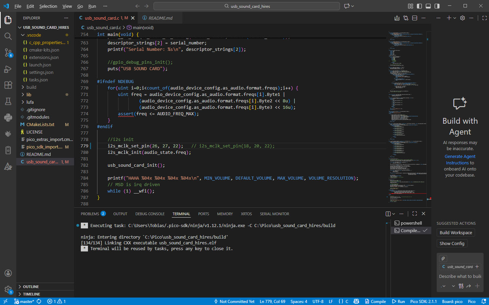
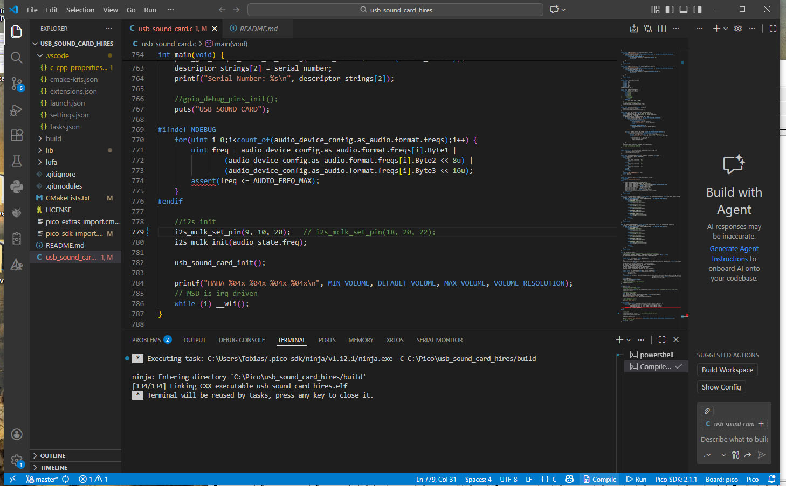


</p>

In addition the Pico Amp 2 firmware for the Waveshare DAC 32bit firmware files are in the folder Waveshare-32bit - compiled after [**changing file main.c line 123**](https://github.com/TobiasVanDyk/Pico-MCU-from-Raspberry-Pi/blob/main/DacPico/Waveshare-32bit/waveshare-32bit.jpg) to i2s_mclk_set_pin(26, 27, 20); Similarly the [**Waveshare Evaluation Board**](https://www.waveshare.com/pico-eval-board.htm) would change it to i2s_mclk_set_pin(3, 27, 22); 

Similarly the Pimoroni DAC 32bit firmware files are in the folder Pimoroni-32bit - compiled after [**changing file main.c line 123**](https://github.com/TobiasVanDyk/Pico-MCU-from-Raspberry-Pi/blob/main/DacPico/Pimoroni-32bit/PimoroniDAC1.jpg) to i2s_mclk_set_pin(9, 10, 20); and adding code to pull the mute pin 22 high. The Pimoroni DAC was tested ok under Linux Mint 22.2 (and Windows 10 and 11).

For a discussion on the PCM5102A Audio DAC modules see [**PCM5102A-Audio-DAC**](https://github.com/TobiasVanDyk/STM32F411-PCM5102A-24bit-USB-Audio-DAC). Solder the three 1, 2 and 4 (or jumper 3 as well if the mute is not controlled in the code) [**as shown here**](https://github.com/TobiasVanDyk/Pico-MCU-from-Raspberry-Pi/blob/main/DacPico/PCM5102A-jumpers.jpg). Also bridge the SCLK jumper on the opposite PCB side. 

**To build the usb_sound_card_hires by Bamboo using Windows 10:**

```
1. Install VSCode and Pico SDK by using the Pico extension - follow the instruction from Raspberry Pi.
2. Create folder C:\Pico.
3. Install Git - see section 6 in https://github.com/TobiasVanDyk/Pico-MCU-from-Raspberry-Pi/blob/main/Install-Pico-SDK-in-Windows10x64-May-2023.pdf
4. In Git Bash: cd c:\Pico
		        git clone https://github.com/BambooMaster/usb_sound_card_hires.git
		        usb_sound_card_hires
		        git submodule update --init
5. Open VSCode and select import C++ project - select the folder C:\Pico\sound_card_hires and press import.
6. Press compile in the VSCode bottom right corner.
7. The uf2 firmware file (usb_sound_card_hires.uf2) will be in the build folder in C:\Pico\usb_sound_card_hires, upload it by putting the Pico in uf2 mode.
8. The Audio device is named Pico Examples HiRes Soundcard and the complete build folder and uf2 firmware are uploaded here in the folder BambooDAC2.
```

The connections between the Pico 1 and the PCM5102A module are the same as on the [Bamboo Github](https://github.com/BambooMaster/usb_sound_card_hires):
```         
Name 	Pin
Data 	GPIO18
LCRCK 	GPIO20
BCLK 	GPIO21
MCLK = SCLK Gnd and Mute +3v3
```

<p align="left">
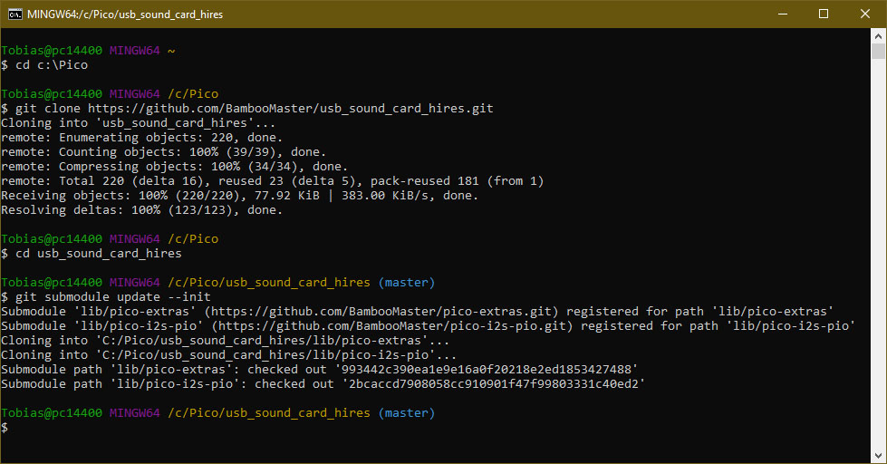

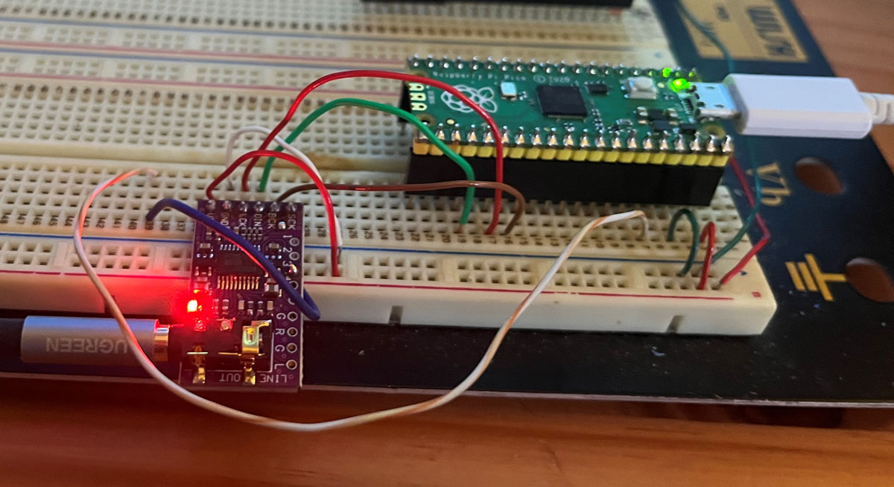
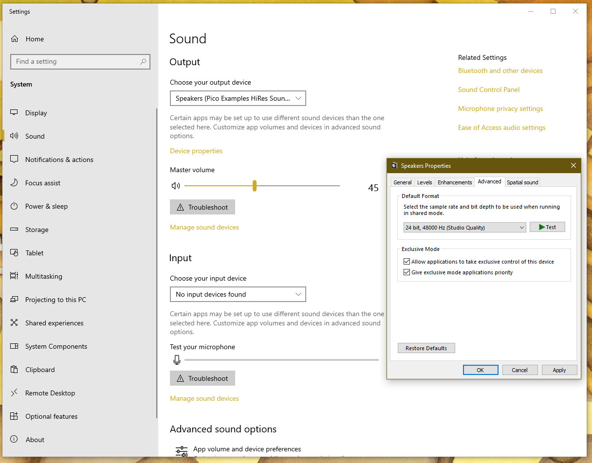
</p>

**To build the Pico Amp 2 by sctanf using Windows 10:**

```
1. Install VSCode and Pico SDK by using the Pico extension - follow the instruction from Raspberry Pi.
2. Create folder C:\Pico.
3. Install Git - see section 6 in https://github.com/TobiasVanDyk/Pico-MCU-from-Raspberry-Pi/blob/main/Install-Pico-SDK-in-Windows10x64-May-2023.pdf
4. In Git Bash: cd c:\Pico
		        git clone https://github.com/sctanf/picoamp-2.git
		        cd picoamp-2
		        git submodule update --init
5. Download the modified tinyusb-rp2040-fixes library from https://github.com/sctanf/tinyusb/tree/rp2040-fixes.
6. Open VSCode and select import C++ project - select the folder C:\Pico\picoamp-2 and press import - it will download the older Pico SDK 2.1.1
7. Close VScode and then in C:\Users\User\.pico-sdk\sdk\2.1.1\lib\tinyusb replace tinyusb with the tinyusb-rp2040-fixes lib - rename it to tinyusb.
8. Open VSCode again and press compile in the VSCode bottom right corner.
9. The uf2 firmware file (pico_usb_i2s_speaker.uf2) will be in the build folder in C:\Pico\picoamp-2, upload it by putting the Pico in uf2 mode.
10. The Audio device is named Pico Amp 2 and the complete build folder and uf2 firmware are uploaded here in the folder PicoAmp2.
```

The connections between the Pico 1 and the PCM5102A module are the same as on the [Pico Amp 2 Github](https://github.com/sctanf/picoamp-2):
```         
Name 	Pin
Data 	GPIO18
LCRCK 	GPIO17
BCLK 	GPIO16
MCLK = SCLK Gnd and Mute +3v3
```

<p align="left">
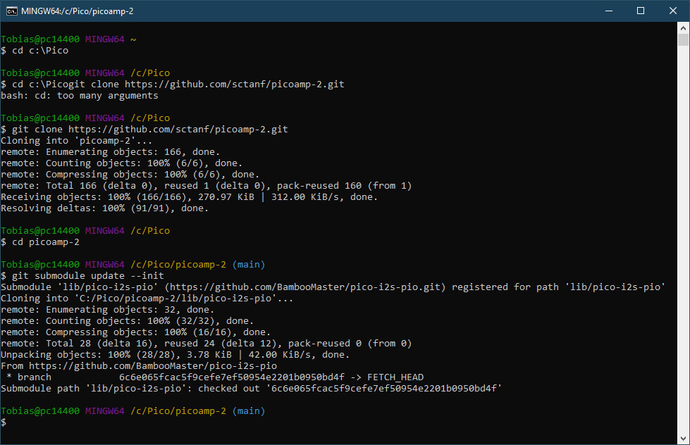
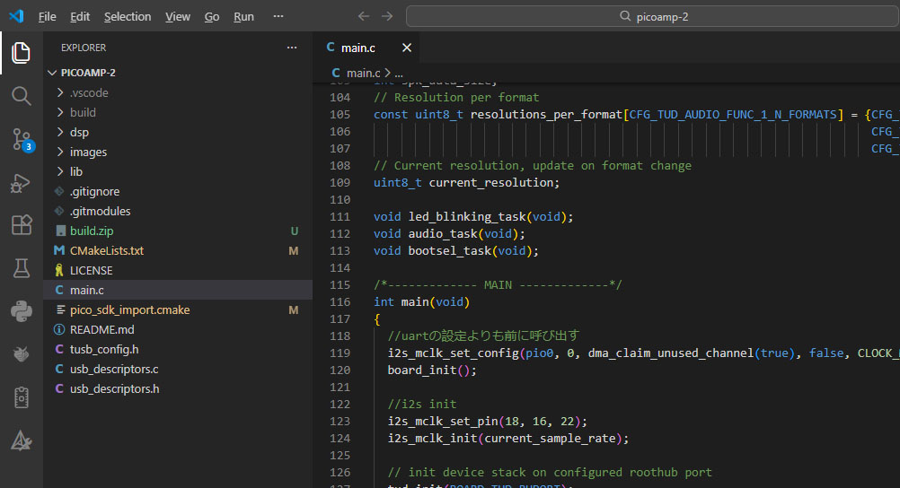

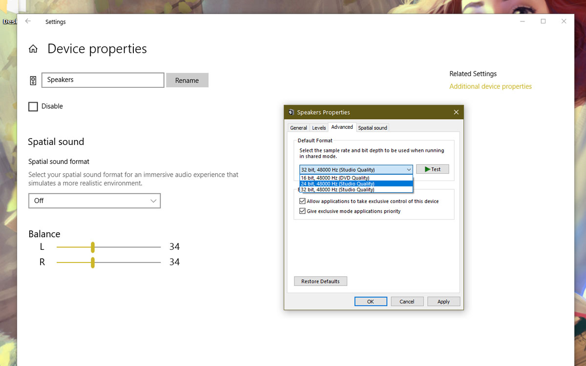
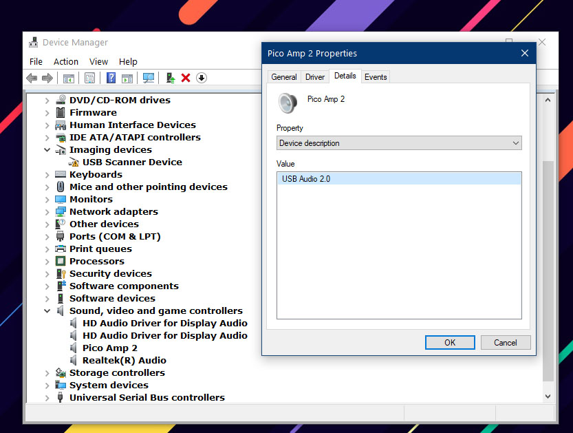
</p>


**To build the pico_usb_i2s_speaker by Bamboo using Windows 10:**

Follow the same steps 1 to 3 as for the PicoAmp2 but use for step 4:
```
4. In Git Bash: cd c:\Pico
		        git clone git clone https://github.com/BambooMaster/pico_usb_i2s_speaker.git
		        cd pico_usb_i2s_speaker
		        git submodule update --init
5. Open VSCode and select import C++ project - select the folder C:\Pico\pico_usb_i2s_speaker and press import.
6. Press compile in the VSCode bottom right corner.
7. The uf2 firmware file (pico_usb_i2s_speaker.uf2) will be in the build folder in C:\Pico\pico_usb_i2s_speaker, upload it by putting the Pico in uf2 mode.
8. The Audio device is named TinyUSB and the complete build folder and uf2 firmware are uploaded here in the folder BambooDAC1.
```

The connections between the Pico 1 and the PCM5102A module are the same as on the [Bamboo Github](https://github.com/BambooMaster/pico_usb_i2s_speaker):
```         
Name 	Pin
Data 	GPIO18
LCRCK 	GPIO20
BCLK 	GPIO21
MCLK = SCLK Gnd and Mute +3v3
```

<p align="left">

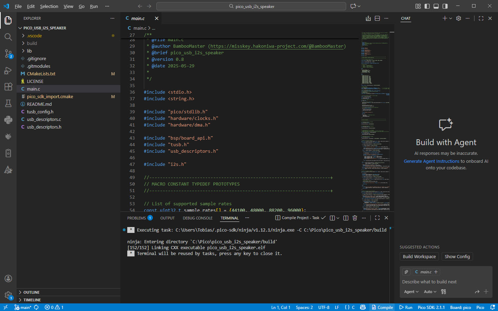

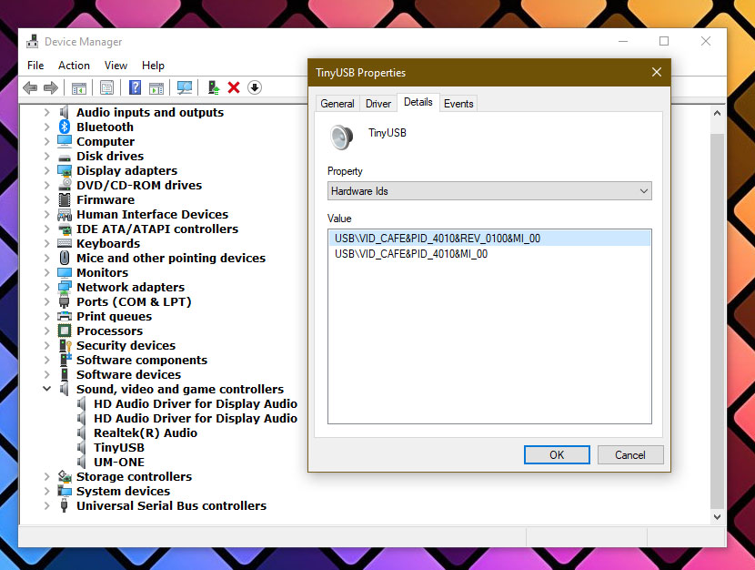
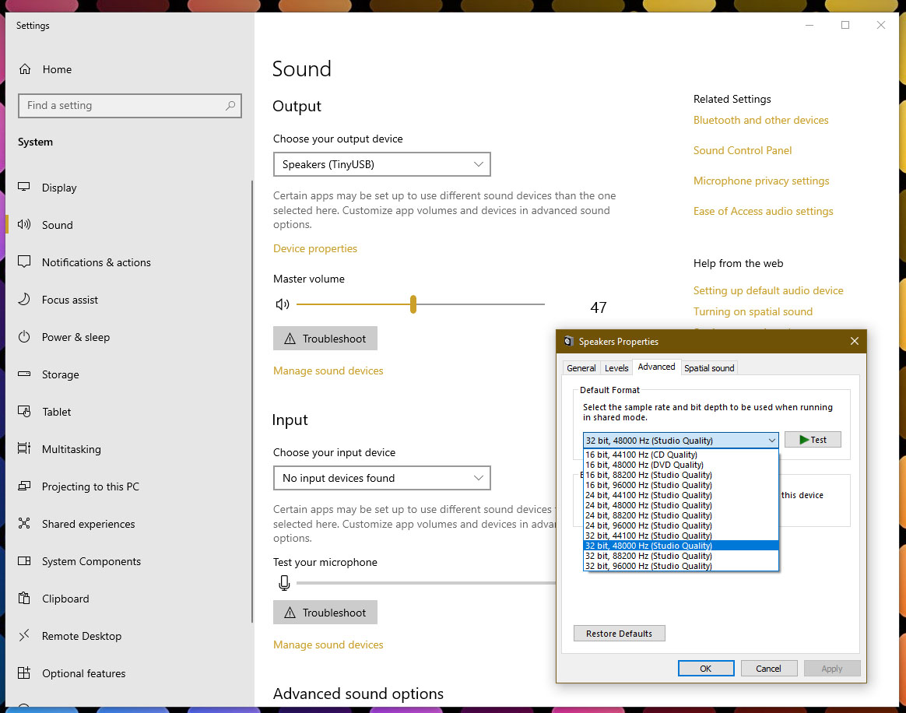
</p>


### 16bit Waveshare and Pimoroni Audio DACs

See below for a guide to make a USB-Audio DAC using the [**Waveshare Pico Audio DAC Hat**](https://www.waveshare.com/pico-audio.htm) with a PCM5101A DAC, for more information also see [**here**](https://www.waveshare.com/wiki/Pico-Audio). This is an example of where the Pico uses a PIO programmed for an i2s 3-wire bus. The [**Waveshare Pico evaluation board**](https://www.waveshare.com/wiki/Pico-Eval-Board), also includes an onboard PCM5101A DAC, but needs GPIO 3 as the i2s Data pin. Both are available [here](https://www.robotics.org.za/W20167) and [here](https://www.robotics.org.za/W20159).

The [**Pimoroni Raspberry Pi Pico Audio Pack**](https://shop.pimoroni.com/products/pico-audio-pack) works with the same code, but using 9 and 10 instead of 26 and 27, as the GPIO pins in pico-extras/src/rp2_common/pico_audio_i2s/include/pico/audio_i2s.h, as explained below. It is available [here](https://za.rs-online.com/web/p/raspberry-pi-hats-add-ons/2206236).

<p align="left">
 
 
<br>

As an example for other sampling frequencies refer to [**wave3Freq**](wave3Freq) where a radio sampling rate of 22050Hz have been added - the two modified files are included. Adding additional bit depth values are not easy - but see [**PIO-32bit**](https://github.com/elehobica/pico_sine_wave_i2s_32b) for an i2s-direct example. For a detailed explanation of the changes made to enable 32bit i2s audio, refer to the (translated) Using 32bit I2S DAC with Raspberry Pi Pico (PCM5102) [**Part 1**](https://elehobica.blogspot.com/2021/03/raspberry-pi-pico32bit-i2s-dac-pcm5102.html) and [**Part 2**](https://elehobica.blogspot.com/2021/07/raspberry-pi-pico32bit-i2s-dac-pcm5102.html). 
 
**21 June 2022** Further Elehobica-derived Audio DAC: Pico-based 32bit-resolution (non-USB) Audio PCM5102 DAC is available (with modified Pico-SDK-Extras) see [**1**](https://github.com/DatanoiseTV/rp2040-vult-demo-board-template) and [**2**](https://github.com/DatanoiseTV/RP2040-DSP-FreeRTOS-Template) and [**3**](https://github.com/DatanoiseTV/pico-extras). Also refer to the [**DatanoiseDAC folder here**](DatanoiseDAC) for the schematic and modified Pico SDK.

<p align="left">
 
 
<br>
 
For a more complete discussion on programming in a Linux (POSIX) environment under MS Windows refer to the section labelled [**Environment**](ENVIRONMENTS.pdf) for the incubator for [**Apache NuttX**](https://github.com/apache/incubator-nuttx). This is a small footprint RTOS for 8 to 32 bit MCU's, that now also supports RP2040 PIO i2s audio - see [**rp2040 i2s pio.c**](https://github.com/apache/incubator-nuttx/blob/master/arch/arm/src/rp2040/rp2040_i2s_pio.c) [**rp2040 i2s pio.h**](https://github.com/apache/incubator-nuttx/blob/master/arch/arm/src/rp2040/rp2040_i2s_pio.h)

### 1 Using Raspberry Pi Os (32 bit)

Note that this uses the original Pico USB-stack - a next step will be to increase the bit rate using tinyusb examples to build the Pico USB-Audio device as in https://github.com/hathach/tinyusb or using https://github.com/elehobica/pico_sine_wave_i2s_32b. 
 
The instructions below are slightly different from the [**widely used install script**](https://github.com/raspberrypi/pico-setup) for the Raspberry Pi. 
```
sudo apt update
sudo apt install cmake gcc-arm-none-eabi build-essential
sudo reboot
```
**(1) Start with following installed directories under /home/pi/pico:**
``` 
pico-playground 
pico-examples 
pico-extras 
pico-sdk 
Pico_Audio 
```
 
1.1 Install Git repositories:
```
sudo apt update
cd ~
mkdir pico
cd pico
git clone -b master https://github.com/raspberrypi/pico-sdk.git
export PICO_SDK_PATH=/home/pi/pico/pico-sdk
cd pico-sdk
git submodule update --init
cd ..
git clone -b master https://github.com/raspberrypi/pico-examples.git
git clone -b master https://github.com/raspberrypi/pico-extras.git
cd pico-extras
git submodule update --init
cd ..
git clone -b master https://github.com/raspberrypi/pico-playground.git
```

1.2 Check that tinyUSB is installed under pico-sdk after the submodule update.

**(2) Install and build Waveshare code:**<br>
(Note pre-built usb_sound_card.uf2 already included inWaveshare code which can be dragged to Pico when in MSD (mass storage mode) - will yield a functoning 44.1kHz/48kHz 16 bit USB-Audio device.)
```
sudo apt-get install p7zip-full
cd ~
sudo wget  https://www.waveshare.com/w/upload/7/7c/Pico_Audio.7z
7z x Pico_Audio.7z -o./Pico_Audio
```

 Move Pico_Audio to /home/pi/pico - there should be two folders:<br>
/home/pi/pico/Pico_Audio/Pico-Audio and /home/pi/pico/Pico_Audio/Pico-Audio/usb_sound_card
```
cd ~/pico/Pico_Audio/Pico-Audio
cd build
export PICO_SDK_PATH=/home/pi/pico/pico-sdk
cmake ..
make -j4
```
This is a sine wave i2s test program when its audio_firmware.uf2 is dragged to Pico - there is also a pre-built uf2 included for this

**(3) Build a new usb_sound_card.uf2**<br> 

3.1 Edit pico-extras/src/rp2_common/pico_audio_i2s/include/pico/audio_i2s.h - change:
```
#ifndef PICO_AUDIO_I2S_DATA_PIN 
//#warning PICO_AUDIO_I2S_DATA_PIN should be defined when using AUDIO_I2S 
// OLD VALUE #define PICO_AUDIO_I2S_DATA_PIN 28 
#define PICO_AUDIO_I2S_DATA_PIN 26 
#endif 

#ifndef PICO_AUDIO_I2S_CLOCK_PIN_BASE
//#warning PICO_AUDIO_I2S_CLOCK_PIN_BASE should be defined when using AUDIO_I2S 
// OLD VALUE #define PICO_AUDIO_I2S_CLOCK_PIN_BASE 26 
#define PICO_AUDIO_I2S_CLOCK_PIN_BASE 27 
#endif 
```
See the Waveshare example code audio_data.h for the sine wave example and the Pico Audio Waveshare Wiki. Without this change the USB-Audio-DAC will appear to be functional but sound will be produced. 
```
//DIN 	GPIO26 	Audio data input 
//BCk 	GPIO27 	Audio data bit clock input 
//LRCK 	GPIO28 	Audio data word clock input  
```

3.2 Build the usb_sound_card<br>
```
cd ~/pico/pico-playground
mkdir ./build
cd build
export PICO_SDK_PATH=../../pico-sdk
cmake ..
cd /home/pi/pico/pico-playground/build/apps/usb_sound_card/
make -j4
```
Look for the uf2 file under the build folder pico/pico-playground/build/apps/usb_sound_card. Rename the new usb_sound_card.uf2 to for example usb_sound_card2.uf2, then drag it to the Pico when in MSD mode

There should then be a functional 44.1kHz/48kHz 16 bit USB-Audio device

### 2 Using Linux Mint 1.93 (32 bit) Virtual Machine with a Windows Host

Based in part on:<br>
https://circuitdigest.com/microcontroller-projects/how-to-program-raspberry-pi-pico-using-c<br>
https://graspingtech.com/upgrade-cmake/<br>
```
sudo apt update
sudo apt install git cmake gcc-arm-none-eabi gcc g++ libstdc++-arm-none-eabi-newlib
sudo apt install automake autoconf build-essential texinfo libtool libftdi-dev libusb-1.0-0-dev
```
Note this has cmake 3.10 installed (cmake --version) i.e. must compile a newer version (cmake >= 3.12 required) from source:
```
wget https://github.com/Kitware/CMake/releases/download/v3.21.3/cmake-3.21.3.tar.gz
tar -zxvf cmake-3.21.3.tar.gz
cd cmake-3.21.3
./bootstrap
make
sudo make install 
mkdir ~/pico
cd pico
git clone -b master https://github.com/raspberrypi/pico-sdk.git
cd pico-sdk
git submodule update --init
cd ..
git clone -b master https://github.com/raspberrypi/pico-examples.git
git clone -b master https://github.com/raspberrypi/pico-extras.git
cd pico-extras
git submodule update --init
cd ..
git clone -b master https://github.com/raspberrypi/pico-playground.git
```
Then follow the instructions as in 3.1 and 3.2 above

As alternative guest VM's which  do not require a cmake build-install, use Linux Mint 20.2 x64 with cmake 3.16 installed, or use
Debian 11.1 x86 which comes with cmake 3.18.
 

### 3 Using Windows 8.1 x86

1. Install Windows PowerShell 5.1 (via the Windows Management Framework 5.1) from https://www.microsoft.com/en-us/download/details.aspx?id=54616
2. Download and run pico-setup-windows-0.3.3-x86.exe (or newer), from https://github.com/ndabas/pico-setup-windows/releases - note the change of the install path to C:\Pico. This will then proceed to downlod about 1.8GB for the MS Visual Studio BuildTools.
3. Run pico-setup.cmd as admin - this will install all the git folders, and compile all the pico-examples - look in the pico-examples/build subfolders for all the uf2 files.
4. Run pico-env.cmd as admin - the output is:
```
C:\Pico>pico-env.cmd 
PICO_sdk_PATH=C:\Pico\pico-sdk 
PICO_examples_PATH=C:\Pico\pico-examples 
PICO_extras_PATH=C:\Pico\pico-extras 
PICO_playground_PATH=C:\Pico\pico-playground 
OPENOCD_SCRIPTS=C:\Pico\tools\openocd-picoprobe\scripts 
```
5. Build the usb_sound_card<br>

Remember to edit (as in the 3.1 above), pico-extras\src\rp2_common\pico_audio_i2s\include\pico\audio_i2s.h file 
```
#define PICO_AUDIO_I2S_DATA_PIN 26 
#define PICO_AUDIO_I2S_CLOCK_PIN_BASE 27 
```
6. Right-click on the Developer Command Prompt for Pico shortcut in the Pico folder and run as admin. 
```
cd pico-playground
mkdir build
cd build
cmake -G "NMake Makefiles" ..
cd apps\usb_sound_card
nmake
```

Look for the uf2 file under the build folder Pico\pico-playground\build\app\usb_sound_card. Rename the new usb_sound_card.uf2 to for example usb_sound_card2.uf2, then drag it to the Pico when in MSD mode

There should then be a functional 44.1kHz/48kHz 16 bit USB-Audio device


