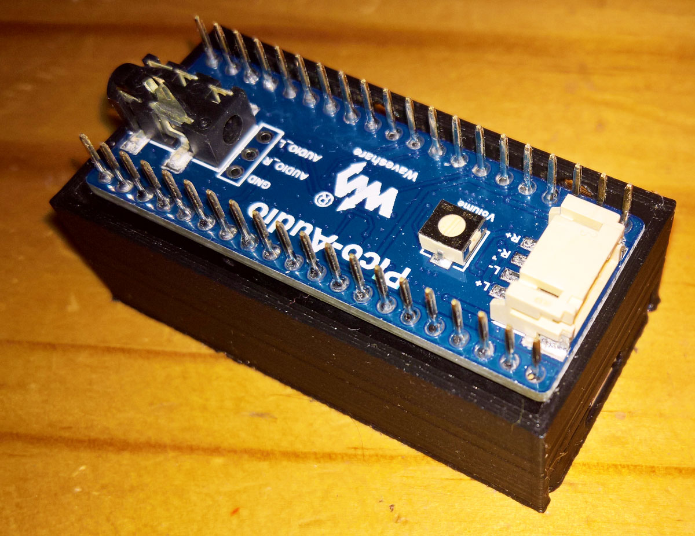
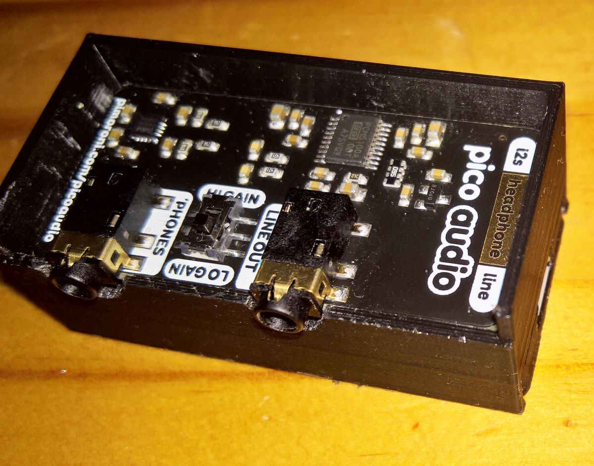
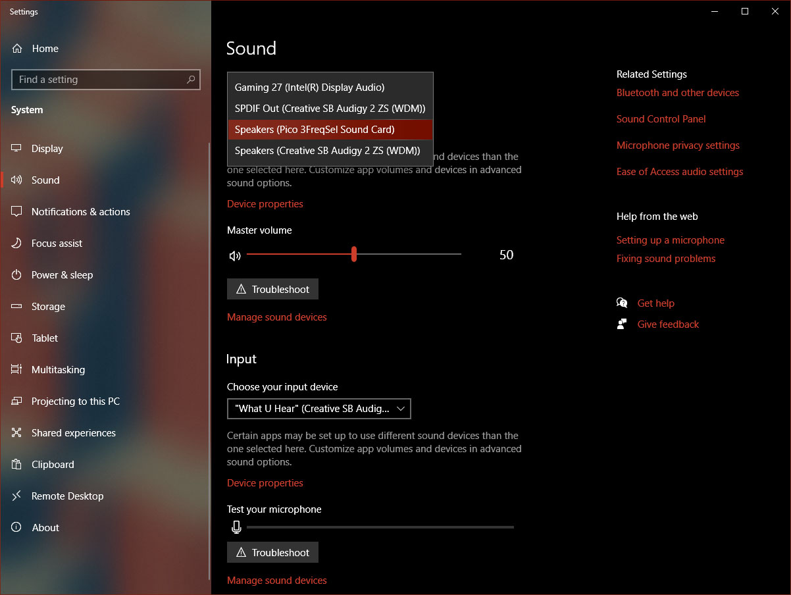
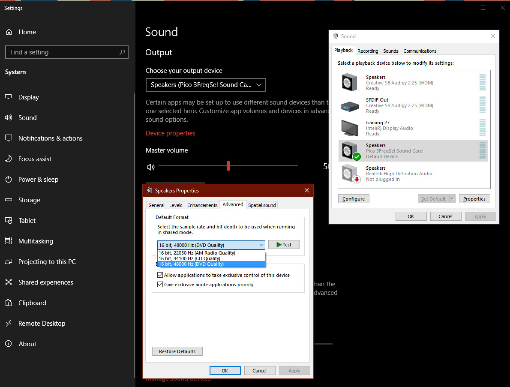

# Pico MCU Audio USB DAC

See below for a guide to make a USB-Audio DAC using the [**Waveshare Pico Audio DAC Hat**](https://www.waveshare.com/pico-audio.htm) with a PCM5101A DAC, for more information also see [**here**](https://www.waveshare.com/wiki/Pico-Audio). This is an example of where the Pico uses a PIO programmed for an i2s 3-wire bus.

The [**Pimoroni Raspberry Pi Pico Audio Pack**](https://shop.pimoroni.com/products/pico-audio-pack) works with the same code, but using 9 and 10 instead of 26 and 27, as the GPIO pins in pico-extras/src/rp2_common/pico_audio_i2s/include/pico/audio_i2s.h, as explained below.

<p align="left">
 
 
<br>

As an example for other sampling frequencies refer to [**wave3Freq**](wave3Freq) where a radio sampling rate of 22050Hz have been added - the two modified files are included. Adding additional bit depth values are not easy - but see [**PIO-32bit**](https://github.com/elehobica/pico_sine_wave_i2s_32b) for an i2s-direct example. For a detailed explanation of the changes made to enable 32bit i2s audio, refer to the (translated) Using 32bit I2S DAC with Raspberry Pi Pico (PCM5102) [**Part 1**](https://elehobica.blogspot.com/2021/03/raspberry-pi-pico32bit-i2s-dac-pcm5102.html) and [**Part 2**](https://elehobica.blogspot.com/2021/07/raspberry-pi-pico32bit-i2s-dac-pcm5102.html). Replacing the old audio and i2s library files with the 32bit files, and then compiling us_sound_card.c results in errors because of the new audio structure definitions, which can be corrected.

<p align="left">
 
 
<br>
 
For a more complete discussion on programming in a Linux (POSIX) environment under MS Windows refer to the section labelled [**Environment**](ENVIRONMENTS.pdf) for the incubator for [**Apache NuttX**](https://github.com/apache/incubator-nuttx). This is a small footprint RTOS for 8 to 32 bit MCU's, that now also supports RP2040 PIO i2s audio - see [**rp2040 i2s pio.c**](https://github.com/apache/incubator-nuttx/blob/master/arch/arm/src/rp2040/rp2040_i2s_pio.c) [**rp2040 i2s pio.h**](https://github.com/apache/incubator-nuttx/blob/master/arch/arm/src/rp2040/rp2040_i2s_pio.h)

### 1 Using Raspberry Pi Os (32 bit)

Note that this uses the original Pico USB-stack - a next step will be to increase the bit rate using tinyusb examples to build the Pico USB-Audio device as in https://github.com/hathach/tinyusb or using https://github.com/elehobica/pico_sine_wave_i2s_32b. 
 
The instructions below are slightly different from the widely used install script for the Raspberry Pi. 
```
sudo apt update
sudo apt install cmake gcc-arm-none-eabi build-essential
sudo reboot
```

(1) Start with following installed directories under /home/pi/pico:<br>
pico-playground<br>
pico-examples<br>
pico-extras<br>
pico-sdk<br>
Pico_Audio<br>

1.1 
```
sudo apt update
cd ~
mkdir pico
cd pico
git clone -b master https://github.com/raspberrypi/pico-sdk.git
export PICO_SDK_PATH=/home/pi/pico/pico-sdk
cd pico-sdk
git submodule update --init
cd ..
git clone -b master https://github.com/raspberrypi/pico-examples.git
git clone -b master https://github.com/raspberrypi/pico-extras.git
cd pico-extras
git submodule update --init
cd ..
git clone -b master https://github.com/raspberrypi/pico-playground.git
```

1.2 Check that tinyUSB is installed under pico-sdk after the submodule update.

(2) Install and build Waveshare code:<br>
(Note pre-built usb_sound_card.uf2 already included inWaveshare code which can be dragged to Pico when in MSD (mass storage mode) - will yield a functoning 44.1kHz/48kHz 16 bit USB-Audio device.)

2.1
```
sudo apt-get install p7zip-full
cd ~
sudo wget  https://www.waveshare.com/w/upload/7/7c/Pico_Audio.7z
7z x Pico_Audio.7z -o./Pico_Audio
```

Move Pico_Audio to /home/pi/pico - there should be two folders:<br>
/home/pi/pico/Pico_Audio/Pico-Audio and /home/pi/pico/Pico_Audio/Pico-Audio/usb_sound_card
```
cd ~/pico/Pico_Audio/Pico-Audio
cd build
export PICO_SDK_PATH=/home/pi/pico/pico-sdk
cmake ..
make -j4
```
This is a sine wave i2s test program when its audio_firmware.uf2 is dragged to Pico - there is also a pre-built uf2 included for this

(3) Build a new usb_sound_card.uf2<br>

3.1 Edit pico-extras/src/rp2_common/pico_audio_i2s/include/pico/audio_i2s.h <br>
Change: <br>

#ifndef PICO_AUDIO_I2S_DATA_PIN<br>
//#warning PICO_AUDIO_I2S_DATA_PIN should be defined when using AUDIO_I2S<br>
// OLD VALUE #define PICO_AUDIO_I2S_DATA_PIN 28<br>
#define PICO_AUDIO_I2S_DATA_PIN 26<br>
#endif<br>

#ifndef PICO_AUDIO_I2S_CLOCK_PIN_BASE<br>
//#warning PICO_AUDIO_I2S_CLOCK_PIN_BASE should be defined when using AUDIO_I2S<br>
// OLD VALUE #define PICO_AUDIO_I2S_CLOCK_PIN_BASE 26<br>
#define PICO_AUDIO_I2S_CLOCK_PIN_BASE 27<br>
#endif<br>

See the Waveshare example code audio_data.h for the sine wave example and the Pico Audio Waveshare Wiki. Without this change the USB-Audio-DAC will appear to be functional but sound will be produced.<br>
//DIN 	GPIO26 	Audio data input<br>
//BCk 	GPIO27 	Audio data bit clock input<br>
//LRCK 	GPIO28 	Audio data word clock input <br>

3.2 Build the usb_sound_card<br>
```
cd ~/pico/pico-playground
mkdir ./build
cd build
export PICO_SDK_PATH=../../pico-sdk
cmake ..
cd /home/pi/pico/pico-playground/build/apps/usb_sound_card/
make -j4
```
Look for the uf2 file under the build folder pico/pico-playground/build/app/usb_sound_card. Rename the new usb_sound_card.uf2 to for example usb_sound_card2.uf2, then drag it to the Pico when in MSD mode

There should then be a functional 44.1kHz/48kHz 16 bit USB-Audio device

### 2 Using Linux Mint 1.93 (32 bit) Virtual Machine with a Windows Host

Based in part on:<br>
https://circuitdigest.com/microcontroller-projects/how-to-program-raspberry-pi-pico-using-c<br>
https://graspingtech.com/upgrade-cmake/<br>
```
sudo apt update
sudo apt install git cmake gcc-arm-none-eabi gcc g++ libstdc++-arm-none-eabi-newlib
sudo apt install automake autoconf build-essential texinfo libtool libftdi-dev libusb-1.0-0-dev
```
Note this has cmake 3.10 installed (cmake --version) i.e. must compile a newer version (cmake >= 3.12 required) from source:
```
wget https://github.com/Kitware/CMake/releases/download/v3.21.3/cmake-3.21.3.tar.gz
tar -zxvf cmake-3.21.3.tar.gz
cd cmake-3.21.3
./bootstrap
make
sudo make install 
```
```
mkdir ~/pico
cd pico
git clone -b master https://github.com/raspberrypi/pico-sdk.git
cd pico-sdk
git submodule update --init
cd ..
git clone -b master https://github.com/raspberrypi/pico-examples.git
git clone -b master https://github.com/raspberrypi/pico-extras.git
cd pico-extras
git submodule update --init
cd ..
git clone -b master https://github.com/raspberrypi/pico-playground.git
```
Then follow the instructions as in 3.1 and 3.2 above

As alternative guest VM's which  do not require a cmake build-install, use Linux Mint 20.2 x64 with cmake 3.16 installed, or use
Debian 11.1 x86 which comes with cmake 3.18.
 

### 3 Using Windows 8.1 x86

1. Install Windows PowerShell 5.1 (via the Windows Management Framework 5.1) from https://www.microsoft.com/en-us/download/details.aspx?id=54616
2. Download and run pico-setup-windows-0.3.3-x86.exe (or newer), from https://github.com/ndabas/pico-setup-windows/releases - note the change of the install path to C:\Pico. This will then proceed to downlod about 1.8GB for the MS Visual Studio BuildTools.
3. Run pico-setup.cmd as admin - this will install all the git folders, and compile all the pico-examples - look in the pico-examples/build subfolders for all the uf2 files.
4. Run pico-env.cmd as admin - the output is:<br>
C:\Pico>pico-env.cmd<br>
PICO_sdk_PATH=C:\Pico\pico-sdk<br>
PICO_examples_PATH=C:\Pico\pico-examples<br>
PICO_extras_PATH=C:\Pico\pico-extras<br>
PICO_playground_PATH=C:\Pico\pico-playground<br>
OPENOCD_SCRIPTS=C:\Pico\tools\openocd-picoprobe\scripts<br>

5. Build the usb_sound_card<br>
Remember to edit (as in the 3.1 above), pico-extras\src\rp2_common\pico_audio_i2s\include\pico\audio_i2s.h file<br>
#define PICO_AUDIO_I2S_DATA_PIN 26<br>
#define PICO_AUDIO_I2S_CLOCK_PIN_BASE 27<br>

6. Right-click on the Developer Command Prompt for Pico shortcut in the Pico folder and run as admin.<br>
```
cd pico-playground
mkdir build
cd build
cmake -G "NMake Makefiles" ..
cd apps\usb_sound_card
nmake
```

Look for the uf2 file under the build folder Pico\pico-playground\build\app\usb_sound_card. Rename the new usb_sound_card.uf2 to for example usb_sound_card2.uf2, then drag it to the Pico when in MSD mode

There should then be a functional 44.1kHz/48kHz 16 bit USB-Audio device


