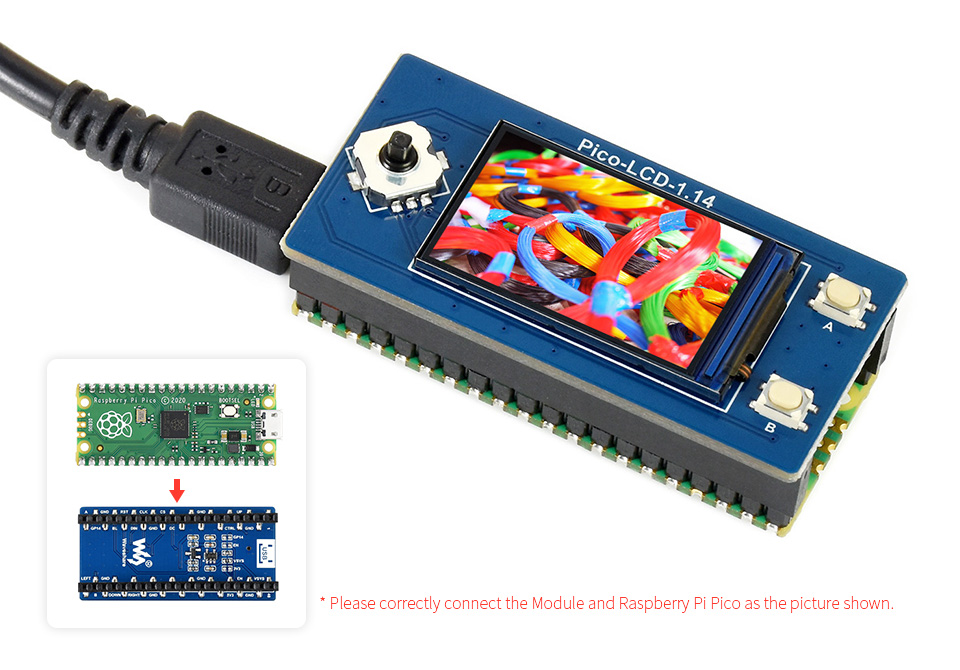
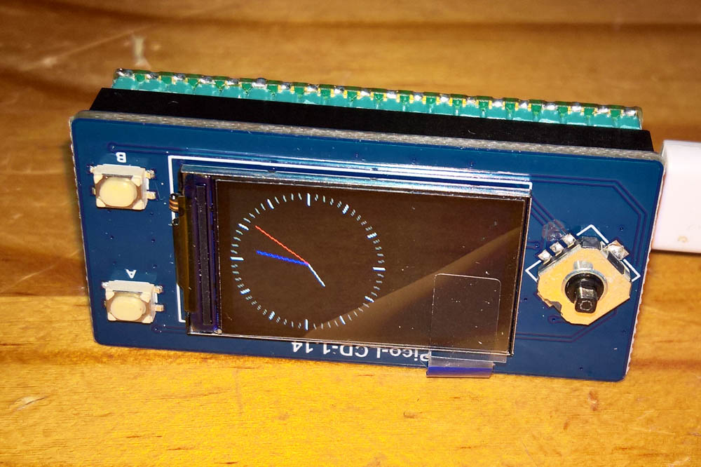
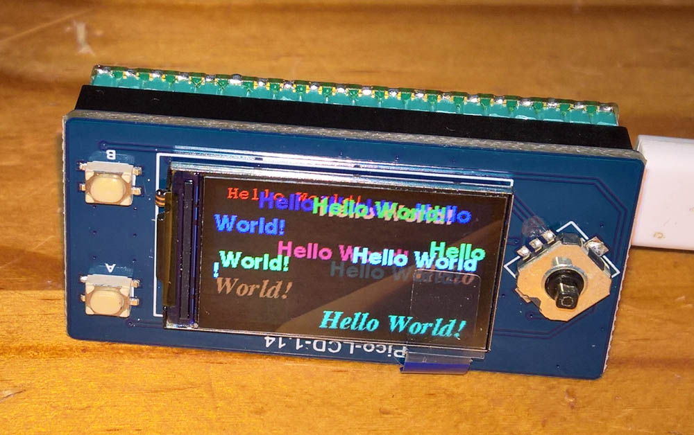

# LCD ST7789 240x135 display SPI driver

Use the [**Waveshare ST7789**](https://www.waveshare.com/pico-lcd-1.14.htm) Pico SPI format [**240x135 1.14 inch IPS LCD**](https://www.waveshare.com/wiki/Pico-LCD-1.14), connected as [**here**](images/connections.jpg)

Arduino support through the [**Arduino_GFX graphics library**](https://github.com/moononournation/Arduino_GFX) and the [**Earlephilhower Arduino Pico Port**](https://github.com/earlephilhower/arduino-pico/), and the Adafruit GFX library.

**The install order on Windows 10x64**
1. [**Arduino IDE**](https://www.arduino.cc/en/software) version 1.8.19.
2. [**Earlephilhower Aduino Pico port**](https://github.com/earlephilhower/arduino-pico/)
3. Recent (August 2022) [**Adafruit GFX library**](https://github.com/adafruit/Adafruit-GFX-Library).

<p align="left">
 
 
 
</p>

```
#include <Arduino_GFX_Library.h>

#define GFX_BL 13 // default backlight pin, you may replace DF_GFX_BL to actual backlight pin
#include <Arduino_GFX_Library.h>

#define TFT_BL 13
Arduino_DataBus *bus = new Arduino_RPiPicoSPI(8 /* DC */, 9 /* CS */, 10 /* SCK */, 11 /* MOSI */, 12 /* MISO */, spi1 /* spi */);
Arduino_GFX *gfx = new Arduino_ST7789(bus, 12 /* RST */, 3 /* rotation */, true /* IPS */, 135 /* width */, 240 /* height */, 52 /* col offset 1 */, 40 /* row offset 1 */, 53 /* col offset 2 */, 40 /* row offset 2 */);

```

For the LCD and MCU configuration and examples refer to these pages [**1**](https://github.com/moononournation/Arduino_GFX/wiki/Data-Bus-Class), and [**2**](https://github.com/moononournation/Arduino_GFX/wiki/Display-Class), and [**3**](https://github.com/moononournation/Arduino_GFX/wiki/Dev-Device-Declaration).


