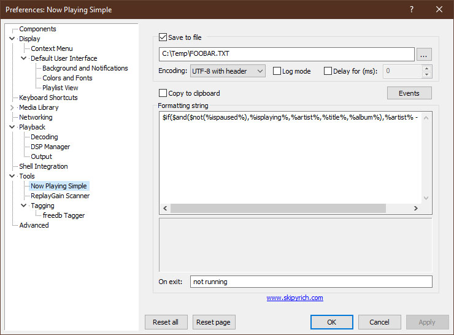

# PC Music Playing Data for the Touch Pad

It is relatively easy to display music playing from [**Foobar2000**](https://www.foobar2000.org/) on the statusbar of the Touch Macropad using [**Now Playing Simple foobar2000 plugin**](https://web.archive.org/web/20200201202714/https://skipyrich.com/wiki/Foobar2000:Now_Playing_Simple) sent to the macropad via a [**powershell script**](https://github.com/TobiasVanDyk/Pico-MCU-from-Raspberry-Pi/blob/main/MacropadFoobarPlaying/PowerShellSession.txt).

To configure Now Playing Simple foobar2000 plugin refer to the picture below, I used:
``` 
$if($and($not(%ispaused%),%isplaying%,%artist%,%title%,%album%),%artist% - %title%)
``` 

The powershell script can be configured to run via the Windows Task Scheduler on a basis as [**explained here**](https://www.partitionwizard.com/partitionmanager/automate-powershell-scripts.html). 

The script used is listed below - no doubt it can be much improved. Currently only the artist and song title are included in the script - but is is easily expanded by modifyingthe Foobar2000 plugin parameters. Note that the plugin only works with he 32-bit version of Foobar2000.

<p align="left">
 

</p>

```
$file_data = Get-Content c:\Temp\FOOBAR.TXT
$file_data
Sharon Van Etten - The End Of The World
$a = "<m"
$b = ">"
$d = $a+$file_data+$b
$d
<mSharon Van Etten - The End Of The World >
$port= new-Object System.IO.Ports.SerialPort COM6,9600,None,8,one
$port.open()
$port.Write($d)
$port.Close()
``` 

Only the code for the Raspberry Pi display adapted for the Pico have been updated for displaying the music playing data - it is also included here.

Only three sets of changes need to be made:

Add the following global variables:
``` 
bool mPlay = false;                    // PC Playing Music
char mPlayArr[32]  = { "                               " };  
``` 

Add the following function:
``` 
/////////////////////////////////////////////////////////////////////////////
void WriteMusicPlayingData()              // PC music Playing from Foobar2000
/////////////////////////////////////////////////////////////////////////////
// Music Playing <mARTIST - TITLE                 >
//                 0123456789012345678901234567890
///////////////////////////////////////////////////////////////////////////// 
{ // char mPlayArr[32]  = { "                               " }; 
  //                         0123456789012345678901234567890
  int i;                 
  for (i=0;  i<NumBytes;  i++) mPlayArr[i] = RecBytes[i+1];                   
  status(mPlayArr);  
}
``` 

Add the following two lines in function DoNewData():
``` 
  mPlay = (a==61);       // 0x6D = 'm' PC music Playing
  if (mPlay) { WriteMusicPlayingData(); return; }
``` 

