# Pico MCU from Raspberry Pi
There are currently three main approaches for programming the [**RPi Pico**](https://www.raspberrypi.org/products/raspberry-pi-pico/) - using the Arduino IDE and adding the RPiPico through the board manager, using methods [**1.1**](https://www.raspberrypi.org/forums/viewtopic.php?f=144&t=309215#p1849553) and/or [**1.2**](https://www.raspberrypi.org/forums/viewtopic.php?f=144&t=307565), using a python interpreter installed on the Pico as firmware (for example the [**RPi Pico port of Micropython**](https://github.com/raspberrypi/micropython/tree/pico/ports/rp2) or Adafruit's [**CircuitPython**](https://circuitpython.org/board/raspberry_pi_pico/)), or using a [**CMake based SDK**](https://github.com/raspberrypi/pico-sdk). 

The Arduino IDE mbed-RTOS-based and the (micro/circuit)python approaches, are the easier of the three to install and use on Windows 8.1 and 10 (64 bit), but using both console (Powershell) and IDE (Visual Studio Code) build methods as discussed in [**Working with the Raspberry Pi Pico with Windows and C/C++**](https://www.element14.com/community/community/raspberry-pi/blog/2021/01/24/working-with-the-raspberry-pi-pico-with-windows), on Windows 8.1 (32 bit), also proved to be reasonably easy - details are in section 3. The much shorter micropython programming tool-chain, works well under both main Raspberry Pi Os flavours (64 bit and 32 bit with kernel 5.10). 

Below is a short description on how to setup and use the RPi Pico with the Arduino IDE (Section 1) , the RPi Pico micropython toolchain (Section 2), and using the C-based SDK with both powershell and Visual Studio Code build-methods (Section 3), on Windows 8.1 (and 10). Section 4 explains how to install the Raspberry Pi Pico driver under Windows 8.1.


### 1. Installing the RPi Pico through the Arduino IDE boards manager (Windows 8.1 and Windows 10).

A reset button was connected between the RPi Pico pin 30 (RUN) and pin 28 (GND). It was neccessary to put the Pico in upload mode everytime a new sketch was uploaded. and during the upload stage the RPi Pico is a Portable Device (Mass Storage), and after the upload it is a COMx device. But the COM device must have been associated with the current board choice at least once before the upload will be completed - see the two screenshots below.

<p align="left">
  
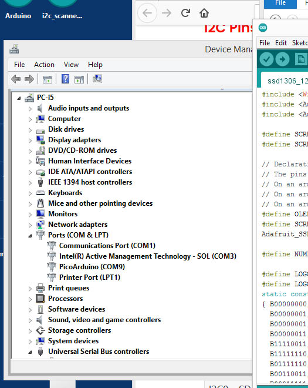 
<br>

**1.1 Official Arduino Mbed-based Pico installation:** After the announcements [**here**](https://github.com/ARMmbed/mbed-os/pull/14488) and [**here**](https://github.com/arduino/ArduinoCore-mbed/releases/tag/2.0.0), an existing Arduino IDE 1.8.13 installation was used with the Arduino mbed-based installation - the instructions as described [**here**](https://www.raspberrypi.org/forums/viewtopic.php?f=144&t=309215#p1849553) were followed. It required a 300 MB download from within the board manager. In addition two Adafruit graphics libraries were installed as described [**here**](https://learn.adafruit.com/monochrome-oled-breakouts/arduino-library-and-examples?view=all#arduino-library-and-examples). Connect the OLED display SDA to Pico pin 9 (GP6) and SCL to Pico pin 10 (GP7). This was based on the [**discussion here**](https://github.com/earlephilhower/arduino-pico/issues/92) - the Arduino-mbed-Pico board uses a fixed i2c-1 assignment for SDA and SCL. The Adafruit example used, had its i2c address changed from 0x3D to 0x3C for this particular OLED display - the modified sketch is inside the OLEDArduino folder above as ssd1306_128x64_i2cPico.ino. Effectively the process is: *(1) Install the board manager files (keep on pressing install if the downloads fails or reports itself as "corrupted"), (2) Press the Reset and Boot Select buttons on the Pico, (3) Select the Arduino Mbed OS RP2040 Boards -> Raspberry Pi Pico in the Board menu, (4) select the ArduinoPico or COMx (Raspberry Pi Pico) in the Port menu, (5) Select the sketch example to upload, modify if required, and press Upload.* 

<p align="left">
 
 
<br>

**1.2 Alternative Arduino-based approach:** The [**second approach**](https://github.com/earlephilhower/arduino-pico) also uses the boards manager, but is not mbed-based, and it is as described [**here**](https://www.tomshardware.com/how-to/program-raspberry-pi-pico-with-arduino-ide) and [**here**](https://www.raspberrypi.org/forums/viewtopic.php?f=144&t=307565). It needed a slightly larger download, and used the same two Adafruit libraries. The SSD1306 128x64 OLED was connected to GP0 (SDA) and GP1 (SCL) - this is the default for this board definition. The SDA and SCL pins can be changed using Wire.setSDA(4) and Wire.setSCL(5) - the modified sketch using Pico pins 6 and 7, is inside the OLEDArduino folder above as ssd1306_128x64_i2cPico2.ino. Effectively the process is: *(1) Install the board manager files (keep on pressing install if the downloads fails or reports itself as "corrupted"), (2) Press the Reset and Boot Select buttons on the Pico, (3) Select the Raspberry Pi RP2040 Boards(1.0.3) -> Raspberry Pi Pico in the Board menu, (4) select the ArduinoPico or COMx (Raspberry Pi Pico) in the Port menu, (5) Select the sketch example to upload, modify if required, and press Upload.* 

Note that the **default pins are now (April 2021) changed** - see [A](https://github.com/earlephilhower/arduino-pico/pull/103) [B](https://github.com/earlephilhower/arduino-pico/issues/92) [C](https://github.com/earlephilhower/arduino-pico/commit/6e51516d6c07fcf84fe5580e0fda69b0b010aab3): From TwoWire Wire(i2c0, 0, 1); TwoWire Wire1(i2c1, 2, 3); to TwoWire Wire(i2c0, PIN_WIRE0_SDA, PIN_WIRE0_SCL); TwoWire Wire1(i2c1, PIN_WIRE1_SDA, PIN_WIRE1_SCL); 

It can be used through: Wire.setSDA(0); Wire.setSCL(1); Wire.begin();  Wire1.setSDA(2); Wire1.setSCL(3);  Wire1.begin(0x30); etc.


<p align="left">
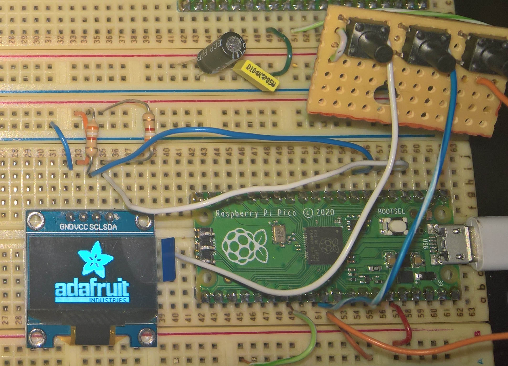 
   
<br>

In addition for both approaches 1.1 and 1.2, the standard blink and a Pico serial temperature sketches were tested - remember to change the LED pin number to 25 for the blink example and to select the Pico serial port for the temperature example.

<p align="left">
 
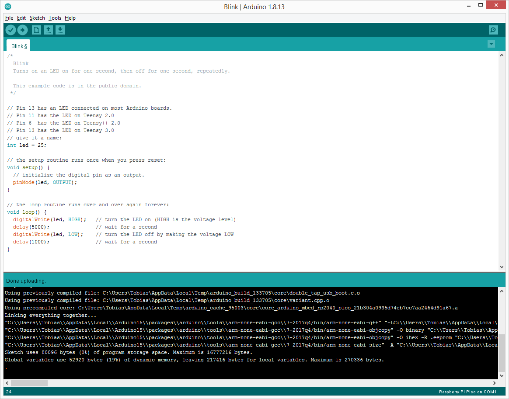 
<br>

For more information on the Arduino IDE [**mbed-based support for the RPi Pico**](https://blog.arduino.cc/2019/07/31/why-we-chose-to-build-the-arduino-nano-33-ble-core-on-mbed-os/), as well as their own [**Arduino Nano Connect RP2040-based board**](https://blog.arduino.cc/2021/01/20/welcome-raspberry-pi-to-the-world-of-microcontrollers/), and also see the new RP2040 Pico boards from [**Sparkfun**](https://www.sparkfun.com/rp2040) and [**Adafruit**](https://www.adafruit.com/category/875).

The new Arduino Pico tools are installed in C:\Users\xxxx\AppData\Local\Arduino15\packages\arduino\tools\rp2040tools and include [**picotool.exe**](picotool.txt) and [**rp2040load.exe**](rp2040load.txt).


### 2. Installing Micropython and the Thonny Python IDE, for the Raspberry Pi Pico under Windows 8.1

A reset button was connected between the RPi Pico pin 30 (RUN) and pin 28 (GND) as shown below - this avoids the requirement of a a disconnection of the USB cable to set the Pico in boot-select load mode. 
<br>
<p align="left">
  
<br>


After the Pico is plugged into a windows 8.1 USB port, press and hold both the onboard Boot-Select button and the (external) Reset button, and then first release the reset button followed by the bootsel button. A new storage drive RPI-RP2 will then be visible. Drag the most current [**Pico Micropython firmware**](https://www.raspberrypi.org/documentation/pico/getting-started/) (pico_micropython_20210121.uf2), to this drive which will then reboot the Pico and it will re-appear as a COM device.

Keep the Pico plugged in as a COM device and then install [**Thonny**](https://thonny.org/) using its default settings (i.e. as standard, and using the included Python 3.x bundle and to the C:\Users\\%User%\AppData\Local\Programs\Thonny, location. Open Thonny, and select at the bottom right the Pico Micropython interpreter, Thonny will then connect to the Pico as shown below:
<br>
<p align="left">
  
<br>

Open the File menu and all the python files currently on the Pico is shown:
<br>
<p align="left">
  
<br>


In this case small OLED (128x64 i2c SSD1306) test program [**ssd1306.py**](ssd1306.py), which is in part based on [**this Github**](https://github.com/blippy/rpi/tree/master/1306 ), and [**this discussion**](https://mcturra2000.wordpress.com/2021/01/25/raspberrypi-pico-working-oled/). 

For convenience the SSD1306 driver is written as a sub-class of the Micropython framebuffer object as discussed [**here**](http://docs.micropython.org/en/latest/library/framebuf.html#constructors).

The connection between the OLED and the Pico is: 

| OLED | GND | VCC | SCL | SDA |
|:-----|:----|:----|:----|:----|
| PICO | GND | 3V3 | GP5 | GP4 |

<br>
<p align="left">
  
<br>
  
Note that to reset the Micropython Pico, one can press Control-C inside Thonny, the result is as shown below, and after pressing Reset and BootSelect buttons the [**flash_nuke.uf2 firmware**](https://www.raspberrypi.org/documentation/rp2040/getting-started/#board-specifications) can be dragged into the Pico folder after which it can be used as an Arduino-programmable device again.

<br>
<p align="left">
  
<br>
  
### 3. Installing the C/C++ SDK and Visual Studio Code for the Raspberry Pi Pico under Windows 8.1

This is based on the shell and also Visual Studio Code build methods as explained in [**Working with the Raspberry Pi Pico with Windows and C/C++**](https://www.element14.com/community/community/raspberry-pi/blog/2021/01/24/working-with-the-raspberry-pi-pico-with-windows), and also the three part series [**Adventures with the Raspberry Pi Pico**](https://www.element14.com/community/people/neilk/blog), on Windows 8.1 (32 bit), and was completed in about two hours - details are as given below. It is recommeded that even if a 64-bit Windows system is used all the 32-bit files as described below should still be used. Note that Python (32 bit - python-3.7.9.exe) was previously installed to its default location. 

<p align="left">
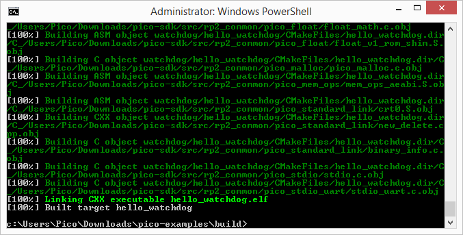  
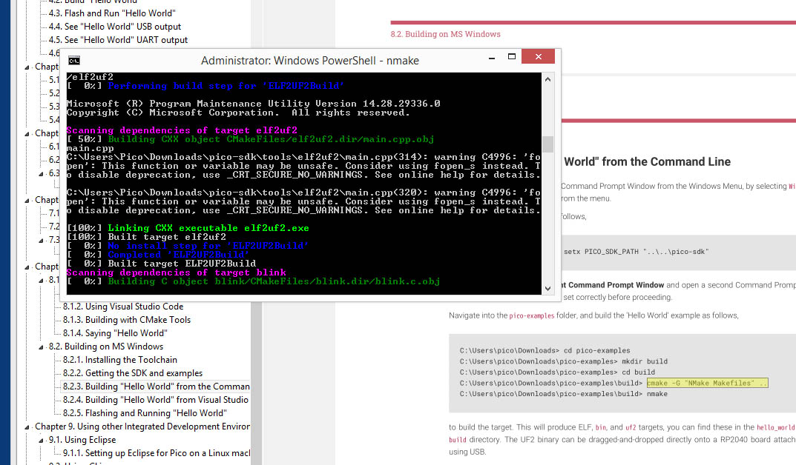 
<br>
  
1. [**Install ARM GCC Compiler**](https://developer.arm.com/tools-and-software/open-source-software/developer-tools/gnu-toolchain/gnu-rm/downloads). 
<br>Download: [**gcc-arm-none-eabi-10-2020-q4-major-win32.exe**] 
<br>Tick the box to register the PATH to the environment variable.
 
2. [**Install CMake**](https://cmake.org/download/)
<br>Download: [**cmake-3.19.4-win32-x86.msi**]
<br>Add CMake to the system PATH for all users.

3. [**Install Git**](https://git-scm.com/download/win)
<br>Download: [**Git-2.30.1-32-bit.exe**]
<br>Select the default editor.
<br>Check the box to allow Git to be used from third-party tools.
<br>Check the box for "Checkout as-is, Commit as-is".
<br>Check the box for "Use Windows default console window".
<br>Check the box for "Enable experimental support for pseudo consoles".

4. Install Pico SDK and examples
<br>Make a code folder such as **C:\Users\Pico\Downloads** (or to prevent admin prompts use C:\Pico\Downloads)
<br>From an admin prompt inside C:\Users\Pico\Downloads:
```
git clone -b master https://github.com/raspberrypi/pico-sdk.git
cd pico-sdk
git submodule update --init
cd ..
git clone -b master https://github.com/raspberrypi/pico-examples.git
```

5. [**Install Build Tools for Visual Studio**](https://visualstudio.microsoft.com/downloads/#build-tools-for-visual-studio-2019)
<br>Download: [**vs_buildtools__1437720386.1612324122.exe**]
<br> During the  install select the C++ build tools only - this will download between 1 and 2 GB new install files.

6. [**Install Visual Studio Code**](https://code.visualstudio.com/Download)
<br>Download: [**VSCodeUserSetup-ia32-1.53.2.exe**]
<br>Install the extension CMake Tools from within VSCode and then select CMake Tools configuration:
<br>Cmake: Configure Environment and click on Add and then configure **PICO_SDK_PATH** as **C:\Users\Pico\Downloads\pico-sdk**
<br>Cmake: Generator and configure as **NMake Makefiles**

7. Open a Developer Command Prompt Window (Visual Studio Shell) - run it as administrator from C:\Users\Pico\Downloads>
```
setx PICO_SDK_PATH "C:\Users\Pico\Downloads\pico-sdk"
```
Close your current Command Prompt Window and re-open again as administrator from C:\Users\Pico\Downloads>
```
cd pico-examples
mkdir build
cd build
cmake -G "NMake Makefiles" ..
nmake
```
This will create the build directory and build all the examples projects. This will produce ELF, bin, and uf2 targets, you can find these in the newly created build directories. Delete or move the entire build folder somewhere else for the next step which will use VSCode to build these directories.

8. Again open a Developer Command Prompt Window (Visual Studio Shell) - run it as administrator.
<br>Then move to the root c:\ and start VSCode from the shell with "code": i.e. type "cd C:\\" and then "code".
<br>Click on "Open Folder" and navigate to pico-examples. Let it configure the project, and then select "GCC for arm-none-eabi" for the compiler.
<br>Click on the "Build" button (with a cog wheel) in the blue bottom bar of the window. This will create the build directory and run CMake and build all the examples projects. This will produce ELF, bin, hex, and uf2 targets, in the newly created build directories. To select just one directory to build click on the [all] next to build and type in for example blink in the search box and press enter. Only the blink folder will then be built. The UF2 binaries can be copied onto a Pico board attached using USB when in mass storage mode. Building a modified blink program is discussed extensively in [**Part 3 here**](https://www.element14.com/community/people/neilk/blog/2021/01/29/adventures-with-the-raspberry-pi-pico-part-3).

<p align="left">
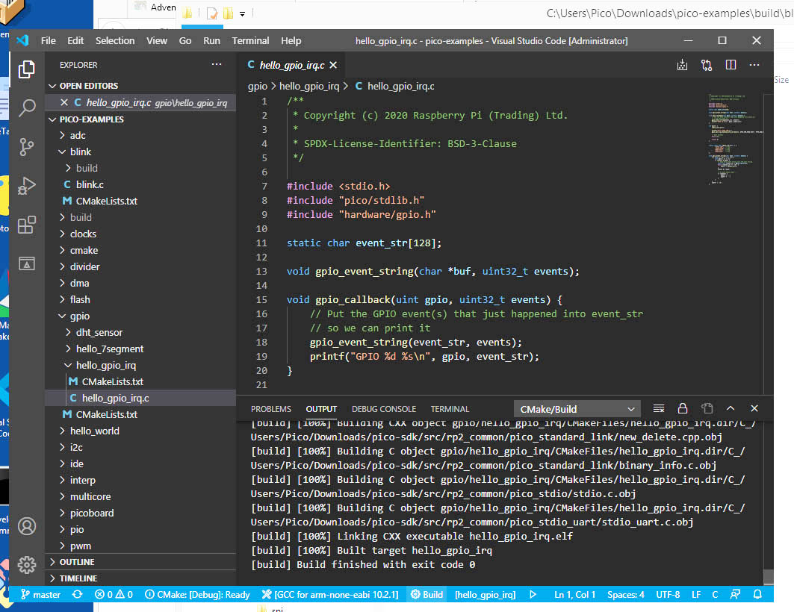  
<br>
<p align="left">
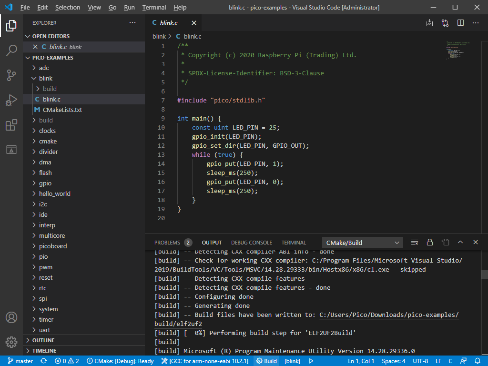
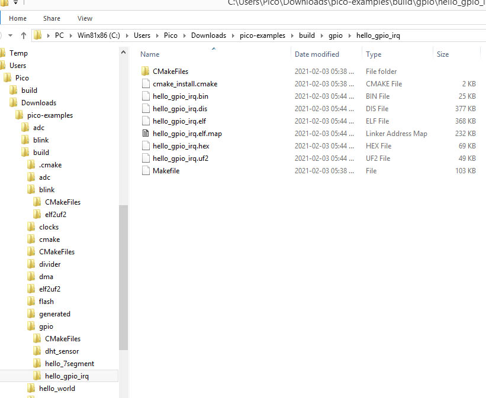   
<br>


### 4. Installing the Raspberry Pi Pico under Windows 8.1 and 10

Windows 10 (version 20H2),  installs the necessary COM-Port driver [**usbser.sys**](images/win10Pico2.jpg) automatically - with a new USB Serial device as COM port number x (refer to the four images [**win10Pico1**](images/win10Pico1.jpg) to [**win10Pico4**](images/win10Pico4.jpg) in the images subfolder). Unexpectedly, Windows 8.1 (32 and 64 bit) seems to be unable to find a suitable serial driver for the RPi Pico MCU, and may show it as an unknown device Board CDC (yellow exclamation mark), in the windows device manager. Note that when the Pico is running a non-micropython (i.e. CMake SDK), program there is usually [**no serial device present**](https://www.raspberrypi.org/forums/viewtopic.php?f=145&t=302359) when the Pico is not in Mass Storage mode.

Trying to install the [**modified windows 7 atmel_devices_cdc.inf driver**](pico-serial.inf) as described here: [**Windows 7 and XP Serial Port Drivers**](https://www.raspberrypi.org/forums/viewtopic.php?f=146&t=300053), is unsuccessful for Windows 8.1 64-bit, as the driver is unsigned, but worked well for Windows 8.1 32-bit as shown below:

<p align="left">
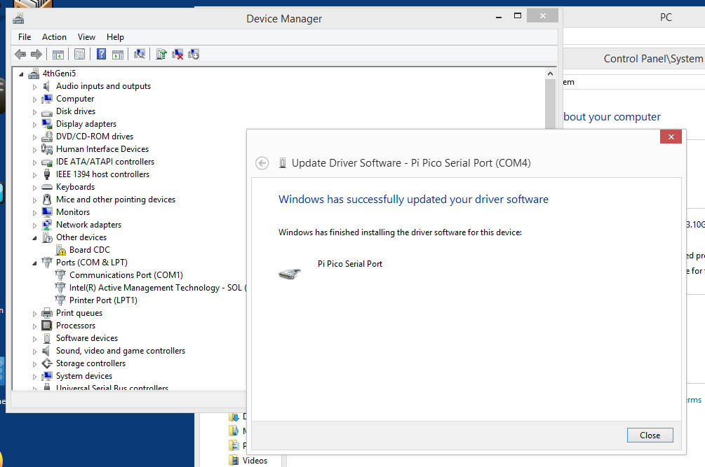  
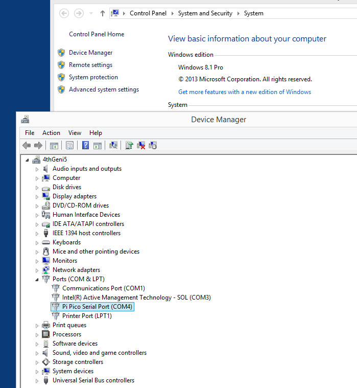 
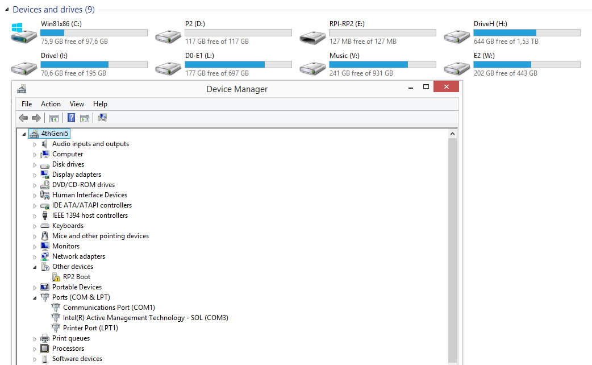 
<br>

[**Another solution is presented here**](https://picockpit.com/raspberry-pi/raspberry-pi-pico-and-micropython-on-windows/), by creating a generic serial driver using the [**Akeo Zadig USB Tool**](https://zadig.akeo.ie/). This installs the Pico as a generic USB serial CDC device. As shown below, its use is a simple two step procedure: Plug in the Pico, then select the Board CDC (Interface 0) and the USB Serial (CDC) in the other field, and lastly install the driver:
<br>
<p align="left">
  
<br>

The result is a new com port (6 in this case) in the device manager:
<br>
<p align="left">
  
<br>

After a reset of the Pico to a mass storage device, to be used for uploading of the .uf2 firmware, is done as shown below:
<br>
<p align="left">
  
<br>
