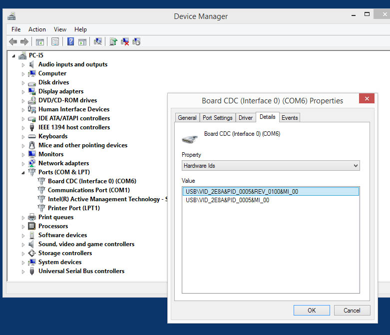
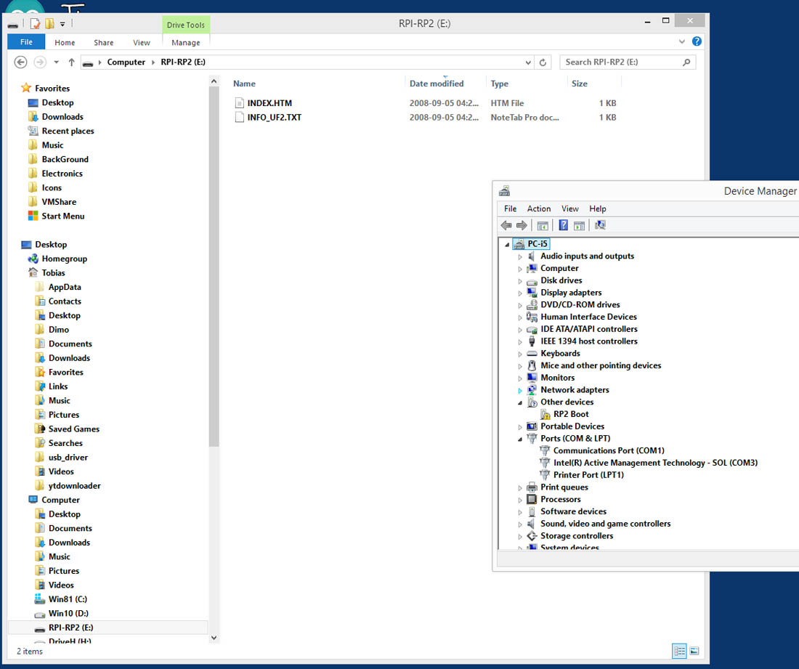
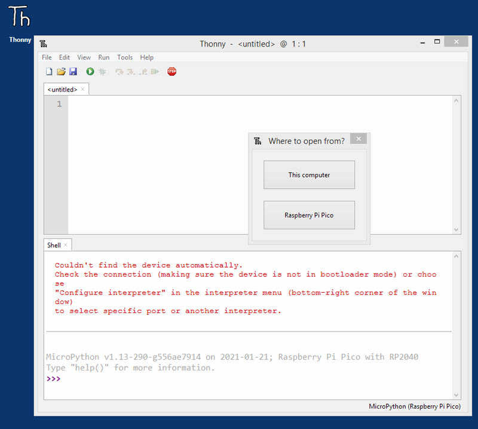
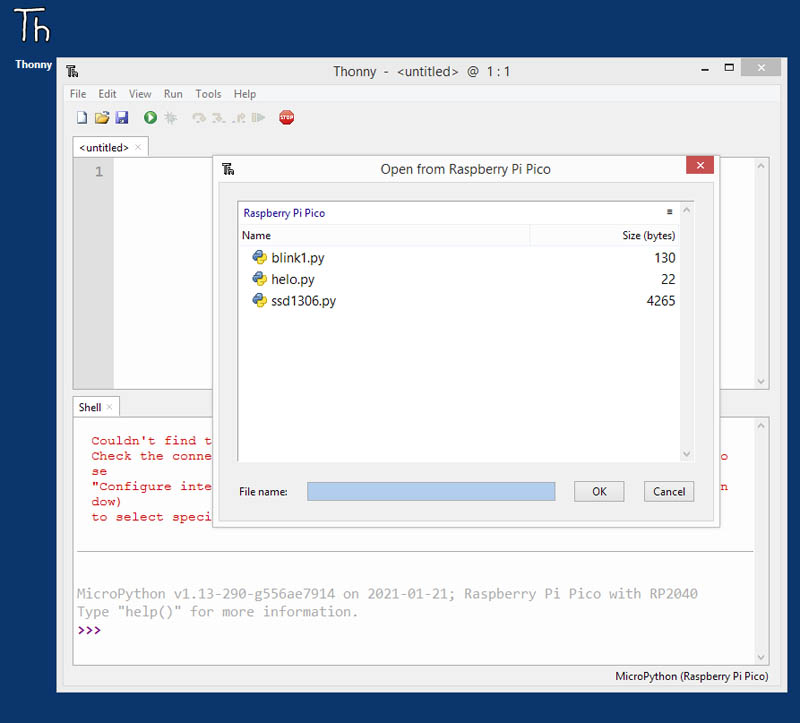

# Pico MCU from Raspberry Pi
There are two main approaches currently for programming the RPi Pico - using a python interpreter installed on the Pico as firmware (for example Micropython (or Adafruit's Circuitpython), or using a C++ based SDK. Currently I am still experimentimng with the latter, but I am satisfied that the python programming tool-chain works well under both of the main Raspberry Pi Os flavours (64 bit and kernel 5.10, and 32 bit with kernel 5.4).

This is then a short discussion on how to setup and use the micropython toolchain under windows 8.1. 

### Installing the Raspberry Pi Pico under Windows 10 and Windows 8.1

Windows 10 (version 20H2),  installs the necessary COM-Port driver (usbser.inf) automatically - with a new USB Serial device as COM port number x. Unfortunately, Windows 8.1 (64 bit) is unable to find a suitable serial driver for the RPi Pico, and show the serial device with a yellow exclamation mark in the windows device manager. 

Trying to install the modified windows 7 atmel_devices_cdc.inf driver as described here: [**Windows 7 and XP Serial Port Drivers**](https://www.raspberrypi.org/forums/viewtopic.php?f=146&t=300053), is also unsuccessful as the driver is unsigned. 

[**Another solution is presented here**](https://picockpit.com/raspberry-pi/raspberry-pi-pico-and-micropython-on-windows/), by creating a generic serial driver using the [**Akeo Zadig USB Tool**](https://zadig.akeo.ie/). This installs the Pico as a generic USB serial CDC device. As shown below, its use is a simple two step procedure: Plug in the Pico, then select the Board CDC (Interface 0) and the USB Serial (CDC) in the other field, and lastly install the driver:
 

  
 

The result is a new com port (6 in this case) in the device manager:
 

  
 

After a reset of the Pico to a mass storage device, to be used for uploading of the .uf2 firmware, is done as shown below:
 

  
 

### Installing Micropython and the Thonny Python IDE, for the Raspberry Pi Pico under Windows 8.1

A reset button was connected between the RPi Pico pin 30 (RUN) and pin 28 (GND) as shown below - this avoids the requirement of a a disconnection of the USB cable to set the Pico in boot-select load mode. 
 

  
 

After the Pico is plugged into a windows 8.1 USB port, press and hold both the onboard Boot-Select button and the (external) Reset button, and then first release the reset button followed by the bootsel button. A new storage drive RPI-RP2 will then be visible. Drag the most current Pico Micropython firmware (pico_micropython_20210121.uf2), to this drive which will then reboot the Pico and it will re-appear as a COM device.

Keep the Pico plugged in as a COM device and then install Thonny using its default settings (i.e. as standard, and using the included Python 3.x bundle and to the C:\Users\%User%\AppData\Local\Programs\Thonny, location. Open Thonny, and select at the bottom right the Pico Micropython interpreter, Thonny will then connect to the Pico as shown below:
 

  
 

Open the File menu and all the python files currently on the Pico is shown:
 

  
 

In this case small OLED (128x64 SSD1306) test program [**ssd1306.py**](ssd1306.py), which is in part based on [**this Github**](https://github.com/blippy/rpi/tree/master/1306 ), and [**this discussion**](https://mcturra2000.wordpress.com/2021/01/25/raspberrypi-pico-working-oled/). 

For convenience the SSD1306 driver written as a sub-class of the Micropython framebuffer object as discussed [**here**](http://docs.micropython.org/en/latest/library/framebuf.html#constructors).

The connection between the OLED and the Pico is: 

| OLED | GND | VDD | SCK | SDA |
|:-----|:----|:----|:----|:----|
| PICO | GND | 3V3 | GP5 | GP4 |

 

  
 
  
