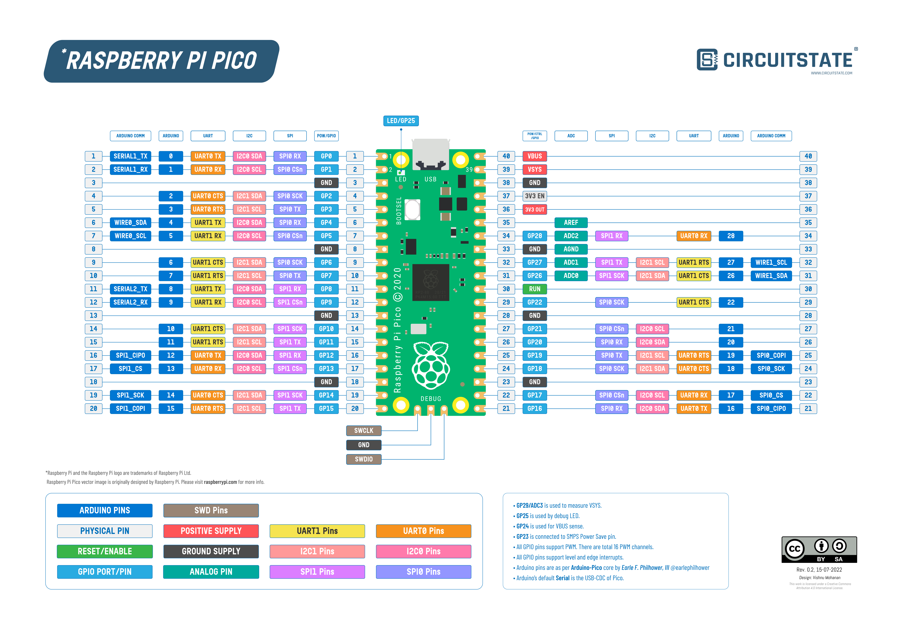
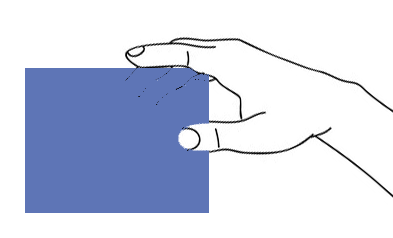
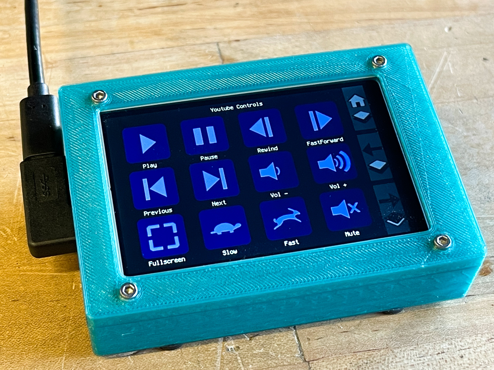

# Pico MCU from Raspberry Pi

<p align="left">
 
</p>

The [**RPi Pico**](https://www.raspberrypi.org/products/raspberry-pi-pico/) is programmed as:

1. **Touch LCD Macropad** - for details see below.
2. [**VS1053 SDCard SPI MP3 music player**](https://github.com/TobiasVanDyk/Pico-MCU-from-Raspberry-Pi/tree/main/Vs1053Pico)
3. [**i2s Audio-USB DAC**](https://github.com/TobiasVanDyk/Pico-MCU-from-Raspberry-Pi/tree/main/DacPico) Pimoroni (PCM5100A) and Waveshare (PCM5101A)
4. [**LCD ST7789 240x135 SPI Pico connector display driver**](https://github.com/TobiasVanDyk/Pico-MCU-from-Raspberry-Pi/tree/main/LCDst7789Pico)
5. [**OLED SSD1306 i2c display driver**](https://github.com/TobiasVanDyk/Pico-MCU-from-Raspberry-Pi/tree/main/OledPico)
6. [**RP2040Zero**](https://github.com/TobiasVanDyk/Pico-MCU-from-Raspberry-Pi/tree/main/RP2040ZeroPico) Waveshare Mini Pico Neopixel Demo
7. For the RP2040 RPi Pico and PSRAM refer to the [**second paragraph here**](https://github.com/TobiasVanDyk/PSRAM-Applications).

The [**RPi Pico**](https://www.raspberrypi.org/products/raspberry-pi-pico/) is used as a **Touch LCD Macropad** with 72 + 99 macrokeys, each of which can be chained 10x, and more than 50 different pages and layouts for actions such as Media-keys (Volume Mute Play-Stop Next-Previous Bass-Treble), inserting special and math-symbols, a Restart-Shutdown Timer and Time(Clock) Config, Timer-and-Time-executed repeat-and-oneshot macros, a macro composition and linking editor, and a Mouse-button, Scoll-wheel and cursor movement keypad, and an enhanced 3 page numberpad. 

 In addition it is [**configured to display sensor data from a PC**](https://github.com/TobiasVanDyk/Pico-MCU-from-Raspberry-Pi/tree/main//MacropadPCSensorData) using [**HWInfo's gadget registry data**](https://github.com/Timthreetwelve/HWiNFO-VSB-Viewer) sent to the macropad via a [**powershell script**](https://github.com/TobiasVanDyk/Pico-MCU-from-Raspberry-Pi/blob/main/MacropadPCSensorData/PowerShellSession.txt) - note that the sensor data is accessed directly and not using the VSB Viewer.  

 It is also [**configured to display music playing from Foobar2000**](https://github.com/TobiasVanDyk/Pico-MCU-from-Raspberry-Pi/tree/main//MacropadFoobarPlaying) using the Now Playing Simple foobar2000 plugin, which is sent to the macropad via a [**powershell script**](https://github.com/TobiasVanDyk/Pico-MCU-from-Raspberry-Pi/blob/main/MacropadFoobarPlaying/PowerShellSession.txt).

 [**Date Time Display**](https://github.com/TobiasVanDyk/Pico-MCU-from-Raspberry-Pi/tree/main/SetDateTime) This is an alternative Date Time which is only displayed, and not used to set the Pico system time-date. The procedure is explained in detail in the SetDateTime section.

 The Touch LCD is used more conveniently when placed upright rather than lying flat, and then using your thumb-tip to press the 5 option pads, and the larger key pads. (The single-touch characteristic of resistive touch overlays is in this case an essential bonus.) Place one or two fingers on top of the LCD to stabilise it when using your thumb to press the keys. Usability guidelines for touch macro pads are difficult to find, but [**these Material Design Layout Guidelines**](https://m2.material.io/design/layout/understanding-layout.html#layout-anatomy) are in part, applicable. The difference in clarity between the TFT LCD (the Arduino-type 4"), and the other three IPS type LCDs (3.5" and 2.8"), are strikingly obvious, and the latter three are preferred even though the larger 4" LCD panel is easier to use.

1. [**ILI9486 3.5" 480x320 SPI Raspberry Pi connector Touch Macro-keys LCD**](https://github.com/TobiasVanDyk/Pico-MCU-from-Raspberry-Pi/tree/main/TouchLCDili9486RPi)
2. [**ILI9486 4" 480x320 SPI Arduino Uno connector Touch Macro-keys LCD**](https://github.com/TobiasVanDyk/Pico-MCU-from-Raspberry-Pi/tree/main/TouchLCDili9486Pico)
3. [**ST7789 2.8" 320x240 SPI Pico connector Touch Macro-keys LCD**](https://github.com/TobiasVanDyk/Pico-MCU-from-Raspberry-Pi/tree/main/TouchLCDst7789Pico)
4. [**ILI9488 3.5" 480x320 SPI Pico connector Touch Macro-keys LCD**](https://github.com/TobiasVanDyk/Pico-MCU-from-Raspberry-Pi/tree/main/TouchLCDili9488Pico)

**Adafruit** has made a stunningly useful and beautiful [**Touch Desk**() which shares a similar layout approach to what I used - their design dates back to early 2021. 

<p align="left">
 
 

</p>

### Other Recent Related Topics
* May 2023 [**How to set up Pi Pico (W) 1.50 SDK on Windows 10x64**](Install-Pico-SDK-in-Windows10x64-May-2023.pdf), using current (May 2023) versions of all components. 
* June 2022 [**Tiny PCM5102A USB Audio PicoDSP board**](https://github.com/DatanoiseTV/PicoDSP-Hardware)
* Combine your Pi400 and the RPi Pico - [**Pi 400 Pico Plate**](https://github.com/Wren6991/Pi400-Pico-Plate).

**Intellikeys:** Some the simpler IntelliKeys layouts will be included in the future such as [**this**](IntelliKeys/Arrows_Classic_overlay.jpg) or [**this**](IntelliKeys/Numbers_Classic_overlay.jpg) - as explained [**here**](IntelliKeys/IntelliKeysIntelliTools.pdf) ([**Spectronics source last updated in 2000**](https://www.spectronics.com.au/article/intellikeys-and-intellitools-programs-solutions-for-everyone)). Also refer to the [**original 1992 article**](IntelliKeys/IntelliKeys-the-Smart-Keyboard.pdf) - Source: Johns Hopkins APL Technical Digest, Volume 13, Number 4 (1992). Also see the [**new initiative by Adafruit**](https://github.com/adafruit/Adafruit_IntelliKeys).

  How to do a [**well known duckyScript example**](notepad-hello-world.png) - Open notepad, type hello and increase the text size 3 times - [**duckyScript**](https://github.com/dekuNukem/duckyPad/blob/master/duckyscript_info.md) needs about 80-90 key-presses as does the example below.

``` 
Change to Layout L2. Press the [k] pad to open the macro editor.

Step 1: Assign the open run command to key [M1] - Gui + "r"
Select destination macro M 01 - press [Dst] then [Num] 
Press [NXT] press [GUI] press [ADD] press [NXT] press [pqr]3x press [ADD] press [EXE] 
press [Up] to save the macro - in shorter form from now on: 
[Dst][Num][NXT][GUI][ADD][NXT][pqr]3x[ADD][EXE][Up]

Step 2: Assign type notepad + Enter to key [M2] - "notepad" + Enter
Select destination macro M 02 - press [Num]
[Num][NXT][mno]2x[ADD][mno]3x[ADD][stu]2x[ADD][def]2x[ADD][pqr][ADD][abc][ADD][def][ADD]
[NXT]4x[CRF][ADD][EXE][Up]

Step 3: Assign type hello to key [M3] - "hello"
Select destination macro M 03 - press [Num]
[Num][NXT][ghi]2x[ADD][def]2x[ADD][jkl]3x[ADD][jkl]3x[ADD][def]2x[ADD][EXE][Up]

Step 4: Assign increase text size to key [M4] - Control + "+"
Select destination macro M 04 - press [Num]
[Num][NXT][CTR][ADD][NXT]3x[9+-]2x[ADD][EXE][Up]

Exit the Macro editor (press the [k] pad), then test all four macro keys [M1] to [M4] by 
pressing them in sequence. It should open notepad type hello and increase the text size once

Step 5: Link all four macros to key [M1] (or any other key):
Enter the macro keyboard and select M 01 as the source macro (press [Src] then [Num] until 
M 01 shows and select M 02 as the destination macro - press [Dst] then [Num] until M 02 shows

Then press [Lnk] - keys [M1] and [M2] are now linked - when you press [M1] it will open the 
run dialog and then open notepad. Then also add macro M 03 to the link list - press [Num] until
it shows M 03 as the destination (the source macro should still be M 01) and press [Lnk] - Key
[M1] will now run notepad and type "hello". Now also add macro 04 - press [Num] for destination
macro M 04 then press [Lnk] - pressing key [M1] will now run notepad and type "hello" and 
increase the text size by one. 

Press [Lnk] again - pressing key [M1] will now run notepad and type "hello" and increase the 
text size by two. Press [Lnk] again -pressing key [M1] will now run notepad and type "hello"
and increase the text size by three.

Key [M1] is now linked to keys [M2][M3] and 3x[M4] - note that you can also link key [M1] to 
macro files instead of macro keys.
``` 

<p align="left">
 
  
 
 
</p>
 
<p align="left">
 
 
 
 
 
</p>

<p align="left">
 
 
 
 
 
</p>

 Note a suggestion for possibly [**better file/folder operations**](Better-File-Operations.txt) in [**Windows 11**](https://answers.microsoft.com/en-us/windows/forum/all/windows-11-file-explorer-right-click-menu-was/abed6378-4c45-4c1c-9cb1-fa6097ca4253?page=1) amongst the task support, familiarity, and other usability problems, in Windows 11 when compared to Windows 10.


