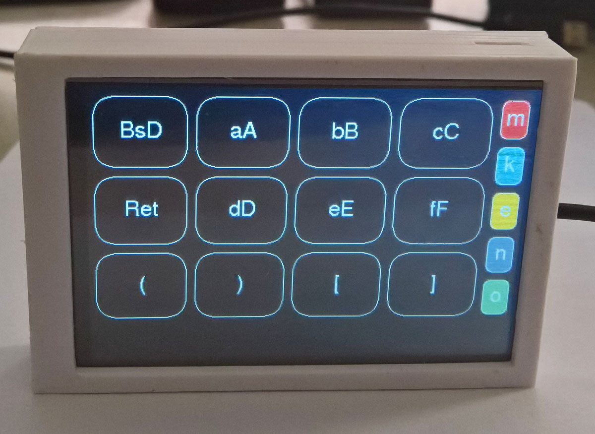
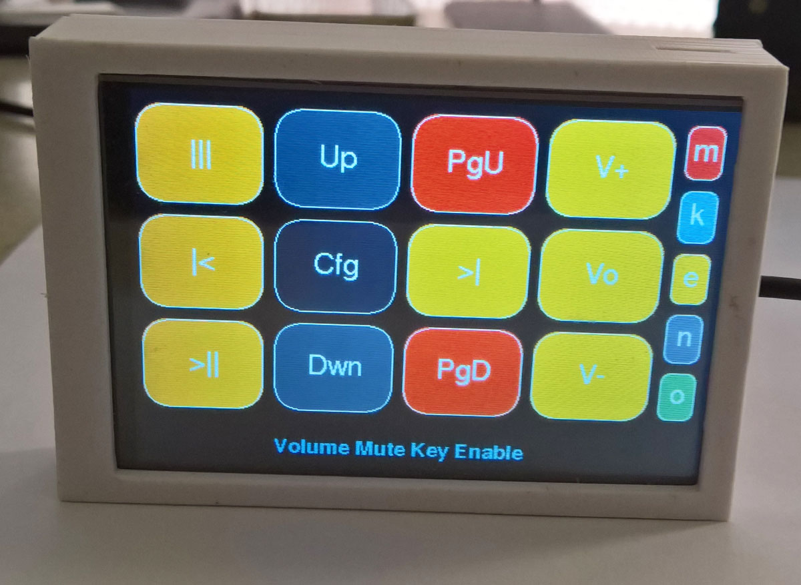

# Pico MCU from Raspberry Pi

 
 
 
 
 
 

 
 
 
 
 
 

The [**RPi Pico**](https://www.raspberrypi.org/products/raspberry-pi-pico/) is programmed as:
1. [**ILI9486 3.5" 480x320 SPI Raspberry Pi connector Touch Macro-keys LCD**](https://github.com/TobiasVanDyk/Pico-MCU-from-Raspberry-Pi/tree/main/TouchLCDili9486RPi)
2. [**ILI9486 4" 480x320 SPI Arduino Uno connector Touch Macro-keys LCD**](https://github.com/TobiasVanDyk/Pico-MCU-from-Raspberry-Pi/tree/main/TouchLCDili9486Pico)
3. [**ST7789 2.8" 320x240 SPI Pico connector Touch Macro-keys LCD**](https://github.com/TobiasVanDyk/Pico-MCU-from-Raspberry-Pi/tree/main/TouchLCDst7789Pico)
4. [**ILI9488 3.5" 480x320 SPI Pico connector Touch Macro-keys LCD**](https://github.com/TobiasVanDyk/Pico-MCU-from-Raspberry-Pi/tree/main/TouchLCDili9488Pico)

 
 
 

6. [**LCD ST7789 240x135 SPI Pico connector display driver**](https://github.com/TobiasVanDyk/Pico-MCU-from-Raspberry-Pi/tree/main/LCDst7789Pico)
7. [**VS1053 SDCard SPI MP3 music player**](https://github.com/TobiasVanDyk/Pico-MCU-from-Raspberry-Pi/tree/main/Vs1053Pico)
8. [**RP2040Zero**](https://github.com/TobiasVanDyk/Pico-MCU-from-Raspberry-Pi/tree/main/RP2040ZeroPico) Waveshare Mini Pico Neopixel Demo
9. [**i2s Audio-USB DAC**](https://github.com/TobiasVanDyk/Pico-MCU-from-Raspberry-Pi/tree/main/DacPico) Pimoroni (PCM5100A) and Waveshare (PCM5101A)
10. [**OLED SSD1306 i2c display driver**](https://github.com/TobiasVanDyk/Pico-MCU-from-Raspberry-Pi/tree/main/OledPico)

### Other Recent Related Topics
* [**How to set up Pi Pico (W) 1.40 SDK on Windows 10x64**](Install-PicoSDK-in-Windows10x64-July2022.pdf), using current (July 2022) versions of all components. 
* [**Pico W**](https://www.raspberrypi.com/news/raspberry-pi-pico-w-your-6-iot-platform/) and later [**Bluetooth**](https://forums.raspberrypi.com/viewtopic.php?t=336764#p2015678) as well. [**Pico SDK version 1.40 updated for Pico W**](https://github.com/raspberrypi/pico-sdk/releases/tag/1.4.0), [**Pico Examples updated for Pico W**](https://github.com/raspberrypi/pico-examples) 30 June 2022.
* [**Pico SDK version 1.3.1 has been released**](https://github.com/raspberrypi/pico-sdk/releases/tag/1.3.1) 19 May 2022.
* June 2022 [**Tiny PCM5102A USB Audio PicoDSP board**](https://github.com/DatanoiseTV/PicoDSP-Hardware)
* Combine your Pi400 and the RPi Pico - [**Pi 400 Pico Plate**](https://github.com/Wren6991/Pi400-Pico-Plate).
 

