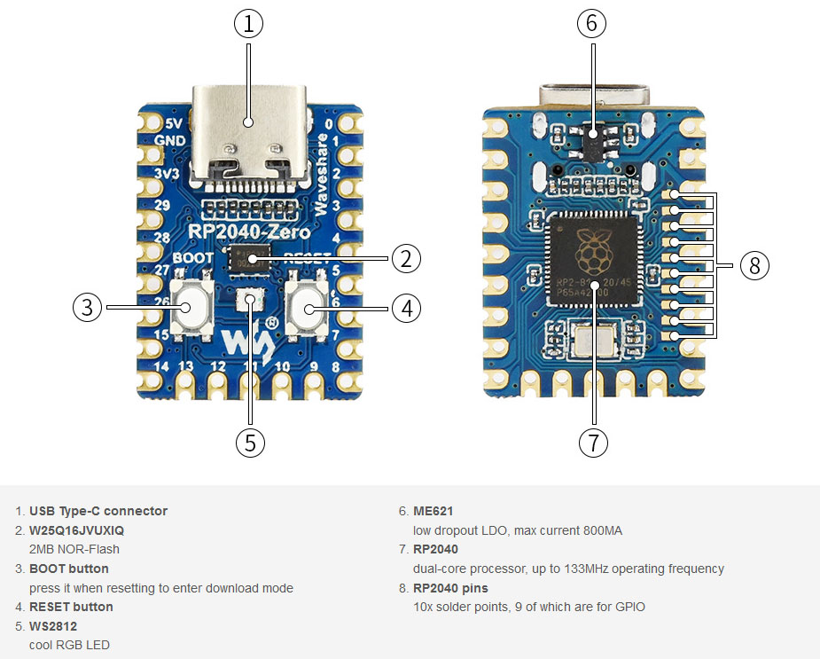
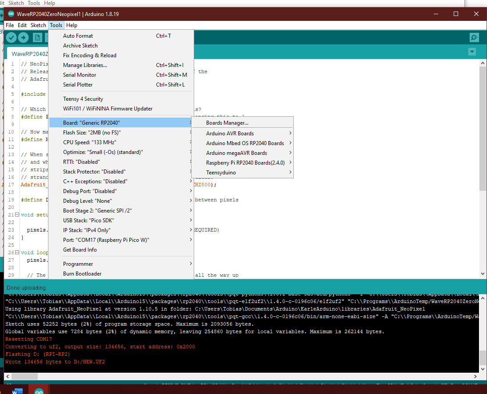
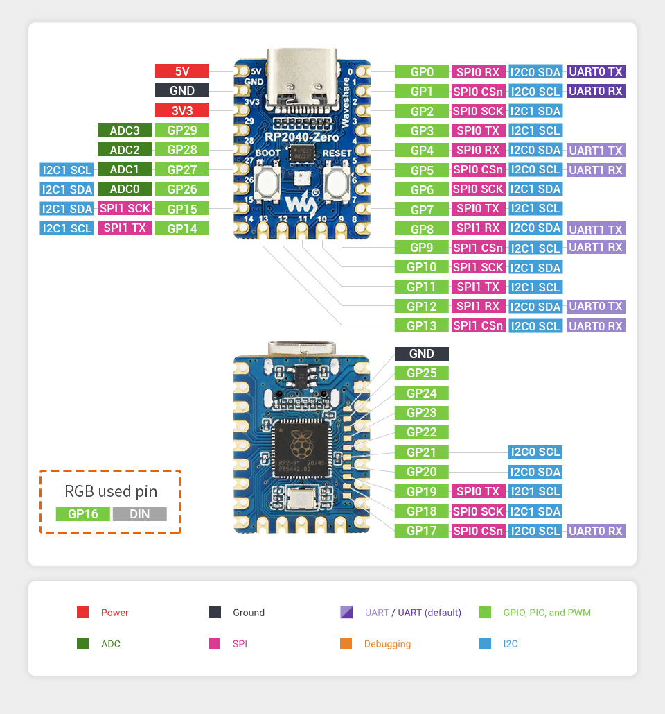

### Waveshare RP2040-Zero

This is a [**Pico-like MCU Board**](https://www.waveshare.com/rp2040-zero.htm) based on the Raspberry Pi MCU RP2040. [**Connections**](connections.jpg) are as shown below, and more details are [**here**](https://www.waveshare.com/wiki/RP2040-Zero). WaveRP2040ZeroNeopixel1.ino is a Neopixel demo for this board based on the Adafruit simple example. 

```
RP2040 microcontroller chip designed by Raspberry Pi in the United Kingdom
Dual-core Arm Cortex M0+ processor, flexible clock running up to 133 MHz
264KB of SRAM, and 2MB of on-board Flash memory
USB-C connector, keeps it up to date, easier to use
Castellated module allows soldering direct to carrier boards
USB 1.1 with device and host support
Low-power sleep and dormant modes
Drag-and-drop programming using mass storage over USB
29 × multi-function GPIO pins (20× via edge pinout, others via solder points)
2 × SPI, 2 × I2C, 2 × UART, 4 × 12-bit ADC, 16 × controllable PWM channels
Accurate clock and timer on-chip
Temperature sensor
Accelerated floating-point libraries on-chip
8 × Programmable I/O (PIO) state machines for custom peripheral support
```
<p align="left">
   
 
</p>

**The install order on Windows 10x64**
1. [**Arduino IDE**](https://www.arduino.cc/en/software) version 1.8.19.
2. [**Earlephilhower Aduino Pico port**](https://github.com/earlephilhower/arduino-pico/)
6. [**Adafruit Neopixel library**](https://github.com/adafruit/Adafruit_NeoPixel)

<p align="left">
   
</p>
