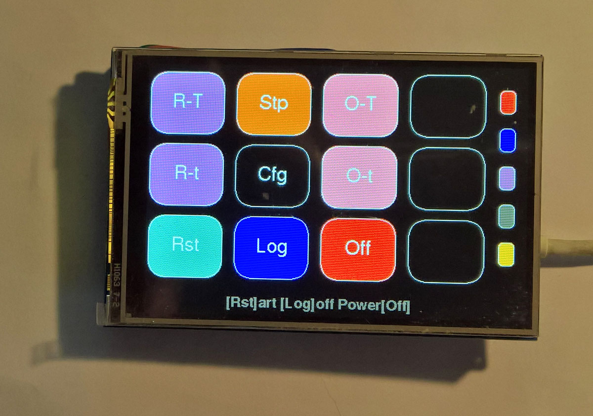
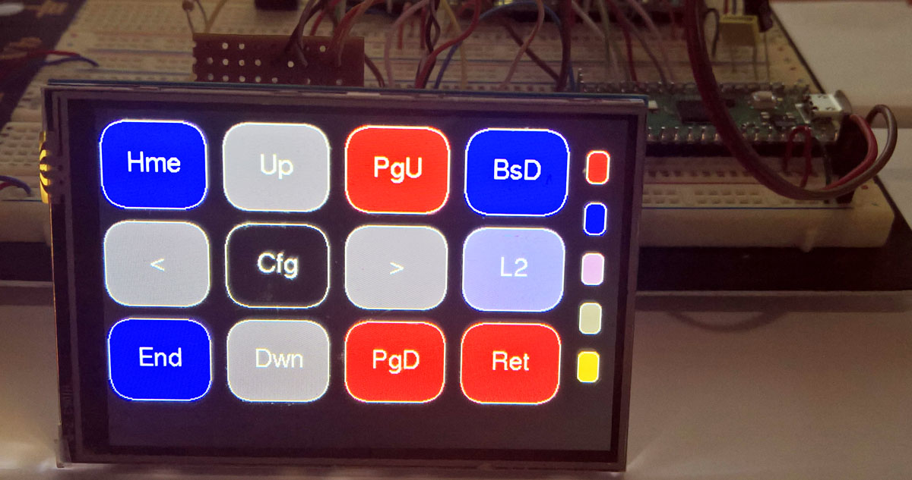
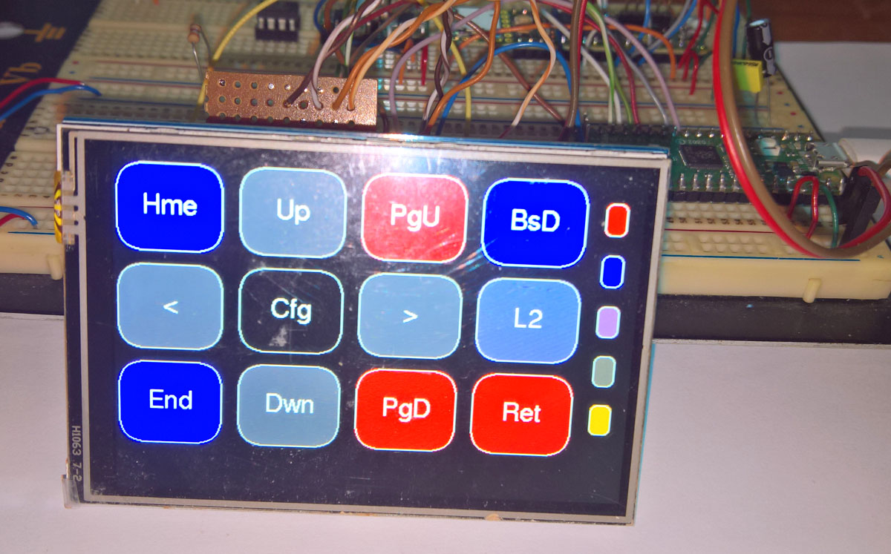

# Pico Volume and Macro Touch Keyboard 480x320 4 inch ILI9486

[**VolumeMacroPad**](VolumeMacroPad-LCDB-3.ino) is a combination of the [**Dustin Watts Pico Touch Macro Keyboard**](https://github.com/DustinWatts/Pico-Matrix-Touch-Keyboard), the [**AdafruitTinyUSB HID examples such as hid_composite.ino**](https://github.com/adafruit/Adafruit_TinyUSB_Arduino/blob/master/examples/HID/hid_composite/hid_composite.ino), and the [**Bodmer Keypad example**](https://github.com/Bodmer/TFT_eSPI/tree/master/examples) Keypad_480x320.ino. They were adapted for use on a  [**3.5inch Touch Display (LCD Type B) for a Raspberry Pi 480×320**](https://www.waveshare.com/3.5inch-rpi-lcd-b.htm) by replacing the PicoSDK USB stack with the Adafruit TinyUSB stack - this allowed the use of multimedia keys such as Volume Up-Down-Mute to be added to the standard keyboard touch buttons. 

Connections were made as in [**Interface-definition**](Interface-definition.txt), with 7 interface wires + ground and +5v - Raspberry Pi pins 18,19,21,22,23,24, and 26. The backlight can be PWM controlled with (GPIO18 Raspberry Pi Pin to GP13 Pico) if a [**bridge on the LCD is shorted**](images/BacklightControl1.png).

The stripboard build ended up being a bit of a kludge - calling it a prototype is being kind - but the lcd ips colours are really rich and vivid. The top of the Raspberry Pi connector comes off easily which reduces the height of the LCD panel to about 15 mm.

<p align="left">
 
 
 
</p>


<p align="left">
 
 
 
 
</p>


Specify the display and touch gpio in User_Setup.h (included [**here**](User_Setup.h)).


```

#define RPI_DISPLAY_TYPE // 20MHz maximum SPI works with waveshare serial to parallel displays

#define ILI9486_DRIVER
#define TFT_INVERSION_ON

#define TFT_BL   13            // LED back-light control pin
#define TFT_BACKLIGHT_ON HIGH  // Level to turn ON back-light (HIGH or LOW)

#define TFT_MISO 12
#define TFT_MOSI 11
#define TFT_SCLK 10
#define TFT_CS   9     // Chip select control pin
#define TFT_DC   8     // Data Command control pin
#define TFT_RST  15    // Reset pin (could connect to RST pin)

#define TOUCH_CS 16    // Chip select pin (T_CS) of touch screen

#define TFT_SPI_PORT 1 // Set to 0 if SPI0 pins are used, or 1 if spi1 pins used

#define SPI_FREQUENCY        24000000
#define SPI_TOUCH_FREQUENCY   2500000
#define SPI_READ_FREQUENCY   10000000

```
