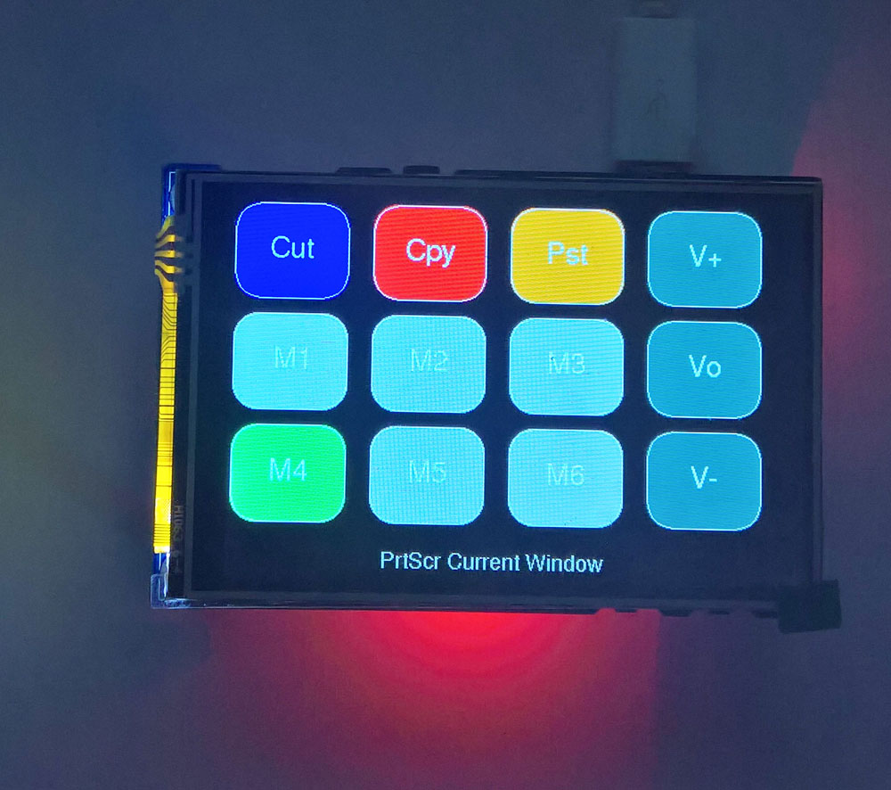
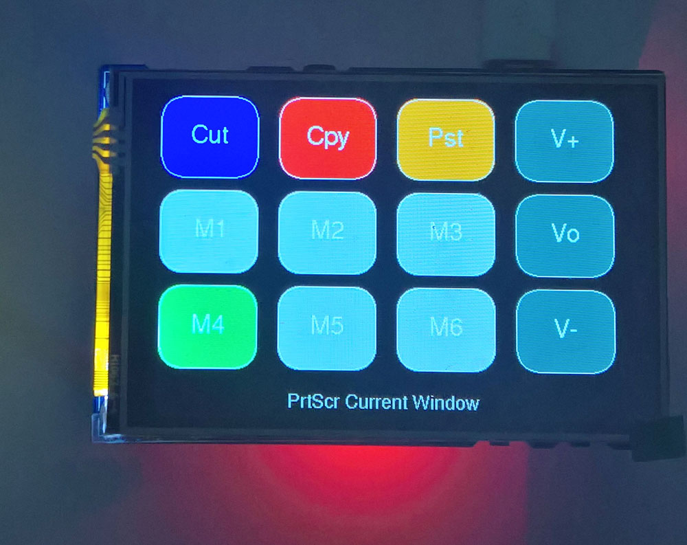
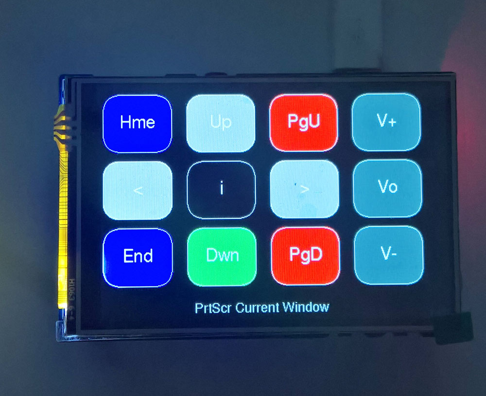
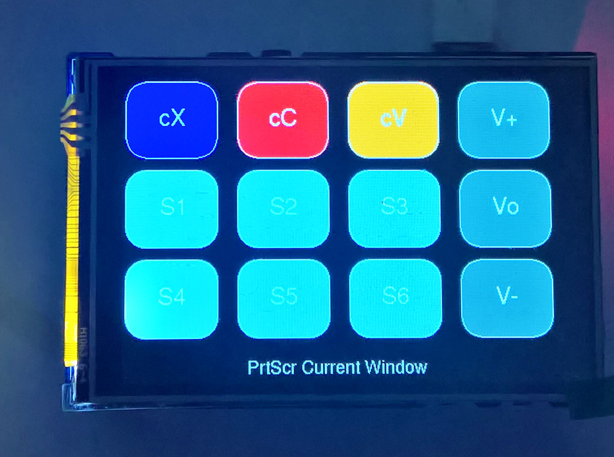

# Pico Volume and Macro Touch Keyboard 480x320

<p align="left">
   
 
 
</p>

Use the [**Waveshare Pico Evaluation board**](https://www.waveshare.com/pico-eval-board.htm) Pico-Evaluation-Board [**480x320 3.5 inch IPS LCD**](https://www.waveshare.com/wiki/Pico-Eval-Board), connected as shown [**here**](images/connections.jpg), and available [here](https://www.robotics.org.za/W20159) and [here](https://www.pishop.co.za/store/raspberry-pi-pico_0/overall-evaluation-board-for-raspberry-pi-pico). Alternatively use [**this**](https://www.waveshare.com/wiki/Pico-ResTouch-LCD-3.5) [**Waveshare Pico LCD combination module**](https://www.waveshare.com/pico-restouch-lcd-3.5.htm).

This has the following components: 
```
Second Micro-USB connector: CP2102 communication or battery recharge
CP2102 USB to UART converter
ETA6096 battery recharger, 1A recharging current, PH2.0 battery header for connecting 3.7V Li-po battery
SP0503 diode for protecting the chip from ESD
PCM5101A stereo audio DAC chip supports analog audio output to 3.5mm audio jack headphone interface
Micro SD card slot: using SDIO interface with faster access speed
W2812B RGB LED
Indicators PWR: power indicator, TXD: CP2102 UART TX, RXD: CP2102 UART RX
Passive buzzer with controllable sound frequency
Photoresistor converting light intensity to voltage
ICM20948 9-axis motion sensor, allows posture sensing
User-defined key, connects to GP2
Reset key for Pico reset
XPT2046 resistive touch controller
LSD0204 voltage level translator
ILI9488 LCD controller via 74HC4040, 74HC04D, 74HC4094
```

The [**Raspberry Pi Pico Touch Macro Keyboard by Dustin Watts**](https://github.com/DustinWatts/Pico-Matrix-Touch-Keyboard) - the leftmost picture below, can be used unchanged on this display, provided the TFT_eSPI LCD driver is configured as shown at the bottom below - the sketch code and uf2 file are included in here (TouchMacro1.ino and TouchMacro1.uf2). If the calibration colours are unclear check that #define TFT_INVERSION_ON in User_Setup.h has been uncommented. Remember to choose the PicoSDK as the USB stack. Refer to [**ArduinoboardSettings**](ArduinoboardSettings.jpg) for the Pico board settings in the Arduino IDE.

[**VolumeMacroPad.ino**](VolumeMacroPad20.ino) is a combination of the [**Dustin Watts Pico Touch Macro Keyboard**](https://github.com/DustinWatts/Pico-Matrix-Touch-Keyboard), the [**AdafruitTinyUSB HID examples such as hid_composite.ino**](https://github.com/adafruit/Adafruit_TinyUSB_Arduino/blob/master/examples/HID/hid_composite/hid_composite.ino), and the [**Bodmer Keypad example**](https://github.com/Bodmer/TFT_eSPI/tree/master/examples) Keypad_480x320.ino. It was adapted for use on a Waveshare evaluation board with an ILI9488 480x320 3.5 inch Touch LCD. It also replaced the PicoSDK USB stack with the Adafruit TinyUSB stack - this allowed consumer keys such as Volume Up-Down-Mute to be added to the standard keyboard (touch) keys. 

VolumeMacroPad includes the means to execute a number of Math symbols and Windows or Linux key macros - refer to the layouts in the diagram below. It sets the Pico LED (and shows a small green "C" or "N" or "S") on the LCD, to reflect the state of the Caps-Num-Scroll-lock keys, and adds control of the LCD backlight to dim the display if not used, or set the normal use brightness. It enables a re-calibration of the touch interface, and store it as a preset, and has four layout modes (L1 L2 L3 L4) and four layers A to D, - switch layouts by pressing [L1][L2][L3][L4] or change layers with the the Volume Mute [Vo] key when in Media Key mode. Switch Layers A/D via the Cfg key + ArrowLeft [A-D] key or the option [o] Pad. It also has a 4 page, 108 Math symbols keyboard, which send the standard Unicode symbol characters to the PC. This [**works on Linux Mint with LibreOffice**](images/Libreoffice1.jpg), as well as MSOffice, and use a superset of the key codes from [**Mathboard**](https://github.com/nup002/Mathboard) - refer to the content of **unicode_symbols.h** there. Note that you do not need additional software running on a Windows PC except MS Office.

Some of the layout, layer, keyboard, and configuration, modes are shown below in the pictures. The pictures shows a page from the Math Keyboard, and Layout 2 - configuration and navigation. Later pictures show the Caps-Num-Sroll-Lock key states as on as shown by the green C, N and S Letters. It is possible to send new text (or control character strings, up to 200 characters long (easily made longer in the program code), to be assigned to keys S1/T1 through to S24/T24 (or M1 - M12), via the Pico's serial USB - start each string with <1 to <6 followed by the string itself to be assigned to the keys - add a > at the end of the string. These strings are saved to the Pico's Flash memory using LittleFS. To enable the string update for layout 4 the screen must be in layout 4, for layout 3 it can be in layout 1, 2 or 3. (For the [M4] key in layout 1 use a <0 at the start of the string.) For each of the two layers A/B the upload will be to the layer that is current i.e. to keys S7 to S12 if layer B is current, and to S1 to S6 if layer A is current. A key auto-repeat that triggers after 500 milliseconds is also implemented - this can be used to instead of typing a character repeatedly, or changing the volume by just holding down the Volume Up/Down keys.

Other pictures below, shows the set of seven Media keys, and Layout 1 Layer A [M1] to [M6] programmable macro keys (Layer B would show the Mx keys as M7 to M12). The Volume Mute key is replaced by L1 to L4 in the Config Menu options. It enables faster layout 1 to 4 switching by disabling/enabling the Volume Mute action by pressing the Config and Home keys in sequence. Repeat the same sequence to enable Mute again. The label on the [Vo] key will change to indicate which layout is active L1, L2, L3, or L4. If PageUp is pressed after Config i.e. the [BsD]key, the VolumeUp and VolumeDown keys are replaced by a Delete/Backspace and an Enter key. Press [Cfg] + {PgU] again to switch back to the Volume Up and Down keys. If PageDown is pressed after Cfg the startup Layout is toggled between L1 and L2, i.e. the [S1S2] key. If End is pressed after the Cfg key all the text files and config settings are deleted from the Pico's Flash memory, and on restart a re-calibration is done. Note that to save the VolMute/L1-L2 and Vol+Vol-/Delete-Return choices on the Flash memory you have to press Cfg [Sav] key, once more after selecting these two options. This is not necessary for the L1/L2 startup selection. 

Press the small Green Pad on the Right to toggle the Media KeyPad on/off, press the small Red Pad to toggle the Number Keypad on/off, and press the small Blue Pad to toggle the Keyboard (5 sub-pages), on/off.

Using a terminal such as RealTerm it is possible to send non-ASCI characters and numbers instead of just text strings to the six keys labelled T1 to T6 - this may then perform various macro key actions - refer to the first picture in the second set of four images below. Other approaches considered included a decoder for encoded [**duckyscripts**](https://github-wiki-see.page/m/hak5darren/USB-Rubber-Ducky/wiki/Duckyscript), but directly programming these macros seems to be more efficient - refer to the built-in keyboard macro examples below. For example to open the windows snipping tool press open the macro keyboard and goto page 4 then press [GUI][ADD][SHF][ADD][NXT][s][ADD][EXE] - the snipping tool will open. This can then be saved to [M2] by pressing the [Up] button. 

Another way to save large text files or non-ASCII macro files directly in the LittleFS formatted Flash memory of the Pico is described [**here**](https://github.com/earlephilhower/arduino-pico-littlefs-plugin/blob/master/README.md) and [**here**](https://arduino-pico.readthedocs.io/en/latest/fs.html). You can therefore copy your files (ASCII text or non-ASCII macro files) using the names StrData1 or TtrData1 through to StrData12 or TtrData12 directly to the Pico Flash filesystem - see the picture below for a file list.

The keys labelled [Cut], [Cpy], and [Pst] are cut, copy, and paste actions, respectively, and execute the operating system agnostic Control + X, + C, and + V key operations. 

Other example macros are opening an admin UAC powershell [M2] (Note 1 and 4) or admin command prompt [M5]. [M1] is Alt + PrintSceen (Note 2). [M6] opens the Task Manager, and [M3] opens the Run dialog box. It will be easy to convert Layer 2 into a Mouse keys keypad - [**refer to this diagram**](https://github.com/TobiasVanDyk/Pico-MCU-from-Raspberry-Pi/blob/main/TouchLCDst7789Pico/Windows%20Keyboard%20Shortcuts/mouse-keys.jpg).

The keys M1-M24, S1-S24, T1-T24 can also be used to trigger [**AutoHotKey**](https://github.com/Lexikos/AutoHotkey_L) or [**AutoIt**](https://www.autoitscript.com/site/) macros, scripts and GUI-shells - but see Note 1 below.

* Note 1 - Because VolumeMacroPad is a trusted device (keyboard) it is able to bypass Windows UAC level 4.
* Note 2 - Some Mini-keyboards do not have a PrintScreen key.
* Note 3 - Microsoft Office Excel still has a functional use for the Scroll-lock.
* Note 4 - The UAC bypass is time sensitive and keydelay3 = 500 may have to be adjusted in the program.


``` 
-----------------------------------------------------------------------------------------------------------------------
Layout 1 - M Keys - [M1]-[M24] - Cycle through Layout 1 to 4 press [L1-L4] or [Vo] 
-----------------------------------------------------------------------------------------------------------------------
[Cut CtrlX] [Copy CtrlC] [Paste CtrlV] [VolUp Various]       [  Cut ] [  Cpy ] [  Pst ] [V+][ Var ] [A-B]
[ AltPScr ] [Adm Pshell] [    Run    ] [VolMute L1-L4]       [M1 M19] [M2 M20] [M3 M21] [Vo][L1-L4] [MST]
[SendText ] [  Adm CMD ] [  TaskMan  ] [VolDwn  Enter]       [M4 M22] [M5 M23] [M6 M24] [V-][ Ret ] [B-A]
         Caps          Num         Scroll                            C        N        S

[Various] 20 options for key 4 [Var] and keys 1,2,3 [cX Cut][cC Cpy][cV Pst] on the toprow:
  1 Delete       2 Backspace 3 Tab       4 AltTab      5 Insert 6 Esc   7 PScr   8 AltPScr      9 Return 10 Snipping 
 11 OnScrKeyBrd 12 NumLock  13 CapsLock 14 ScrollLock 15 Cut   16 Copy 17 Paste 18 TaskManager 19 Run    20 GuiX
           
Top row 3 keys cX-Cut, cC-Copy, cV-Paste: Programmable as x1, x2, x3 Layout 1, and x4, x5, x6 for Layout 3 and 4. 
Can use any of the [Various] actions for x1 - x6. Program as *xn*number n=1-6, number = 1-20

Note: The key M1-M24 macros listed above are default macros - use the macro editor to configure new macros or copy, 
rename and/or chain/link new or existing macros.

-----------------------------------------------------------------------------------------------------------------------
Layout 2 - Config - Cycle through Layout 1 to 4 press [L1-L4] or [Vo] 
-----------------------------------------------------------------------------------------------------------------------
[Hme  Stop  L1-L4] [UpArr BsDel] [PgeUp     DelRet] [VolUp Various]             [Hme] [Up ] [Pgu] [V+][Var]
[ArrL Prev    A-D] [Config Save] [ArrR Nxt MacrTim] [VolMute L1-L4]             [  <] [Cfg] [>  ] [Vo][L14]
[End  PlayP Media] [DwnArr POff] [PgeDwn StartL1L4] [VolDwn Return]             [End] [Dwn] [PgD] [V-][Ret]
Macro: Source Num   Target Num                                                  S-nn  T-nn      
                Caps           Num               Scroll                              C     N     S

Layout 2 (Config) has five additional small pad-buttons on the right side (from top to bottom):
[m] Math KeyPad on/off.
[k] Macro Composition Keypad on/off.
[e] Mouse Keypad on/off.
[n] Number Keypad on/off.
[o] Options Pad: Config Mode - Toggle Capslock and Numlock on/off in combinations
                 Macro Mode - Direct Mode On/Off (Blue "D" indicator).
                 NumPad Mode - Switch between 3 NumPad pages.
                 Media Mode  - Switch [Bass-Treble +/-] or [Cursor Up/Dwn + Page Up/Dwn] 

-----------------------------------------------------------------------------------------------------------------------
Layout 2 - Full Media Mode - Play Controls On - Volume Controls On - Tone Controls On 
-----------------------------------------------------------------------------------------------------------------------
[     Stop     ] [ Bass Up ] [ Treble Up ] [Volume Up  ]        [|||] [B+ ] [T+ ] [V+]
[Previous Track] [ Config  ] [ Next Track] [Volume Mute]        [ |<] [Cfg] [ >|] [Vo]
[  Play-Pause  ] [Bass Down] [Treble Down] [Volume Down]        [>||] [B- ] [T- ] [V-]
                                         
               Caps        Num          Scroll                       C     N     S  

Note: Bass and Treble Controls only works with SoundBlaster Audigy and X-Fi Audio Cards

The 5 Pads has the following functions in Layouts 1, 3, and 4 (M S T Keys):
[a][d]    Toggle Layers A B C or D with M1-M6->M19-M24, S1-S6->S19-S24, T1-T6->T19-T24
[m][s][t] Move to Keys M, S or T Layout Pages

-----------------------------------------------------------------------------------------------------------------------
Layout 3 - S Keys - [S1]-[S24] - Cycle through Layout 1 to 4 press [L1-L4] or [Vo] 
Layout 4 - T Keys - [T1]-[T24] - Cycle through Layout 1 to 4 press [L1-L4] or [Vo] 
-----------------------------------------------------------------------------------------------------------------------
[Cut Ctrl+X][Copy Ctrl+C][Paste Ctrl+V][VolUp DelBsTI]  [ cX  ] [ cC  ] [ cV  ] [V+][DB-TI][A-B]
[Macro 1/19][Macro 2/20 ][Macro 3/21  ][VolMute L1-L4]  [ST  1] [ST  2] [ST  3] [Vo][L1-L4][MST]
[Macro 4/22][Macro  5/23][Macro 6/24  ][VolMute Enter]  [ST 22] [ST 23] [ST 24] [V-][ Ret ][B-A]
          Caps          Num         Scroll                     C       N       S

-----------------------------------------------------------------------------------------------------------------------
Layouts 1, 3 and 4, four Layers A B C D each with six keys: A = M1-M6, S1-S6, T1-T6 to D = M19-M24, S19-S24, T19-T24
-----------------------------------------------------------------------------------------------------------------------
To cycle through the Layouts press press [L1-L4] (or VolumeMute [Vo] if active at the time). Also use the three Pads 
[m][s][t] to move to Layers [L1 L3 L4] and use the top or bottom pads [a][d] to move through the four layers a,b,c,d. 

Press Config Key (new set of config keys change colour):
1L4 [Home]     ] - VolumeMute -> L1, L2, L3, L4 - repeat to restore Vo
Var [ArrowUp]  ] - Select from 20 key actions (as below) for Right Upper Key. Will only show if Volume is disabled.
Vol [PageUp]   ] - Vol+ -> Delete and Vol- -> Enter - repeat to restore V+ V-
A-D [ArrowLeft]] - Layouts 1, 3, 4, change to Layer A B C or D
Med [End]      ] - Change Layout 2 to Media Controls Previous-Next-PlayPause-Stop
mCT [ArrowRight] - Macro Timer Trigger Repeat and Oneshot Countdown or Clock Timers
1S4 [PageDown]]] - Start with Layout 1 to Layout 4 on powerup - press [Cfg][1S4] repeatedly
Sav [Cfg]        - Info and File List to Serial Monitor and Text/Macro and Config files saved
ROf [ArrowDwn]   - Restart-PowerOff-Logoff - Bottom row [Rst][Log][Off] - cancel by pressing 
    [Cfg][ROf]   - Includes long or short Timer options as well and Countdown and Clock Timers

Select Key Actions for Top Row keys: Del Bks Tab aTb Ins Esc PrS aPr Ret Snp Osk Num Cap Scr Cut Cpy Pst Tsk Run wX

-----------------------------------------------------------------------------------------------------------------------
Mouse Keyboard: When in Layer 2 - press middle pad [u] to toggle Mouse KeyBoard on/off - these are mouse buttons, 
                scroll, and cursor movement keys:

[LBt] [Up ] [RBt]  [Sc+]         [Left-Button] [  Cursor-Up  ]  [ Right-Button ] [   Scroll-Up     ]
[ < ] [MBt] [ > ]  [L2x]         [Cursor-Left] [Middel-Button]  [ Cursor-Right ] [Double-Left-Click]
[Bck] [Dwn] [Fwd]  [Sc-]         [Back-Button] [ Cursor-Down ]  [Forward-Button] [  Scroll-Down    ]

Note that a Mouse Right-click can be also programmed as a Shift and F10.

-----------------------------------------------------------------------------------------------------------------------
Macro Composition Keyboard:

Keyboard Page 1          Page 2         Page 3              Page 4               Page 5
[abc][def][ghi][EXE]  [ABC]-[XY_]  [012][345][678]   [Lst][Ren][Rmv][Snd]   [ALT][SHF][CTR] 
[jkl][mno][pqr][NXT]   Uppercase   [9+-][/=*][*Cm]   [Snd][Cpy][Lnk][NXT]   [GUI][TEI][CRF] 
[stu][vwx][yz ][ADD]     Page 1    [Sym][Brc][Fnn]   [Src][Dst][Num][Sav]   [LHR][UED][UND]  
                                                      Snn Tnn
                                                   Source Target 
                                           Macro Selection: M01-M24 S01=S24 T01-T24 A01-A99
Page 1: [xy ] = x y space
Page 2: [XY_] = X Y underscore  Page 1 and 2 + Caplock reverse characters
Page 3: [Fnn] F1-F24  [Sym] 17 symbols 
        [Brc] 8 bracket symbols  
        [*Cm] Insert from 45* Star codes - do not press [ADD] if required press Number[ADD][EXE]

Page 4: Macro Tools                                 Page 5: Modifiers 
[Src] Macro Source M S T or A(ll)                   [ALT] = [ Alt-L ][  Alt-R ][ PrintScr] [EXE]
[Dst] Macro Target (Destination) M S T              [SHF] = [Shift-L][Shift-R ][ Delete  ] 
[Num] Macro Number M S T = 1-12 A = 1-99            [CTR] = [Contr-L][Contrl-R][BackSpace]  
[Cpy] Copy [Src][Num] to [Dst][Num] Macro           [GUI] = [ Win-L ][ Win-R  ][  NULL   ] [NXT]
[Rmv] Remove [Src][Num] Macro                       [TEI] = [  Tab  ][ Escape ][ Insert  ]  
[Ren] Rename current[Src][Num] Macro                [CRF] = [  C/R  ][   L/F  ][  Return ]   
[Lnk] Link [Src][Num] and [Dst][Num] Macro          [LHR] = [Arrow-L][  Home  ][ Arrow-R ] [ADD] 
      Then optionally assoc with [Src]NumDisplayed  [UED] = [ArrowUp][  End   ][Arrow-Dwn]  
[Lst] List first 8 bytes contents of source macro   [UND] = [PageUp ][ Numlock][ PageDwn ]
[Snd] Send Source Macro directly 
[Sav] Save Source Macro to Flash (overwrite if already saved)
[Tmr] Macro Timer options (One-shot or Repeat)

-----------------------------------------------------------------------------------------------------------------------
Note: The Macro Destination [Dst] is also referred to as the Target Macro here in some cases.

Note: To choose between Macro A = 1 to 99 does not require 99 key-presses - just hold the [Num] key down for key-repeat
It cycles through 1-99 in about 5 seconds.

Note: If a shorter string replaces a longer string end the shorter string with a NULL char - press [GUI]3x and then 
press [ADD] at the end of shorter string. For example Key [S2] contains "notepad" which is 7 chars. To replace it with
*188# select [S2] as the destination, press [Dst] then [Num] until 02 shows, then press [*=/], press [ADD], press [*=/]
and [ADD] again (** is not treated as special command but as the chr *), then press [012]2x[ADD], [678]3x[ADD], again 
[678]3x[ADD], [Sym]2x[ADD], [NXT]2x, [GUI]3x[ADD], then press [EXE] and then the [Up] key to save.
                                                                          
The keyboard has 5 pages - most with 9 triple function keys, and 3 control keys [EXE] [NXT] [ADD]. For example page 1 
has keys [abc], [def], to [y,z,space]. To select a or b or c press the abc key once, twice or thrice - to add it to a 
new macro press the ADD key else press another character-symbol modifier key or press [NXT] for the next keyboard page. 

Press Pad 2 again to leave the keyboard or press [EXE] to send the macro to the PC and save to the (Source-Destination)
or SD Macro Key as indicated by the second number 1 to 24. Change the target number by pressing the [Dst] then the [Num]
key. The macro is saved when the Up-Arrow key is pressed after the [EXE] key. Refer to the examples below on how to copy
commands between the KeyBrd macros (a01-a99 files), and the 3 sets of 24 keys M, S, T files s01-s24, m01-m24, t01-t24.

The macros on page 5 are modifiers (simultaneously pressed keys) such as Control + Alt + Delete + GUI (maximum of 6 keys
in macro). To send this sequence press [CTR][ADD][ALT][ADD][SHF]x3 (3 times for delete)[ADD][EXE]. 

To open the windows snipping tool press [GUI][ADD][SHF][ADD][NXT][s][ADD][EXE] - the snipping tool will open. This can 
then be saved to [M2] by pressing the [Up] button. 

To send a sequence such as [WinKey] + "r" press [GUI][ADD][NXT][pqr]x3[ADD][EXE]. To assign Alt + PrintScr to key [M2]
press [NXT]4x[ALT][ADD][ALT]3x[ADD][EXE} and [Up] to save. Alt + PScr is then executed when pressing [M2]. 

Another example: [GUI][ADD][NXT]1x[r][EXE][Up] then press [n][ADD][o][ADD][t][ADD][e][ADD][p][ADD][a][ADD][d][ADD] 
[NXT]3x[CRF][ADD][NXT][h][ADD][e][ADD][l][ADD][l][ADD][e][ADD][EXE][Up]. After this press just two keys [M2][M1] to 
open notepad and insert the text "hello". To make the text larger [CTR][ADD][NXT]3x[9+-]2x to make the text larger.

Toggle the sticky keys: Press [SHF][ADD] 5 times then press [EXE] and save to key [M2]. (For a complete macro add 
[C/R] [ADD] key at the end of this sequence.) 

The option to use the combined modifier bit instead of a modifier byte, is used in the top row Cut-Copy-Paste keys, and
also for some of the pre-programmed examples for the M1-M24 keys. 

Macros sent to the PC from the built-in keyboard will be saved to file aX X = 01-99, and if selected, assigned to key
[MX]. Press [Up] after sending the macros to the PC to assign them to [MX]key. 

To set it up at first (displays red xx = Src Num Dst Num) press [Src] once then [Dst] - it will now show M01 M01 i.e.
the source and destination macro is M1 and M1. 

Note: The [Cpy] key on page 4 is now the most direct way to copy the [Src][Num] to [Dst][Num] Macro. The [*Cm] key 
      cycles through all available star codes and insert it directly (no [ADD] required except if the *code* is 
      followed by numbers then press [ADD] after inserting the number). For example press [*Cm] until *bb* is 
      displayed then press then press [678][ADD][EXE] to set the LCD Brightness to 25 percent.
      
Example 1: Set up M01 M04 as SrcNum DstNum - then press [CTR][SHF][TEI]2x[EXE][UP] - press [Up] to save to key Target
          (Destination) key [M4]. Press [M4] and the (Windows) Task-Manager opens (Ctrl+Shft+Esc).
Example 2: Set up M01 M01 - press [GUI][r][EXE][Up] - save to key [M1] - file list shows two files a01 and m01 - both
           3 bytes length - setup Source M01 then press [Lst] it shows E3 15 00 which are in hexadecimal [GUI][r][NULL]
           Two copies were made as only the aXX files are used for linking. Copy M01 to Key [S4] - Set up A01 S04 then 
           press [Cpy]. Press [M4] to test and setup SrcNum S04 then press [Lst] - E3 15 00 00 (one 0x00 added). Press 
key [S4] to open the run window.
Example 3: Set up A01 S01 - then [Cpy] - file list has s01 4 press [S1] open run command window
Example 4: Set up A04 S02 - then [Cpy] - file list has s02 5 press [S2] open TaskMan
Example 5: Set up S04 M04 - press [GUI][r][EXE][Up] - press [S4] to open run window
           Set up M04 S02 - then [Cpy] - press [S2] open run windows 
Example 6: Set up A04 T07 - Rename a04 (must exist) to t07 - press [Ren] - then press [T7]

Linking Macro Examples: M macros are associated with file-macros a01-a24 
                        S macros are associated with file-macros a25-a48
                        T macros are associated with file-macros a49-a72 -> linking T20+T21 link files a68+a69

Example 1: Program [M1] with a Open Run windows [GUI][r] 
           Program [M2] with a notepad+C/R
           Program [M3] with hello+C/R
           Program [M4] with [CTR][SHF][Esc] Open Taskman
           
           Then set up SrcNum DstNum M01 M02 - Press Link [Lnk], then press [M1] it opens the run window, and then opens
           notepad. Set up M01 M03 - Press Link [Lnk], then press [M1] it opens the run window, then runs notepad, then
           enter text "hello" in Notepad. Again repeat above line - it should write hello twice when pressing key [M1]
           
           If no number is added via [012][345][678][9][ADD] then keys [M1][S1][T1] are used as the default with the Src
           determining whether it is M, S, or T and the DstNumber determining which macro number a01-a99 are added. If 
           a number is added for example 5, then those SrcNumbers [M5][S5][T5] are used as the key to run the macro (or
           linked macros).
           
Example 2: Program M1 and M4 (GUI+r and Ctr+Shf+Esc) i.e. M01 M04. Then go to the numbers page and add 5 i.e. press 
           [345[3x[ADD] then goto the Macro Tools page where M01 M04 is still visible and press [Lnk]. Key [M5] (not 
           keys [M1] or [M4]), will then open the Run window, and then also open the TaskMan. 
Example 3: Setup Source S04 and Target M02, and do not add any numbers - press [Lnk] - will then link files a04 and a02
           to key [S1].
Example 4: Setup Source M04 Target M02, and do not add any numbers - press [Lnk] - will then link files a02 and a02 to
           key [M1] i..e pressing key [M1] will run the macro in file a02 twice. Repeat this again, and the number of 
           times will increase by one each time. 
                
Note 1: To unlink send *ul* with the Macro Key to be unlinked visible as the Source Macro such a Mx mm xx.
Note 2: Linked Macro Data will be lost after a power cycle or reset unless the save-restore option is turned on by 
        executing an *lr* command - then also press the black [Cfg] button twice to save the option to flash. An *ld* 
        will send a Link and Macro datadump to the serial port. 
Note 3: Pressing [Cpy] is the same as *cm* [EXE]. Macro-linking has been implemented for all 72 M S T 1-24 keys.
Note 4: All keys haves the same repeat period of 0.5 seconds - holding a key down after this time has elapsed will 
        trigger a fairly rapid repeat.

F1-F24 keys are all one key [Fnn] and are sent as keycodes (simultaneous) and not keypress types - to send [F3] open
the macro keyboard then press [NXT]2x[Fnn]3x[ADD][EXE]. Press [Up] to assign it to a [Dst][Num] key.

The Keyboard has a Direct (to PC) Mode - use the Yellow Options Pad on the bottom right, to switch Direct Mode On/Off.
A Blue "D" indicator will show if it is on. Any character selected (shows in status bar), will be sent to the PC by 
pressing [EXE] - [ADD] is not necessary. If a character or more than one characters have been [ADD]ed they will only 
be sent after Direct Mode is switched off.
-----------------------------------------------------------------------------------------------------------------------
The Keyboard can be used to change various options by sending *option*value commands. The [*Cm] key can also be used 
and then pressing the [Add] key after the last * is not necessary:
(a) Macro Timer Keys time values - default Short Time = 30 seconds and default Long Time 10 minutes. To change Timer
    values send Repeat Macro Timer *mt*num or *mT*num or Oneshot Macro Timer *nt*num or *nT*num where num 0 is
    3 hours t time and 300 hours T time mode. 1 = 30 seconds (2 hours for T) to 9 = 1 hour (48 hours for T). Associate 
    a Macro with a Timer in the KeyBrd Macro Tools Page using key [Tmr] after 1 to 8 have been [ADD]ed to information
    line at the bottom. Then the Source Number Macro will be linked to (1) and (2) Repeat-Timer T and t, (3) and (4)
    Oneshot-Timer T and t, (5) Repeat on Clock Tiem, (6) Oneshot on Clock Time, (7) Repeat Countdown Timer, 
    (8) Oneshot Countdown timer. Ensure that the matching key on the timer keybrd is pressed i.e. if you used 2 then 
    press key [R-t] else the timer will not fire. For a first test use R-t - i.e. select Source macro M01, select 2 
    and press [ADD],[Tmr], exit the Macro KeyBrd, press [Cfg][Mct][R-t].
(b) LCD blank timeout - Send the macro *tb*num with the built-in keyboard where num = 0,1-9 - *tb*0 = 120 hours, 
    *tb*1 = 30 seconds.  
(c) LCD blank dim value - Send the macro *db*num with the built-in keyboard where num = 0,1-9 - *db*0 = no dimming
    - just on/off after blank timeout, and 1-9 = 3 to 30 % PWM instead of blank. 
(d) LCD screen brightness - Send the macro *bb*num with the built-in keyboard where num = 0,1-9 - *bb*0 = full
    brightness and 1-9 = 3 to 50 % PWM brightness.
(e) Power Keys Menu/Command Option - Send the macro *po* with the built-in keyboard to toggle the Power Keys Option
    to use the Menu (GUI+X + U + i,u,r or the run command GUI+R + shutdown + options command.
(f) Power Keys time values - Default Short Time = 30 seconds and Default Long Time 600 seconds (10 minutes). To change 
    Time values send PowerOff *ot*num or *oT*num or Restart *rt*num or *rT*num where num 0 = 6000 second (100 minutes)
    1 = 30 second (x100 for T) to 9 = 300 second (x100 for T).
(g) Calibration Enable/Disable - Send the macro *ca* with the built-in keyboard to set/clear re-calibration option after 
    a restart to ON or OFF. 
(h) LCD Orientation 180 degree change - Send the macro *ro* with the built-in keyboard - the USB cable will then be on
    the opposite side. This forces a re-calibration on restart. 
(i) Key Font Bold/Normal change - Send the macro *fo* with the built-in keyboard to toggle the labels on the buttons from
    normal to bold.
(j) Key Font White/Black change - Send the macro *fc* with the built-in keyboard to toggle the labels on the buttons from
    white to black.
(k) Macro Copy - Copy a01-a99 to M,S,T keys. Can use *cm* if the SrcNum DstNum is set up - see the four examples 
    above. Else compose *cm*nnXmm via [ADD] where: nn = a01-a99 X = Keys M S T mm = 01-24
(l) Macro Unlink - unlink *ul* with the Macro Key to be unlinked visible as the Source Macro such a Src nn Dst mm. *ua*
    = unlink all macros.
(m) Macro Link Save-Restore On-Off - Linked Macro Data will be lost after a power cycle or reset unless the save-restore 
    option is turned on by executing *lr* command - then also press the black [Cfg] button twice to save the values to 
    flash. An *ld* will send a Link and Macro datadump to the serial port. A save setting for the linked macros do make
    the [Cfg] key slower as well as pressing the [Sav] key - it takes about 1-2 seconds to respond.
(n) To fill M S T 1-24 with hard-coded text string examples send *fm* *fs* *ft* or *fa* (all three) commands.
(o) To overwrite and save to Flash M S T keys 1-24 send *sm* *ss* *st* or *sa* (all 3 sets M S T of 24 keys) commands.
    Note that after using *fs,m,t,a* the macros are not automatically saved - it is also necessary to do *sS,m,t,a* to
    save them (and to list their contents).
(p) To delete all macro and config files use "*de*" - will re-calibrate on restart. Remove macro files with the [Rmv] or 
    rename with [Ren] keys
(q) *ct* display four time clocks with a 1 second delay - Time, Macro[R-C][O-C], Macro[Rct][OcT] Power[R-C][O-C].
(r) *0R* Enable/Disable the resistor colour-coded number pad.
(s) *br* = toggle brightness controls up/down replace volume up/dwn for Layouts 1, 3, 4 (not in Layout 2 Cfg). The
    brightness slider usually only has an effect when used in notebook computers not desktops.
(t) *tt* *ta* *tp* *tw* Use *tx*yymmddwhhmm -> *tx*22110341200 12:00am 3 Nov 2022 Thursday where x = t,a,p,w
    t = Main Time/Clock a  = Macro Clock Repeat-Oneshot [R-C][O-C] p = Macro Clock Countdown [RcT][OcT] 
    w = Power Clock [O-C][R-C]. if using [*Cm] only add the numbers yymmddwhhmm w = weekday 0 = Sunday 6 = Saturday  
(u) *xn*number n=1-6, number = 1-20. Top row 3 keys cX-Cut, cC-Copy, cV-Paste: Programmable as x1, x2, x3 Layout 1, 
    and x4, x5, x6 for Layout 3 and 4. 20 options are: Del  Bks  Tab  aTb  Ins  Esc  PrS  aPr  Ret  Snp  Osk  Num  
    Cap  Scr  Cut  Cpy  Pst  Tsk  Run  wX. For example *x1*3 - 1st top-row key in Layout 1 (M) will change from 
    [Cut] to [Tab]. (Press [*Cm] until *x1* shows then press [345] once, press [ADD] press [EXE]) To reset use 
    *x1*0 - will reset all six x1-x6 to Cut, Copy, Paste.
(v) Mouse Cursor and Scroll movement: *m1*nn Scroll amount 1-10 (default 1) and *m2*nn Cursor move amount 1-99 
    (default 5). For example *m2*20 will change the cursor jump movement to 20 from the 5 default.          
(w) Media Key Options: Normally pressing the media key [Cfg] then [Med], only displays the four Media controls 
    Play-Pause, Next, Previous and Stop. To add the Volume Up and Down and the Mute keys press [Cfg][Vol] or 
    [Cfg][1L4]. By using *e1* to *e4* codes the action of this media key can be changed to display the (1) four
    Media Control Keys, (2) add the Volume Up/Down keys to the 4 control keys, (3) add the Mute key to (1) and (2), 
    (4) add the Tone control keys. To disable this additional behaviour use the *e0* command. Note that when 
    the media options (2-4) are enabled using *e2* to *e4*, pressing the media key off, will cancel all the
    other media keys as well - pressing [Cfg][Sav] will save the off state after a reboot else the media keys will
    be active after a reboot. On reboot the setting e0 to e4 is saved i.e. if the [Med] is pressed after a powerup,
    and the e2 setting was previously activated, then both the Volume and Media control keys will show. The single 
    key options [Vol], [1L4] for Volume and Mute are still active when the *en* options are activated but to survive
    a boot the [Cfg]->[Sav] key must then be pressed.
(x) Operating System Option: Use *os*[EXE] to toggle between Windows and Linux. Currently only used for different 
    Restart or PowerOff or Logout options for the [ROf] key. These commands are working in Debian 11.7 but Linux 
    Mint 21.1 and Ubuntu 20.04 steal the focus from the Terminal to the Desktop search box. Note that using these 
    will show passwords as plaintext in the history. Edit ShutDwn1 string and change PASSWORD and USER.
(y) Serial monitoring (via USB) on/off using *se*. A Red/Green "S" will indicate the state (Off/On). Switch the 
    serial on if macros or other text strings are sent to the Touchpad such as DateTime, Foobar Track Info, or
    HWInfo System Sensors.
    
-----------------------------------------------------------------------------------------------------------------------
Math-Greek-Algebra Keyboard:
This is a triple-key macro keyboard with 4 pages and 4 x 9 x 3 = 108 math and Greek algebra
symbols. It is sent to the PC as (hex) Unicode + [ALT] + [x] and can be directly entered into MSWord and in LibreOffice
(also on Linux). The three control keys are [EXE] - send the symbol to the PC, [NXT] - next page of symbols, and [ESC]
go back to the main Config layout - or press the small blue pad again to leave the Math keyboard. Watch out for MSWord 
insisting on capitalising the first letter of a sentence - which will change the first math symbol in a sentence/line 
after a second symbol or letter or enter is typed. 

The [M6] key section in the code has a few examples of using Alt + Number Keypad for Maths and special symbols or 
characters. There are 2 ways to do it - the first is to type the character's Unicode (hex without the 0x or decimal) into 
MSWord and then press [ALT] + [x]. The second method is to hold the Alt key down, then type in a special code number using
the number keypad and then release the Alt key. There are examples of entering the open infinity symbol and the small pi 
symbol in the [M6] key section. 
-----------------------------------------------------------------------------------------------------------------------
Numeric Keypad    [ BackSpc] [ 7 Spc aA ] [ 8 % bB ] [ 9 xX cC ]  Press 4th Pad - toggle the Number Keypad on/off.
                  [ Return ] [ 4  ,  dD ] [ 5 . eE ] [ 6 =  fF ]  Press 5th Pad - switch Num Pages 1-3 - CapsLock a-A
                  [ 0  + ( ] [ 1  -   ) ] [ 2 *  [ ] [ 3 /   ] ]  *0R* Enable/Disable the resistor colour-code.
-----------------------------------------------------------------------------------------------------------------------
Power Restart KeyPad [Restart Timer] [ Stop ] [Power Timer] [Restart Clock]     [R-T] [Stp] [O-T] [R-C]   
                     [Restart timer] [ Cfg  ] [Power timer] [Power   Clock]     [R-t] [Cfg] [O-t] [O-C]       
                     [Restart   Now] [Logoff] [Power   Now] [    Exit     ]     [Rst] [Log] [Off] [   ]
-----------------------------------------------------------------------------------------------------------------------
Macro Timers KeyPad  [Repeat Timer] [  Stop  ] [Onceof Timer] [Repeat  CTimer]  [R-T] [Stp] [O-T] [RcT]   
                     [Repeat timer] [   Cfg  ] [Onceof timer] [Oneshot CTimer]  [R-t] [Cfg] [O-t] [OcT]       
                     [Repeat Clock] [Repeat x] [Onceof Clock] [    Exit      ]  [R-C] [Rep] [O-C] [   ]
  
To cancel a timed shutdown press the [Stop] key. To exit the Macro Timer or the Power Restart Keypad press any of the
[black] keys or press [Cfg][McT] again. This is also a way to check if any of the timers are running - press [McT] then
press one of the black keys to exit - the display should indicate if a Macro Timer is running or not.
-----------------------------------------------------------------------------------------------------------------------
Macro Timer Example:
Program key [M2] with the text hello. Then again from the KeyBrd press [Src] and [Num] until it shows M and 02 as source.
[ADD] a number 1 to 8 - i.e. choose one of the 8 types of timers - for example press [012]3x[ADD]. Then press [NXT][Tmr] 
It will show a message that Macro M02 has been set up for Repeat Timer R-t. If 1 or 3 or 4 had been added then the timer 
used would be Repeat t, Oneshot T, and Oneshot t where t = short time , and T = Long Time. Exit the KeyBrd and press the 
black [Cfg] then [McT] and then make sure to press the same button that have been set up - in this case [R-t]. Open 
notepad and wait for the repeating hello to appear. Note numbers 1-4 are for the countdown timers and numbers 5-8 are used
for the clock timers such as R-C or O-C as discussed below.

Change the timer values with *mt*x *mT*x *nt*x *nT*x where x = 0-9 - you can use the [*Cm] key and [ADD] one number 0-9
then press [EXE].

Currently only single macros from M, S and T 1-24 can be used for the timers - if a chained (linked) macro is used 
it will run the last macro used by the chain. The Timers are programmed as Time-Fire-Time-Fire. There will be an option
later to change this to Fire-Time-Fire-Time for the Repeat timers. The two real-time (using the Pico's HW RTC or Clock)
timers are configured by first setting the Clock Time by sending the string <tyymmddwhhmm> -> <t22110341439> is Thursday
3 Nov 2022 at 14h30. Then set the alarm time by sending the string <ayymmddwhhmm> -> <a22110601439> is Sunday 6 Nov 
2022 at 14h30. To send a repeat macro every 1 minute send <a-1-1-1--1-1> (the double -- is for the day of week not
significant), and associate with it 5 [R-C]. The clock time and alarm time are sent to a serial terminal and displayed
in the status bar by pressing [Cgf] twice. Can use a *code *tx*yymmddwhhmm to send all the clock values else send these
either manually using a serial terminal or use a Proccessing script, or a scheduled task powershell script. Note that 
the Pico has a HW RTC but does not have a dedicated battery backup for its HW RTC.

The Repeat-only mode (i.e send macro fixed number of times with a delay or no delay, is not implemented as yet.

Text Strings: 
Send new text strings up to 200 characters to keys S1/T1 - S12/T24 via USBserial
Start string with <1 to <6 followed by the string assigned to S1/T1-S24/T24 - end string with >
If current Layout is L3 then S1 to S6 changed, Layout L4 T1 to T6 changed, Layout L1 then M1 to M6 changed
If current Layer is A then M1/S1/T1-M6/S6/T6 changed, if Layer B M7/S7/T7-M12/S12/T12 changed etc. 

Example 1: To send the text "This is a string for key [S2]." use a serial terminal to send 
<2This is a string for key [S2].> with Layer 3 visible.
Example 2: Send the macro 0x3C 0x34 0xE0 0xE1 0x29 0x3E (which is <4 Control Shift Escape >), 
with Layer 4 visible, then pressing [M4] will open the Task Manager.

PC Sensor Data: The sensor data read from HWInfo's Gadget Regisry data can be sent to the touchpad and displayed on the
LCD statusbar. The procedure is explained in detail in the MacropadPCSensorData section.

PC Music Playing Data: The Music Playing data read from Foobar2000's Now Playing Simple foobar2000 plugin, can be sent
to the touchpad and displayed on the LCD statusbar. The procedure is explained in detail in the MacropadFoobarPlaying 
section.

Date Time Display This is an alternative Date Time which is only displayed, and not used to set the Pico system 
time-date. The procedure is explained in detail in the SetDateTime section. This uses <T > and the system time date 
uses <t >. 

-----------------------------------------------------------------------------------------------------------------------
Panic mode reset. If for any reason your keypad becomes unresponsive or behaves strangely reset it as follows:

(1) If the Config button [Cfg] still works press it once and then press the [Del]ete key at the left-hand bottom. Then 
    unplug or reset the keypad. This will delete all files. macros and settings and you should have a re-calibration at
    start-up.
(2) Press either the white button at the bottom and hold it in, then press the black reset button at the back and release
    it (or unplug and re-plug the USB cable instead of the rest button), then only release the white button at the bottom.
    The file manager should show a new storage device named RPI-RP2. Drag and drop any of the code.UF2 files to this 
    device. It will restart after a second or two. If this still does not reset the keypad then instead of the code.UF2 
    file drag and drop the file flash_nuke.uf2, wait a few seconds and then drag the code.UF2 file to the device.
-----------------------------------------------------------------------------------------------------------------------
On First Start: 
You will have to do a four-arrow corner calibration - press at the TIP of each arrow just ONCE. If you make a mistake 
and press the same corner twice it is likely that you will need a full reset with the nuke.uf2 file as described above
because the LCD will not pick up the correct buttons being touched.  

The default LCD settings are full brightness and full blank or off. Change these by pressing the second Pad on the right
(blue) and then press [NXT]4x (four times), then press [*Cm]2x - when *bb* shows in info bar at bottom press [678] key 
once, press [ADD] then [EXE]. The LCD Brightness is then set to 25 percent. Do the same for the blank setting use *db* 
and 2 - this sets the blank LCD to 6 percent. 

Also note that the LCD timeout is set for 5 minutes (change with *tb*n). After that it will either blank or dim 
depending on the setting *db*n. When the LCD has dimmed or blanked a first keypress is ignored - it is used to restore 
the LCD to its selected brightness. 

The Volume Up and Down keys [V+] and [V-], are on by the default on a first start. To display the first of another set 
of 20 options (Del  Bks  Tab aTb  Ins  Esc  PrS  aPr  Ret  Snp  Osk  Num  Cap  Scr  Cut  Cpy  Pst  Tsk  Run  wX), 
disable the volume key by pressing [Cfg] then the grey [Vol] to toggle the Volume keys on/off. (This setting is saved
automatically.) Then optionally, press [Cfg] and [Var] to choose from the other 20 options for the Top Right hand key. 

Linked macros are not saved by default (but restoring saved linked-macro configuration is always on). To turn it on 
(and off) execute *lr* command via the KeyBrd on the Cfg Page. When on it slows the response when pressing the [Cfg] and 
[Sav] key - it may be acceptable to turn the links save off (*lr*) once links have been programmed. 
```

Another use of the two main layouts could be to have one customised for Linux - although all the keys in layout 1 and 2 except the run dialog, and the powershell and command prompt, function the same under Linux.

The list of key names that can be used is in TinyUSB stack's hid.h, as included here. Use the configuration descrition as shown below to set up the TFT_eSPI driver. The sampled calibration data can be adjusted - see the comments in the program for instructions. Compile with the USB stack set to TinyUSB not PicoSDK. 

*In contrast, this [**Pico mbed RP2040 volume and macro keyboard**](https://www.hackster.io/Murchx/pi-pico-macro-keyboard-d0bd1c) uses the Arduino mbed-based RP2040 board definitions (instead of the earlephilhower version). The USB Keyboard supports both normal and consumer keys using only one include **#include <USBKeyboard.h>**. The article is [**here as a pdf file**](Pi-Pico-mbed-RP2040-volume-and-macro-keyboard.pdf). The code was tested using push-buttons on both Arduino 2.0 and 1.8.19 IDE's, and was working (could adjust the volume up or down). [**This discussion**](https://github.com/Bodmer/TFT_eSPI/discussions/1558) notes that the Pico mbed Arduino board does not offer touch support when used with the TFT_eSPI drivers.*

STL files for the case - based on [**Customizable LCD Box**](https://www.thingiverse.com/thing:57427), are in the STL folder when available for the specific LCD. To protect the LCD resistive film use a sheet of laser print transparent film cut to the right size for the LCD.

Use the configuration description as shown below to set up the TFT_eSPI driver. Compile with the USB stack set to TinyUSB not PicoSDK.

Arduino support is through the [**Bodmer TFT_eSPI graphics library**](https://github.com/Bodmer/TFT_eSPI) and the [**Earlephilhower Arduino Pico Port**](https://github.com/earlephilhower/arduino-pico/). XPT2046 touch screen controller support is for SPI based displays only.

<p align="left">
   
 
 
</p>

**The install order on Windows 10x64**
1. [**Arduino IDE**](https://www.arduino.cc/en/software) version 1.8.19.
2. [**Earlephilhower Aduino Pico port**](https://github.com/earlephilhower/arduino-pico/)
3. [**Adafruit GFX library**](https://github.com/adafruit/Adafruit-GFX-Library).
4. [**Bodmer TFT_eSPI graphics library**](https://github.com/Bodmer/TFT_eSPI).
5. [**Adafruit TinyUSB library**](https://github.com/adafruit/Adafruit_TinyUSB_Arduino)
6. [**Adafruit Neopixel library**](https://github.com/adafruit/Adafruit_NeoPixel)

Specify the display and touch gpio in User_Setup.h (included [**here**](User_Setup.h)).

```
#define RPI_DISPLAY_TYPE // 20MHz maximum SPI works with waveshare serial to parallel displays

#define ILI9488_DRIVER   //

#define TFT_INVERSION_ON

#define TFT_BL   13            // LED back-light control pin
#define TFT_BACKLIGHT_ON HIGH  // Level to turn ON back-light (HIGH or LOW)

#define TFT_MISO 12
#define TFT_MOSI 11
#define TFT_SCLK 10
#define TFT_CS   9     // Chip select control pin
#define TFT_DC   8     // Data Command control pin
#define TFT_RST  15    // Reset pin (could connect to RST pin)

#define TOUCH_CS 16    // Chip select pin (T_CS) of touch screen

#define SPI_TOUCH_FREQUENCY   2500000
#define SPI_READ_FREQUENCY    8000000
#define SPI_FREQUENCY         14000000

#define TFT_SPI_PORT 1 // Set to 0 if SPI0 pins are used, or 1 if spi1 pins used

#define SUPPORT_TRANSACTIONS
```

<p align="left">
 
 
</p>

Note 1: The RPI Display Type is selected - [**see the comment here**](https://github.com/moononournation/Arduino_GFX/issues/151): *"ILI9488 configured in 16 bit parallel mode with a complicated spi to parallel bus converter using 2 74hc4094 chips, a 74hc4040 and a 74hc04d."* It is also described at the Note 2 URL as: *"The ILI9486 RPi display must be of the Waveshare design and use a 16 bit serial interface based on the 74HC04, 74HC4040 and 2 x 74HC4094 logic chips."*

Note 2: The SPI frequency settings are conservative and has a slowish screen redraw.

Note 3: A suitable user_setup.h for this board is [**shown here**](https://github.com/Bodmer/TFT_eSPI/discussions/1554?sort=new) towards the end.

Note 4: This [**discussion**](https://forum.pjrc.com/threads/59334-3-5-quot-display-using-ILI9488-will-not-work-with-XPT2048_Touchscreen) examines problems with the ILI9488 chipset sharing the SPI MISO bus. Also see the [**TFTeSPI Hardware modification**](https://github.com/Bodmer/TFT_eSPI/tree/master/docs/RPi_TFT_connections) of Raspberry Pi type LCDs. Refer to [**this guide**](https://www.pjrc.com/better-spi-bus-design-in-3-steps/) for better SPI shared bus design.

Note 5: The Windows 10 SDK setup as [**previously described**](https://github.com/TobiasVanDyk/Pico-MCU-from-Raspberry-Pi/blob/main/Install-PicoSDK-in-Windows10x64-July2022.pdf), can be used to compile the waveshare examples for the this board - [**instructions are here**](WavePicoEvaluationBoard.pdf)


