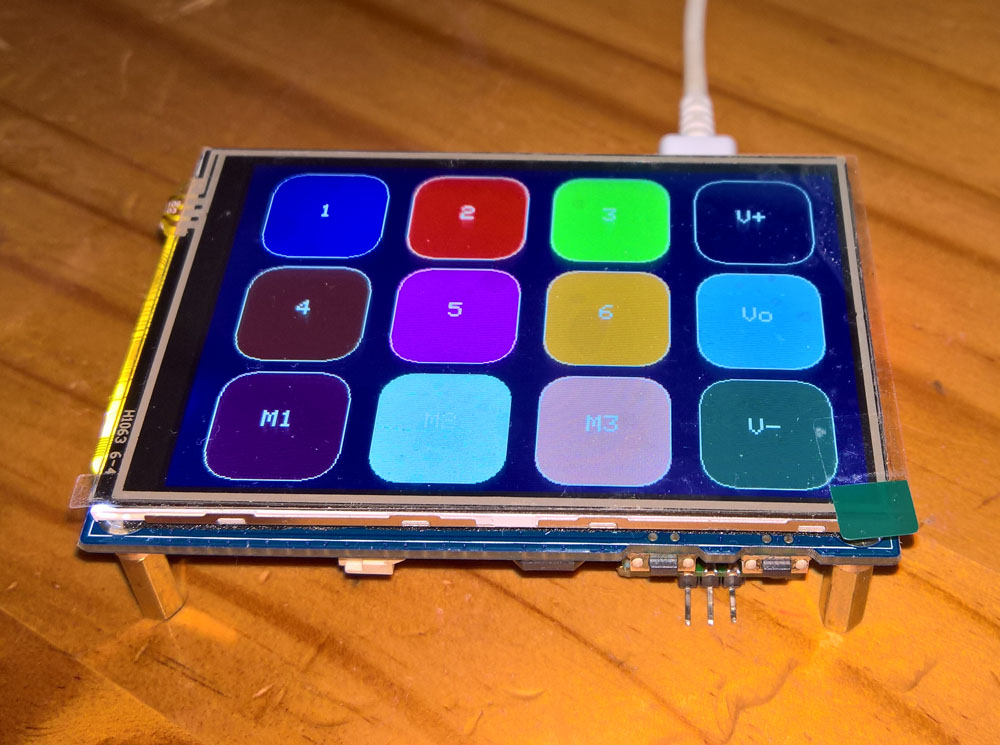
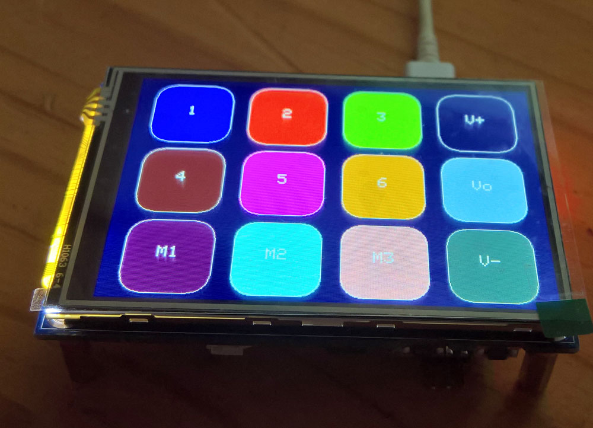

# Pico Volume and Macro Touch Keyboard 480x320

Use the [**Waveshare Pico Evaluation board**](https://www.waveshare.com/pico-eval-board.htm) Pico-Evaluation-Board [**480x320 3.5 inch IPS LCD**](https://www.waveshare.com/wiki/Pico-Eval-Board), connected as shown [**here**](images/connections.jpg). 

This has the following components: 
```
Second Micro-USB connector: CP2102 communication or battery recharge
CP2102 USB to UART converter
ETA6096 battery recharger, 1A recharging current, PH2.0 battery header for connecting 3.7V Li-po battery
SP0503 diode for protecting the chip from ESD
PCM5101A stereo audio DAC chip supports analog audio output to 3.5mm audio jack headphone interface
Micro SD card slot: using SDIO interface with faster access speed
W2812B RGB LED
Indicators PWR: power indicator, TXD: CP2102 UART TX, RXD: CP2102 UART RX
Passive buzzer with controllable sound frequency
Photoresistor converting light intensity to voltage
ICM20948 9-axis motion sensor, allows posture sensing
User-defined key, connects to GP2
Reset key for Pico reset
XPT2046 resistive touch controller
LSD0204 voltage level translator
ILI9488 LCD controller via 74HC4040, 74HC04D, 74HC4094
```

The [**Raspberry Pi Pico Touch Macro Keyboard by Dustin Watts**](https://github.com/DustinWatts/Pico-Matrix-Touch-Keyboard) - the leftmost picture below, can be used unchanged on this display, provided the TFT_eSPI LCD driver is configured as shown below - the sketch code and uf2 file are included in here (TouchMacro1.ino and TouchMacro1.uf2). If the calibration colours are unclear check that #define TFT_INVERSION_ON in User_Setup.h has been uncommented. Remember to choose the PicoSDK as the USB stack. 

[**VolumeTouchLCD2.ino**](VolumeTouchLCD2.ino) is a combination of the [**Dustin Watts Pico Touch Macro Keyboard**](https://github.com/DustinWatts/Pico-Matrix-Touch-Keyboard), the [**AdafruitTinyUSB HID examples such as hid_composite.ino**](https://github.com/adafruit/Adafruit_TinyUSB_Arduino/blob/master/examples/HID/hid_composite/hid_composite.ino), and the [**Bodmer Keypad example**](https://github.com/Bodmer/TFT_eSPI/examples/) Keypad_480x320.ino. It was adapted for use on a Waveshare evaluation board with an ILI9488 480x320 3.5 inch Touch LCD. It also replaced the PicoSDK USB stack with the Adafruit TinyUSB stack - this allowed consumer keys such as Volume Up-Down-Mute to be added to the standard keyboard (touch) keys. 

This sketch includes macros for sending large text sections - press [5] and then [6], or [5] and then [M2], and it sets the Neopixel RGB LED red to reflect the state of Caps-Lock, and adds control of the backlight to dim the display if not used. [**VolumeMacroPad**](https://github.com/TobiasVanDyk/Pico-MCU-from-Raspberry-Pi/blob/main/TouchLCDst7789Pico/VolumeMacroPad121.ino) used for the other Waveshare TouchLCD board (ST7789 320x240 2.8 inch), has additional functions such as three different layouts modes, updating the text macros trough the serial usb, and the key background colour reflecting the state of the Caps-Num-Scroll-lock keys. 

Use the configuration description as shown below to set up the TFT_eSPI driver. Set #define REPEAT_CAL false after the first run (the calibration is stored if the option Flash = 128 MB is set). Compile with the USB stack set to TinyUSB not PicoSDK.

Arduino support is through the [**Bodmer TFT_eSPI graphics library**](https://github.com/Bodmer/TFT_eSPI) and the [**Earlephilhower Arduino Pico Port**](https://github.com/earlephilhower/arduino-pico/). XPT2046 touch screen controller support is for SPI based displays only.

<p align="left">
   
 
 
</p>

**The install order on Windows 10x64**
1. [**Arduino IDE**](https://www.arduino.cc/en/software) version 1.8.19.
2. [**Earlephilhower Aduino Pico port**](https://github.com/earlephilhower/arduino-pico/)
3. [**Adafruit GFX library**](https://github.com/adafruit/Adafruit-GFX-Library).
4. [**Bodmer TFT_eSPI graphics library**](https://github.com/Bodmer/TFT_eSPI).
5. [**Adafruit TinyUSB library**](https://github.com/adafruit/Adafruit_TinyUSB_Arduino)
6. [**Adafruit Neopixel library**](https://github.com/adafruit/Adafruit_NeoPixel)

Specify the display and touch gpio in User_Setup.h (included [**here**](User_Setup.h)).

```
#define RPI_DISPLAY_TYPE // 20MHz maximum SPI works with waveshare serial to parallel displays

#define ILI9488_DRIVER   //

#define TFT_INVERSION_ON

#define TFT_BL   13            // LED back-light control pin
#define TFT_BACKLIGHT_ON HIGH  // Level to turn ON back-light (HIGH or LOW)

#define TFT_MISO 12
#define TFT_MOSI 11
#define TFT_SCLK 10
#define TFT_CS   9     // Chip select control pin
#define TFT_DC   8     // Data Command control pin
#define TFT_RST  15    // Reset pin (could connect to RST pin)

#define TOUCH_CS 16    // Chip select pin (T_CS) of touch screen

#define SPI_FREQUENCY  20000000
#define SPI_READ_FREQUENCY  16000000
#define SPI_TOUCH_FREQUENCY  2500000

#define TFT_SPI_PORT 1 // Set to 0 if SPI0 pins are used, or 1 if spi1 pins used

#define SUPPORT_TRANSACTIONS
```

<p align="left">
 
 
</p>

Note 1: The RPI Display Type is selected - [**see the comment here**](https://github.com/moononournation/Arduino_GFX/issues/151): *"ILI9488 configured in 16 bit parallel mode with a complicated spi to parallel bus converter using 2 74hc4094 chips, a 74hc4040 and a 74hc04d."* It is also described at the Note 2 URL as: *"The ILI9486 RPi display must be of the Waveshare design and use a 16 bit serial interface based on the 74HC04, 74HC4040 and 2 x 74HC4094 logic chips."*

Note 2: A suitable user_setup.h for this board is [**shown here**](https://github.com/Bodmer/TFT_eSPI/discussions/1554?sort=new) towards the end.

Note 3: This [**discussion**](https://forum.pjrc.com/threads/59334-3-5-quot-display-using-ILI9488-will-not-work-with-XPT2048_Touchscreen) examines problems with the ILI9488 chipset sharing the SPI MISO bus. Also see the [**TFTeSPI Hardware modification**](https://github.com/Bodmer/TFT_eSPI/tree/master/docs/RPi_TFT_connections) of Raspberry Pi type LCDs. Refer to [**this guide**](https://www.pjrc.com/better-spi-bus-design-in-3-steps/) for better SPI shared bus design.

Note 4: The Windows 10 SDK setup as [**previously described**](https://github.com/TobiasVanDyk/Pico-MCU-from-Raspberry-Pi/blob/main/Install-PicoSDK-in-Windows10x64-July2022.pdf), can be used to compile the waveshare examples for the this board - [**instructions are here**](WavePicoEvaluationBoard.pdf)


