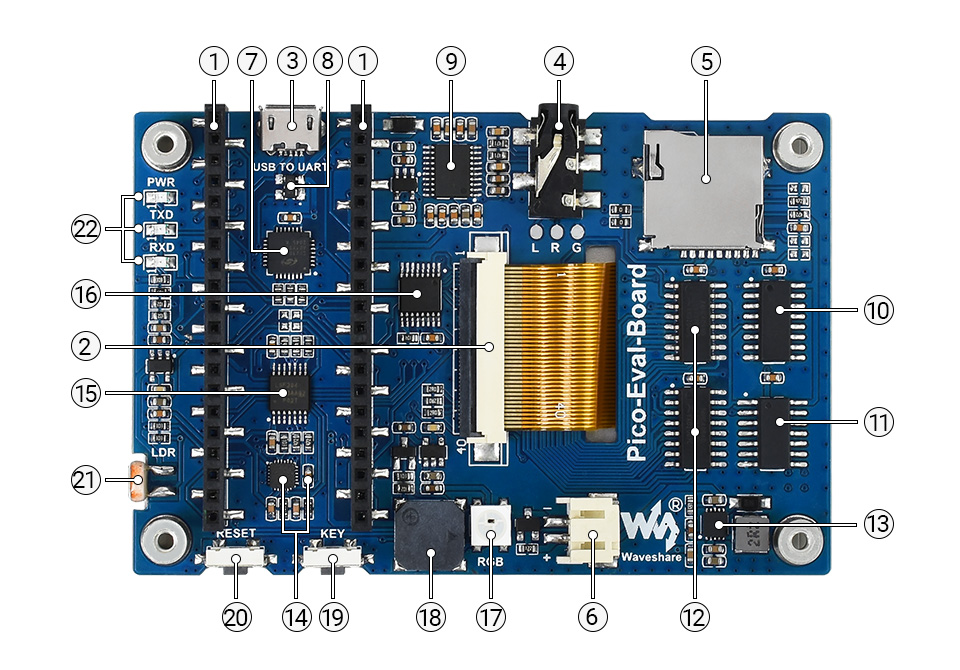

# LCD ILI9488 480x320 Resistive Touch SPI driver

Use the [**Waveshare Pico Evaluation board**](https://www.waveshare.com/pico-eval-board.htm) Pico-Evaluation-Board [**480x320 3.5 inch IPS LCD**](https://www.waveshare.com/wiki/Pico-Eval-Board), connected as shown [**here**](images/connections.jpg). 

Arduino support is through the [**Bodmer TFT_eSPI graphics library**](https://github.com/Bodmer/TFT_eSPI) and the [**Earlephilhower Arduino Pico Port**](https://github.com/earlephilhower/arduino-pico/). XPT2046 touch screen controller support is for SPI based displays only.

**The install order on Windows 10x64**
1. [**Arduino IDE**](https://www.arduino.cc/en/software) version 1.8.19.
2. [**Earlephilhower Aduino Pico port**](https://github.com/earlephilhower/arduino-pico/)
3. [**Adafruit GFX library**](https://github.com/adafruit/Adafruit-GFX-Library).
4. [**Bodmer TFT_eSPI graphics library**](https://github.com/Bodmer/TFT_eSPI).

<p align="left">
 
 
 
</p>


Specify the display and touch gpio in User_Setup.h (included [**here**](User_Setup.h)).


```
#define RPI_DISPLAY_TYPE // 20MHz maximum SPI works with waveshare serial to parallel displays

#define ILI9488_DRIVER   //

#define TFT_BL   13            // LED back-light control pin
#define TFT_BACKLIGHT_ON HIGH  // Level to turn ON back-light (HIGH or LOW)

#define TFT_MISO 12
#define TFT_MOSI 11
#define TFT_SCLK 10
#define TFT_CS   9     // Chip select control pin
#define TFT_DC   8     // Data Command control pin
#define TFT_RST  15    // Reset pin (could connect to RST pin)

#define TOUCH_CS 16    // Chip select pin (T_CS) of touch screen

#define SPI_FREQUENCY  20000000
#define SPI_READ_FREQUENCY  16000000
#define SPI_TOUCH_FREQUENCY  2500000

#define TFT_SPI_PORT 1 // Set to 0 if SPI0 pins are used, or 1 if spi1 pins used
```

Note 1: The RPI Display Type is selected - [**see the comment here**](https://github.com/moononournation/Arduino_GFX/issues/151): "ILI9488 configured in 16 bit parallel mode with a complicated spi to parallel bus converter using 2 74hc4094 chips, a 74hc4040 and a 74hc04d." 

Note 2: A suitable user_setup.h for this board is [**shown here**](https://github.com/Bodmer/TFT_eSPI/discussions/1554?sort=new) towards the end.


