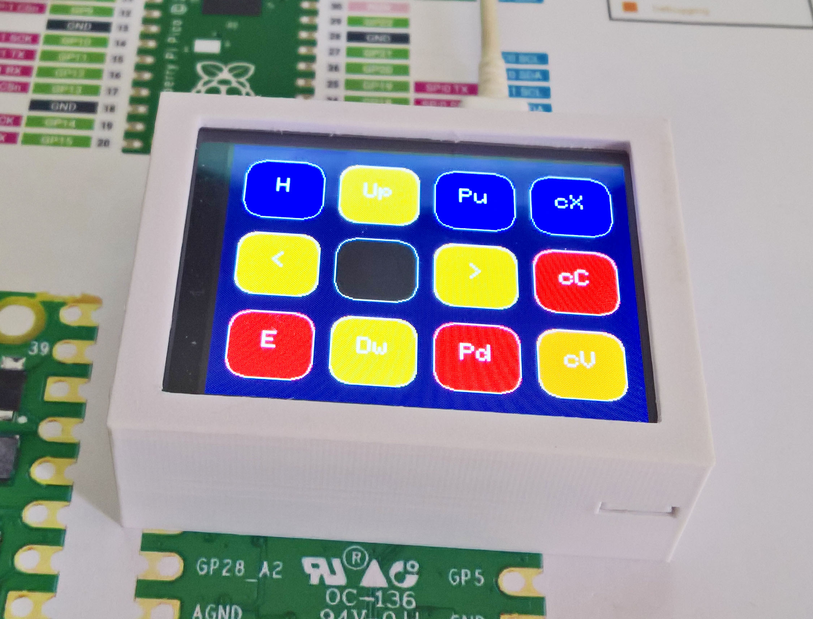
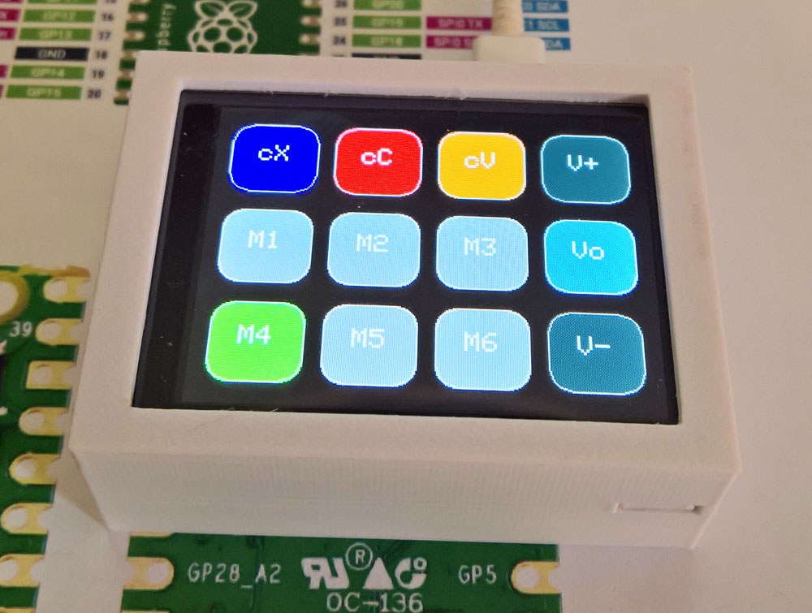

# Pico Volume and Macro Touch Keyboard 320x240

[**VolumeMacroPad8.ino**](VolumeMacroPad8.ino) is a combination of the [**Dustin Watts Pico Touch Macro Keyboard**](https://github.com/DustinWatts/Pico-Matrix-Touch-Keyboard), the [**AdafruitTinyUSB HID examples such as hid_composite.ino**](https://github.com/adafruit/Adafruit_TinyUSB_Arduino/blob/master/examples/HID/hid_composite/hid_composite.ino), and the [**Bodmer Keypad example**](https://github.com/Bodmer/TFT_eSPI/examples/) Keypad_240x320.ino. They were adapted for use on a  Waveshare ST7789 320x240 2.8 inch Touch LCD by replacing the PicoSDK USB stack with the Adafruit TinyUSB stack - this allowed the use of multimedia keys such as Volume Up-Down-Mute to be added to the standard keyboard touch buttons.

VolumeMacroPad8.ino includes example macros for sending large text sections - for example press [M4] when in mode 0. It sets the Pico LED to reflect the Capslock state, and adds control of the LCD backlight to dim the display if not used. It includes preset (typical) touch calibration values, and has two modes - switch modes by pressing the top left three keys in sequence. The two modes are as shown below in the first two pictures.

The keys labelled [cX], [cC], and [cV] are cut, copy, and paste actions, respectively. VolumeMacroPad8.ino also sets the bottom three keys to green if the Capslock, Numlock or Scrolllock (still used by Excel), are pressed - see the third picture below. 

Other example macro's are two ways to open an admin powershell [M2] (Note 1) or nomal command prompt [M5], or Alt + PrintSceen [M1] (Note 2). [M6] is an Enter key. 

(Note 1) Because VolumeMacroPad8.ino is a keyboard not a macro it is able to bypass Windows highest UAC levels.
(Note 2) Some mini-keyboards make it impossible to press Alt+PrintScreen, only PrtScr by itself.

<p align="left">
 
 
 
</p>

*Do not press the black key*

The list of key names that can be used is in TinyUSB stack's hid.h, as included here. Use the configuration descrition as shown below to set up the TFT_eSPI driver. Set #define REPEAT_CAL false after the first run (the calibration is stored if the option Flash = 128 MB is set). It is possible to have the sampled calibration data hard-coded - see the comments in the sketch for more details. Remember to compile with the USB stack set to TinyUSB not PicoSDK. 

*In contrast, this [**Pico mbed RP2040 volume and macro keyboard**](https://www.hackster.io/Murchx/pi-pico-macro-keyboard-d0bd1c) uses the Arduino mbed-based RP2040 board definitions (instead of the earlephilhower version). The USB Keyboard supports both normal and consumer keys using only one include **#include <USBKeyboard.h>**. The article is [**here as a pdf file**](Pi-Pico-mbed-RP2040-volume-and-macro-keyboard.pdf). The code was tested using push-buttons on both Arduino 2.0.0-rc9.2 and 1.8.19 IDE's, and was working (could adjust the volume up or down). [**This discussion**](https://github.com/Bodmer/TFT_eSPI/discussions/1558) notes that the Pico mbed Arduino board does not offer touch support when used with the TFT_eSPI drivers.*

<p align="left">
 
 
  
</p>

STL files for the case - based on [**Customizable LCD Box**](https://www.thingiverse.com/thing:57427), are in the STL folder. An alternative design was used than the photo. Use the bottom screws to clamp the top lid into place.

### LCD ST7789 320x240 Resistive Touch SPI driver

Use the [**Waveshare ST7789**](https://www.waveshare.com/pico-restouch-lcd-2.8.htm) Pico-ResTouch-LCD-2.8 [**320x240 2.8 inch IPS LCD**](https://www.waveshare.com/wiki/Pico-ResTouch-LCD-2.8), connected as shown [**here**](images/connections.jpg). Note that the LCD board is jumper hard-wired to be non-SDIO - that means five of the six GPIO SDIO pins are available for other use (gpio pins 5, and 18 to 21). 

Arduino support is through the [**Bodmer TFT_eSPI graphics library**](https://github.com/Bodmer/TFT_eSPI) and the [**Earlephilhower Arduino Pico Port**](https://github.com/earlephilhower/arduino-pico/), and the Adafruit GFX library (for some of the button classes). XPT2046 touch screen controller support is for SPI based displays only.

**The install order on Windows 10x64**
1. [**Arduino IDE**](https://www.arduino.cc/en/software) version 1.8.19.
2. [**Earlephilhower Aduino Pico port**](https://github.com/earlephilhower/arduino-pico/)
3. [**Adafruit GFX library**](https://github.com/adafruit/Adafruit-GFX-Library).
4. [**Bodmer TFT_eSPI graphics library**](https://github.com/Bodmer/TFT_eSPI).
5. [**Adafruit TinyUSB library**](https://github.com/adafruit/Adafruit_TinyUSB_Arduino)

<p align="left">
 
 
 
</p>


Specify the display and touch gpio in User_Setup.h (included [**here**](User_Setup.h)).


```
#define TFT_WIDTH  240 // ST7789 240 x 240 and 240 x 320
#define TFT_HEIGHT 320 // ST7789 240 x 320

#define ST7789_2_DRIVER    // Minimal configuration option, define additional parameters below for this display

#define TFT_BL   13            // LED back-light control pin
#define TFT_BACKLIGHT_ON HIGH  // Level to turn ON back-light (HIGH or LOW)

#define TFT_MISO 12
#define TFT_MOSI 11
#define TFT_SCLK 10
#define TFT_CS   9     // Chip select control pin
#define TFT_DC   8     // Data Command control pin
#define TFT_RST  15    // Reset pin (could connect to RST pin)

#define TOUCH_CS 16    // Chip select pin (T_CS) of touch screen

#define TFT_SPI_PORT 1 // Set to 0 if SPI0 pins are used, or 1 if spi1 pins used

```

