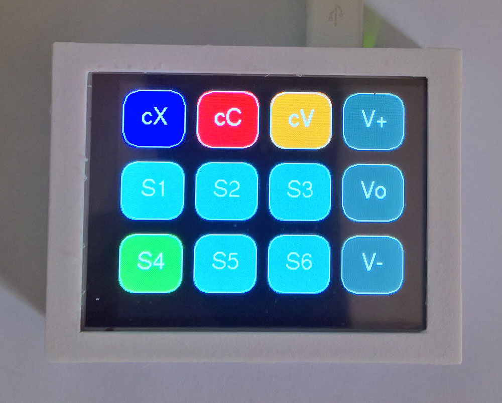
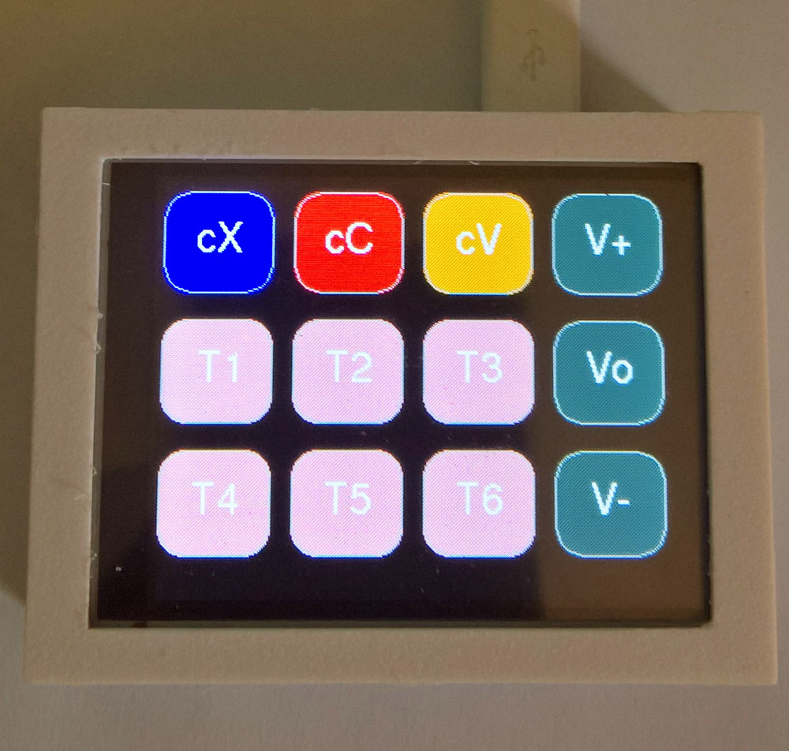

# Pico Volume and Macro Touch Keyboard 320x240

[**VolumeMacroPad**](VolumeMacroPad172.ino) is a combination of the [**Dustin Watts Pico Touch Macro Keyboard**](https://github.com/DustinWatts/Pico-Matrix-Touch-Keyboard), the [**AdafruitTinyUSB HID examples such as hid_composite.ino**](https://github.com/adafruit/Adafruit_TinyUSB_Arduino/blob/master/examples/HID/hid_composite/hid_composite.ino), and the [**Bodmer Keypad example**](https://github.com/Bodmer/TFT_eSPI/tree/master/examples) Keypad_240x320.ino. They were adapted for use on a  Waveshare ST7789 320x240 2.8-inch Touch LCD by replacing the PicoSDK USB stack with the Adafruit TinyUSB stack - this allowed the use of multimedia keys such as Volume Up-Down-Mute to be added to the standard keyboard touch buttons. Refer also to [**Keyboard shortcuts in Windows**](https://support.microsoft.com/en-us/windows/keyboard-shortcuts-in-windows-dcc61a57-8ff0-cffe-9796-cb9706c75eec). 

VolumeMacroPad includes a number of example macros - refer to the four layouts in the diagram below. It sets the Pico LED (and shows a small green "C" or "N" or "S"), to reflect the state of the Caps-Num-Scroll-lock keys, and adds control of the LCD backlight to dim the display if not used. It includes preset (typical) touch calibration values, and has four layout modes and two layers A/B, for layouts L1, L3, and L4- switch layouts by pressing [L1] to [L4] or via the Volume Mute [Vo] key, and switch layers via the Cfg key + ArrowLeft.

Some of the four modes are shown below in the pictures. The first picture shows layout 3 layer A, with six text/number macro keys S1 to S6 and the Capslock key state on as shown by the green S4 key in the old version of the software. It is possible to send new text (or control character strings - in progress from version 141 - refer to the RealTerm screen capture below where Control+Shift+Escape is sent, or in the program code line 701), up to 200 characters long (easily made longer in the program code), to be assigned to keys S1/T1 through to S12/T12 via the Pico's serial USB - start each string with <1 to <6 followed by the string itself to be assigned to the keys - add a > at the end of the string. These strings are saved to the Pico's Flash memory using LittleFS. To enable the string update for layout 4 the screen must be in layout 4, for layout 3 it can be in layout 1, 2 or 3. (For the [M4] key in layout 1 use a <0 at the start of the string.) For each of the two layers A/B the upload will be to the layer that is current i.e. to keys S7 to S12 if layer B is current, and to S1 to S6 if layer A is current. A key auto-repeat that triggers after 500 milliseconds is also implemented.

The Config key in the second and third picture is part of layout 2, and it enables faster layout 1 to 4 switching by disabling/enabling the Volume Mute action by pressing the Config and Home keys in sequence. Repeat the same sequence to enable Mute again. The label on the [Vo] key will change to indicate which layout is active L1, L2, L3, or L4. There is a timeout on the Layout switch key (Vo or L1-L4), i.e. the key presses must happen fairly quickly to cycle through the four layouts. If PageUp is pressed after config the VolumeUp and VolumeDown keys are replaced by a Delete and an Enter key. Press [Cfg] + {PgU] again to switch back to the Volume Up and Down keys. If PageDown is pressed after Cfg the startup Layout is toggled between L1 and L2. If End is pressed after the Cfg key all the text files and config settings are deleted from the Pico's Flash memory. Note that to save the VolMute/L1-L2 and Vol+Vol-/Delete-Return choices on the Flash memory you have to press Cfg by itself, at least once more after selecting these two options. This is not necessary for the L1/L2 startup selection.

<p align="left">
 
 
 
 
</p>

Using a terminal such as RealTerm it is possible to send non-ASCI characters and numbers instead of just text strings to the six keys labelled T1 to T6 - this may then perform various macro key actions - refer to the first picture in the set of four images below. Other approaches considered included a decoder for encoded [**duckyscripts**](https://github-wiki-see.page/m/hak5darren/USB-Rubber-Ducky/wiki/Duckyscript), but directly programming these macros seems to be more efficient - refer to the built-in keyboard macro examples below.

Another way to save large text files or non-ASCII macro files directly in the LittleFS formatted Flash memory of the Pico is described [**here**](https://github.com/earlephilhower/arduino-pico-littlefs-plugin/blob/master/README.md) and [**here**](https://arduino-pico.readthedocs.io/en/latest/fs.html). You can therefore copy your files (ASCII text or non-ASCII macro files) using the names StrData1 or TtrData1 through to StrData12 or TtrData12 directly to the Pico Flash filesystem - see the 3rd picture below for a file list.

The keys labelled [Cut], [Cpy], and [Pst] are cut, copy, and paste actions, respectively. VolumeMacroPad also turns the bottom left three keys to green if the either of the Caps-lock, Num-lock or Scroll-lock (Note 3), are active - refer to [**this picture**](images/lcd101.jpg). 

Other example macros are opening an admin UAC powershell [M2] (Note 1, 4, 5) or admin command prompt [M5]. [M1] is Alt + PrintSceen (Note 2). [M6] opens the Task Manager, and [M3] opens the Run dialog box. It will be easy to convert Layer 2 into a Mouse keys keypad - [**refer to this diagram**](https://github.com/TobiasVanDyk/Pico-MCU-from-Raspberry-Pi/blob/main/TouchLCDst7789Pico/Windows%20Keyboard%20Shortcuts/mouse-keys.jpg).

* Note 1 - Because VolumeMacroPad is a trusted device (keyboard) it is able to bypass Windows UAC level 4 - see Note 4.
* Note 2 - Some Mini-keyboards do not have a PrintScreen key.
* Note 3 - Microsoft Office Excel still has a functional use for the Scroll-lock.
* Note 4 - If the Macro Keypad triggers a Windows-based Macro or Shortcut Keys (including [**AutoIt**](https://www.autoitscript.com/site/)), it cannot bypass UAC.
* Note 5 - The UAC bypass is time sensitive and keydelay3 = 500 may have to be adjusted in the program.
* Note 6 - Change to Layout 1 to 4 by pressing VolumeMute or L1 to L4 consecutively. 

``` 
Layout 1  Cycle through Layout 1 to 4 press VolumeMute [L1-L4] once or [Vo] 3 or more times
------------------------------------------------------------------------------------------------
[Cut Ctrl+X] [  Copy Ctrl+C   ] [Paste Ctrl+V] [VolUp  Del-Bs]    [cX]  [cC]  [cV]  [V+][Del-Bs]
[Alt+PrtScr] [Admin Powershell] [ Run window ] [VolMute L1-L4]    [M1]  [M2]  [M3]  [Vo][L1-L4 ]
[Send Text ] [Admin CMD Prompt] [Task Manager] [VolDwn  Enter]    [M4]  [M5]  [M6]  [V-][Enter ]
          Caps                Num           Scroll                    C     N     S

Layout 2  Cycle through Layout 1 to 4 press VolumeMute [L1-L4] once or [Vo] 3 or more times
--------------------------------------------------------------------------------------------------
[Home   Prev  Mute] [UpArr  BsDel] [PgeUp Nxt DelRet] [VolUp  Delete] [H] [Up ] [Pu] [V+][Del-Bs]
[ArrL PlayPse L-AB] [Config  Save] [ArrR  Stop Media] [VolMute L1-L4] [<] [Cfg] [> ] [Vo][L1-L4 ]
[End    CfgFileDel] [DwnArr KeyBr] [PgeDwn StartL1L2] [VolMute Enter] [E] [Dw ] [Pd] [V-][Enter ]
                 Caps            Num               Scroll                C     N    S

Layout 3+4 Cycle through Layout 1 to 4 press VolumeMute [L1-L4] once or [Vo] 3 or more times
--------------------------------------------------------------------------------------------------
[Cut Ctrl+X ] [Copy Ctrl+C] [Paste Ctrl+V] [VolUp  Del-Bs]   [ cX ]  [ cC  ]  [ cV  ] [V+][Del-Bs]
[Send Text 1] [Send Text 2] [Send Text 3 ] [VolMute L1-L4]   [S1 T1] [S2 T2]  [S3 T3] [Vo][L1-L4 ]
[Send Text 4] [Send Text 5] [Send Text 6 ] [VolMute Enter]   [S4 T4] [S5 T5]  [S6 T6] [V-][Enter ]
           Caps           Num           Scroll                      C       N        S

Cycle through Layout 1 to 4 press VolumeMute [L1-L4] once or [Vo] 3 or more times
-------------------------------------------------------------------------------------------------
Layouts 1, 3 and 4, two Layers A/B each with A=M1-M6, S1-S6, T1-T6 and B=M7-M12, S7-S12, T7-T12
Press VolumeMute consecutively within 5 seconds else count is reset to 0 or press [L1-L4] once.
[L1-L4] has a repeat period of 0.5 seconds - after this key repeat is active

Press Config Key (new active keys change colour) then:
L14 (Home) - VolumeMute -> L1, L2, L3, L4 - repeat to restore Vo
BsD (ArrowUp) - Toggle Vol+ key to either Delete or Backspace
Vol (PageUp) - Vol+ -> Delete and Vol- -> Enter - repeat to restore V+ V-
A-B (ArrowLeft) - Layouts 1, 3, 4, change to Layer A or Layer B 
Med (ArrowRight) - Change Layout 2 to Media Controls Previous-Next-PlayPause-Stop
Del (End) - Delete all files on Flash (Strings and Config)
S12 (PageDown) - Start with Layout 1 or Layout 2 on powerup - must also press Sav(e) (Cfg)
Kbd (ArrowDwn] - A-Z 0-9 keyboard send keys. ADD to macro NXT keybrd ESC quit EXE send + quit
Sav (Cfg) Info and File List to send Serial Monitor and Text/Macro and Config files saved

Text Strings: 
Send new text strings up to 200 characters to keys S1/T1 - S12/T12 via USBserial
Start string with <1 to <6 followed by the string assigned to S1/T1-S12/T12 - end string with >
If current Layout is L3 then S1 to S6 changed if Layout is L4 then T1 to T6 changed
If current Layer is A then S1/T1-S6/T6 changed, layer B S7/T7-S12/T12 changed. 

To send the text "This is a string for key [S2]." use a serial terminal to send 
<2This is a string for key [S2].> with Layer 3 visible.

Send new text for Key [M4] - start with <0 end with > and send it with Layers 1 or 3 visible - if 
sent from Layer 2 it will be ignored. 
Example 1: Send <0This is [M4] Text> with Layers 1 or 3 visible - pressing [M4] will send the text 
string "This is [M4] Text" to the PC. 
Example 2: Send the macro 0x3C 0x30 0xE0 0xE1 0x29 0x3E (which is <0 Control Shift Escape >), 
with Layer 4 visible, then pressing [M4] will open the Task Manager. 

See the Key-M4-Examples.jpg

Keyboard Page 1              Page 2          Page 3          Page 4              Page 5
[abc] [def] [ghi] [ESC]  [ABC] to [XY_]  [012] to [9+-]  [1F3] to [1F2]  [ALT] [SHF] [CTR] [EXE]
[jkl] [mno] [pqr] [NXT]    Uppercase     Numbers            F1 -  F12    [GUI] [TEI] [CRF] [NXT]
[stu] [vwx] [yz ] [ADD]    Uppercase     Symbols          Symbols        [LHR] [UED] [UND] [ADD]

Page 5      [ALT] = [ Alt-L ]  [  Alt-R ]  [ PrintScr]   [EXE]
Keyboard    [SHF] = [Shift-L]  [Shift-R ]  [ Delete  ]
            [CTR] = [Contr-L]  [Contrl-R]  [BackSpace]
            [GUI] = [ Win-L ]  [ Win-R  ]  [  NULL   ]   [NXT]   
            [TEI] = [  Tab  ]  [ Escape ]  [ Insert  ]
            [CRF] = [  C/R  ]  [   L/F  ]  [  Return ]
            [LHR] = [Arrow-L]  [  Home  ]  [ Arrow-R ]   [ADD]
            [UED] = [ArrowUp]  [  End   ]  [Arrow-Dwn]
            [UND] = [PageUp ]  [ Numlock}  [ PageDwn ]
       
The keyboard is has 5 pages each with 9 triple function keys and 3+1 control keys [ESC-EXE] [NXT] [ADD]. For
example page 1 has keys [abc], [def], to [y,z,space]. To select a or b or c press the abc key once, twice or 
thrice - to add it to a new macro press the ADD key else press another character/symbol/modifier key or press
[NXT] for the next keyboard page. Press [ESC] to leave the keyboard or on page 5 press [EXE] to send the macro
 to the PC. The maximum length of a text macro is 200 characters.

The macros on page 5 are modifiers (simultaneously pressed keys) such as Control + Alt + Delete (with a maximum of 
6 keys in a macro). To send this sequence press [CTR] [ADD] [ALT] [ADD] [SHF]x3 (3 times for delete) [ADD] [EXE]. 
To send a sequence such as [WinKey] + "r" press [GUI] [ADD] [NXT] [pqr]x3 [ADD] [NXT]x4 [EXE]. To assign Alt + 
PrintScreen to key [M2] press [Cfg] [Kbd] [NXT] 4 times then [ALT] [ADD] [ALT] 3 x then [ADD] [EXE} [Up]. Alt + 
PrtScr is then executed when pressing [M2]. Another example: [Cfg] [Kbd] [NXT]4x [SHF] [NXT] [abc] [ADD] [NXT]4x 
[EXE] will send "A" not "a" because Shift is pressed at the same time as "a".

Macros sent to the PC from the built-in keyboard will be saved to file KeyBrdMacro2 and if so selected, assigned to key
[M2] if of the modifiers type, and is saved as KeyBrdMacro1 an assigned to key [M1], if of the sequence type (200 chars 
max). Press [Up] after sending the macros to the PC to assign them to [M1] or [M2]. Combining macros of both types will
are planned.

F1-F12 keys are sent as keycodes (simultaneous) and not keypress types - to send [F3] press [Cfg] [Kbd] [NXT] 3 times 
then [1F3] 3 times then [ADD] [NXT] [EXE]. Press [Up] to assign it to key [M2]. Once assigned it will survive a reboot.

Change the LCD blank timeout: Send the macro *tb*num with the built-in keyboard where num = 0,1-9 - *tb*0 = 12 hours,
*tb*1 = 30 seconds

Numeric Keypad    [Bsp] [7] [8] [9]  Enter the numeric keypad through a macro *kb from the Keyboard:                    
                  [Ret] [4] [5] [6]  [Cfg] [Kbd] [NXT]2x [=*]2x [ADD] [NXT]2x [jkl]2x [ADD] [abc]2x [ADD] [NXT]3x [EXE]                    
                  [ 0 ] [1] [2] [3]  Exit the num-keypad press [Bsp] 10 times or use the hardware reset switch.
```
Another use of the two main layouts could be to have one customised for Linux - although all the keys in layout 1 and 2 except the run dialog, and the powershell and command prompt, function the same under Linux.

The list of key names that can be used is in TinyUSB stack's hid.h, as included here. Use the configuration descrition as shown below to set up the TFT_eSPI driver. The sampled calibration data can be adjusted - see the comments in the program for instructions. Compile with the USB stack set to TinyUSB not PicoSDK. 

*In contrast, this [**Pico mbed RP2040 volume and macro keyboard**](https://www.hackster.io/Murchx/pi-pico-macro-keyboard-d0bd1c) uses the Arduino mbed-based RP2040 board definitions (instead of the earlephilhower version). The USB Keyboard supports both normal and consumer keys using only one include **#include <USBKeyboard.h>**. The article is [**here as a pdf file**](Pi-Pico-mbed-RP2040-volume-and-macro-keyboard.pdf). The code was tested using push-buttons on both Arduino 2.0.0-rc9.2 and 1.8.19 IDE's, and was working (could adjust the volume up or down). [**This discussion**](https://github.com/Bodmer/TFT_eSPI/discussions/1558) notes that the Pico mbed Arduino board does not offer touch support when used with the TFT_eSPI drivers.*

<p align="left">
 
 
 
  
</p>

STL files for the case - based on [**Customizable LCD Box**](https://www.thingiverse.com/thing:57427), are in the STL folder. An alternative design was used than the photo. Use the bottom screws to clamp the top lid into place. To protect the LCD resistive film use a sheet of laser print transparent film cut to the right size for the LCD.

### LCD ST7789 320x240 Resistive Touch SPI driver

Use the [**Waveshare ST7789**](https://www.waveshare.com/pico-restouch-lcd-2.8.htm) Pico-ResTouch-LCD-2.8 [**320x240 2.8 inch IPS LCD**](https://www.waveshare.com/wiki/Pico-ResTouch-LCD-2.8), connected as shown [**here**](images/connections.jpg). Note that the LCD board is jumper hard-wired to be non-SDIO - that means five of the six GPIO SDIO pins are available for other use (gpio pins 5, and 18 to 21). 

<p align="left">
  
 
  
</p>

Arduino support is through the [**Bodmer TFT_eSPI graphics library**](https://github.com/Bodmer/TFT_eSPI) and the [**Earlephilhower Arduino Pico Port**](https://github.com/earlephilhower/arduino-pico/), and the Adafruit GFX library (for some of the button classes). XPT2046 touch screen controller support is for SPI based displays only.

**The install order on Windows 10x64**
1. [**Arduino IDE**](https://www.arduino.cc/en/software) version 1.8.19.
2. [**Earlephilhower Aduino Pico port**](https://github.com/earlephilhower/arduino-pico/)
3. [**Adafruit GFX library**](https://github.com/adafruit/Adafruit-GFX-Library).
4. [**Bodmer TFT_eSPI graphics library**](https://github.com/Bodmer/TFT_eSPI).
5. [**Adafruit TinyUSB library**](https://github.com/adafruit/Adafruit_TinyUSB_Arduino)

<p align="left">
 
 
  
 
</p>


Specify the display and touch gpio in User_Setup.h (included [**here**](User_Setup.h)).


```
#define TFT_WIDTH  240 // ST7789 240 x 240 and 240 x 320
#define TFT_HEIGHT 320 // ST7789 240 x 320

#define ST7789_2_DRIVER    // Minimal configuration option, define additional parameters below for this display

#define TFT_BL   13            // LED back-light control pin
#define TFT_BACKLIGHT_ON HIGH  // Level to turn ON back-light (HIGH or LOW)

#define TFT_MISO 12
#define TFT_MOSI 11
#define TFT_SCLK 10
#define TFT_CS   9     // Chip select control pin
#define TFT_DC   8     // Data Command control pin
#define TFT_RST  15    // Reset pin (could connect to RST pin)

#define TOUCH_CS 16    // Chip select pin (T_CS) of touch screen

#define TFT_SPI_PORT 1 // Set to 0 if SPI0 pins are used, or 1 if spi1 pins used

```

