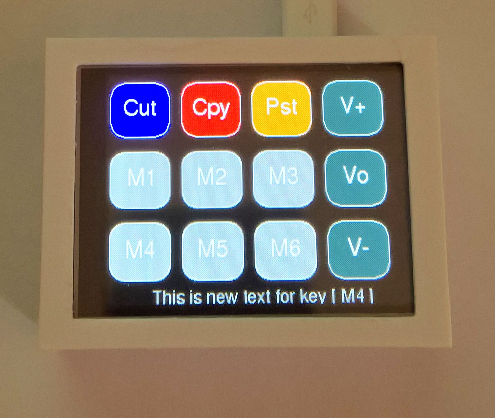
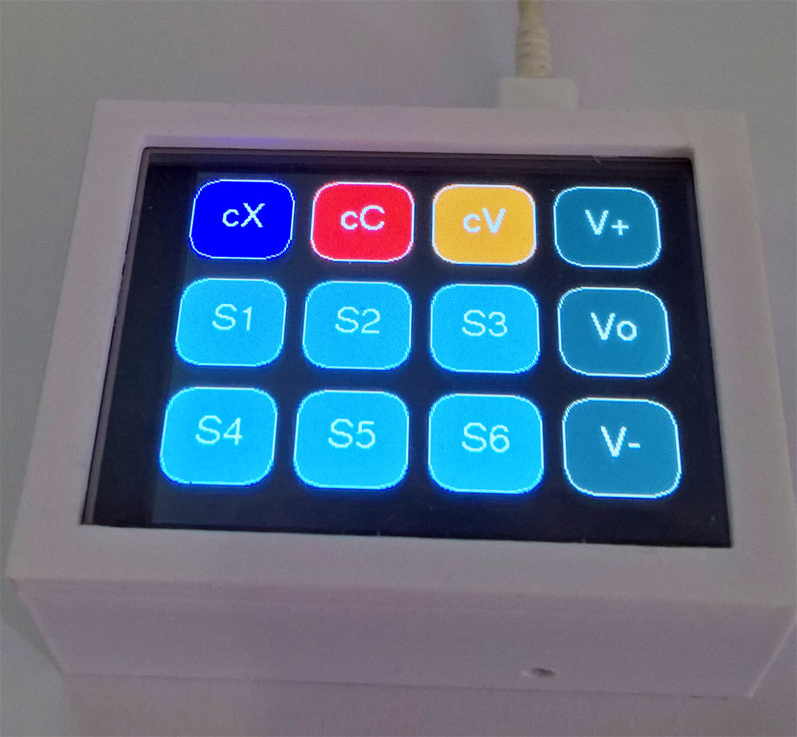
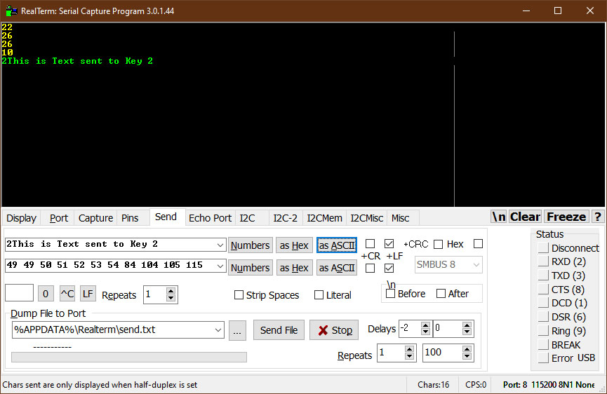
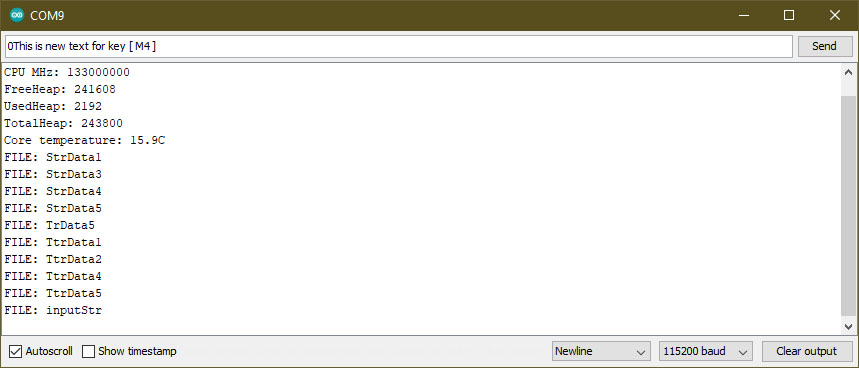
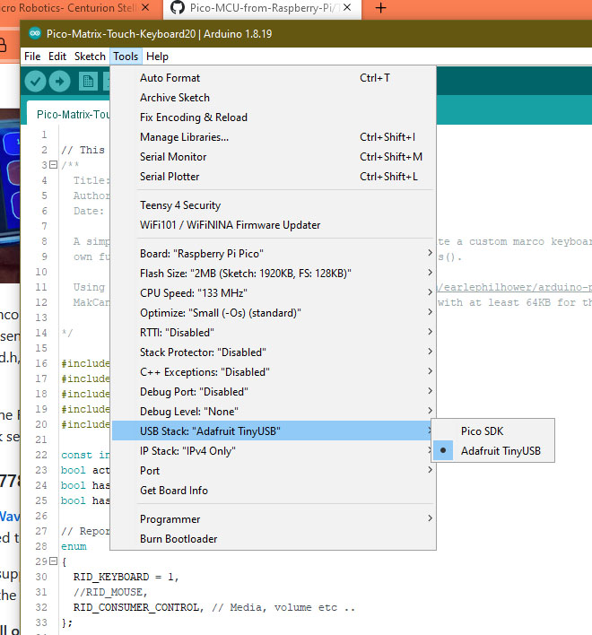
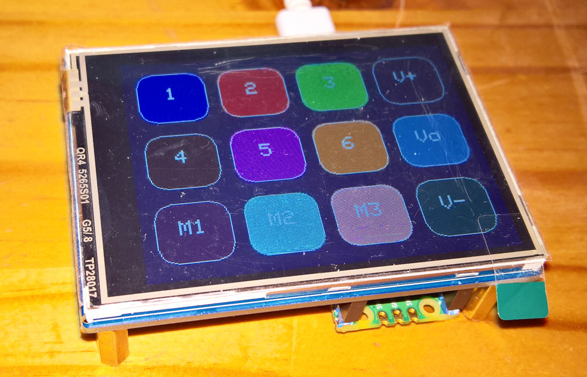
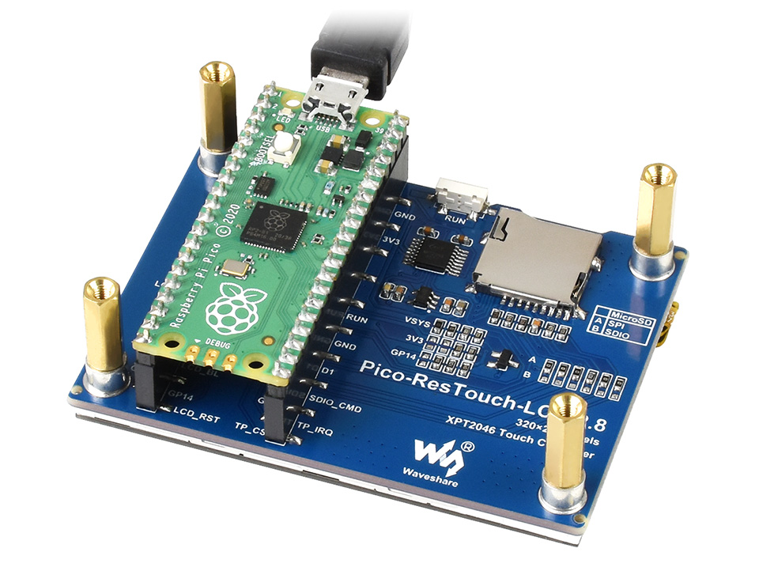
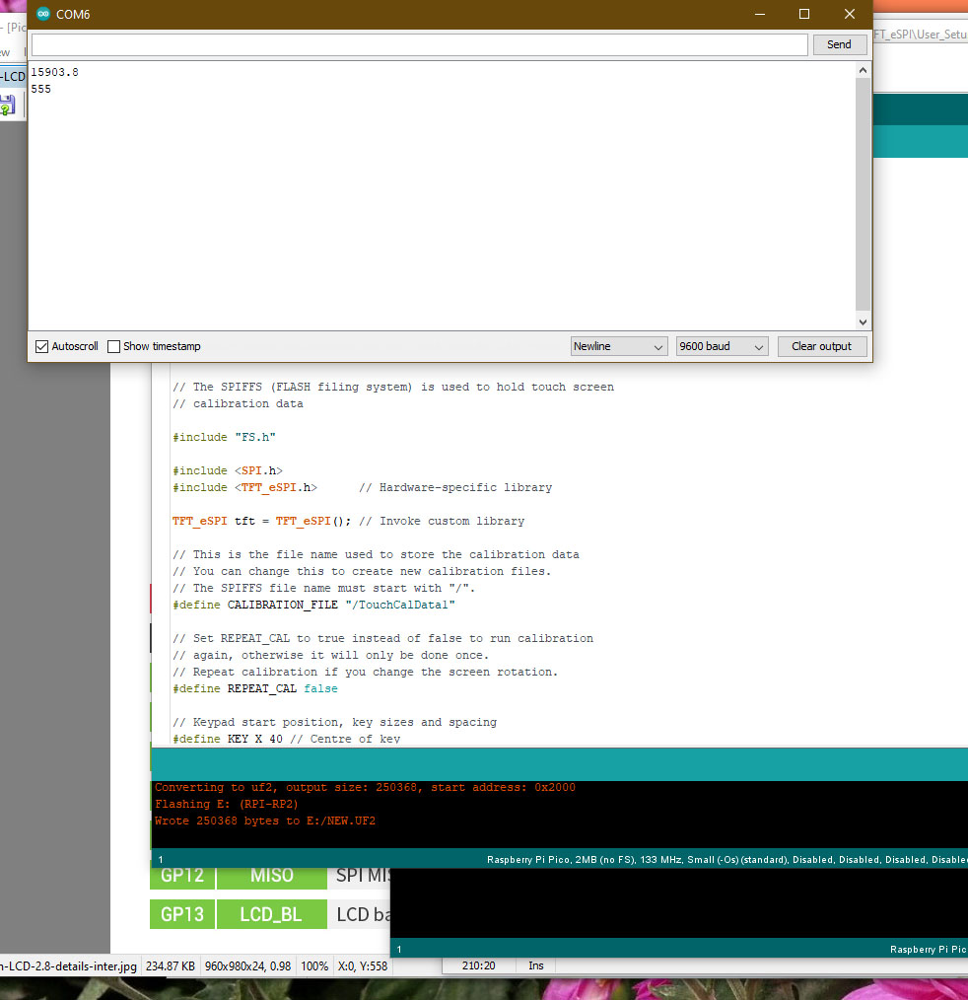

# Pico Volume and Macro Touch Keyboard 320x240

[**VolumeMacroPad**](VolumeMacroPad122.ino) is a combination of the [**Dustin Watts Pico Touch Macro Keyboard**](https://github.com/DustinWatts/Pico-Matrix-Touch-Keyboard), the [**AdafruitTinyUSB HID examples such as hid_composite.ino**](https://github.com/adafruit/Adafruit_TinyUSB_Arduino/blob/master/examples/HID/hid_composite/hid_composite.ino), and the [**Bodmer Keypad example**](https://github.com/Bodmer/TFT_eSPI/examples/) Keypad_240x320.ino. They were adapted for use on a  Waveshare ST7789 320x240 2.8 inch Touch LCD by replacing the PicoSDK USB stack with the Adafruit TinyUSB stack - this allowed the use of multimedia keys such as Volume Up-Down-Mute to be added to the standard keyboard touch buttons. Refer also to [**Keyboard shortcuts in Windows**](https://support.microsoft.com/en-us/windows/keyboard-shortcuts-in-windows-dcc61a57-8ff0-cffe-9796-cb9706c75eec).

VolumeMacroPad includes a number of example macros - refer to the four layouts in the diagram below. It sets the Pico LED (and the background colour of the rightmost bottom key to green or grey), to reflect the Capslock state, and adds control of the LCD backlight to dim the display if not used. It includes preset (typical) touch calibration values, and has four layout modes - switch layouts by pressing the Volume Mute [Vo] key. 

The four modes are shown below in the pictures. The first picture show the infobar displaying new text entered via a serial terminal for key [M4] - this message is cleared after the first screen timeout (i.e. backlight switched off). It is possible to send new text or control character strings up to 200 characters long (easily made longer in the program code), to be assigned to keys S1/T1 through to S6/T6 via the Pico's serial USB - start each string with 1 to 6 followed by the string itself to be assigned to the keys - add a LF at the end of the string. These strings are saved to the Pico's Flash memory using LittleFS. To enable the strings overwrite for layout 4 the screen must be in layout 4, for layout 3 it can be in layout 1, 2 or 3. (For the [M4] key in layout 1 use a 0 at the start of the string.) The Config middle button [Cfg] on the second layout enables a quicker layout switching by disabling/enabling the Volume Mute action - i.e. press the Config key then immediately press Home - the label on the [Vo] key will now indicate which layout is active L1, L2, L3, or L4. If End is pressed after the Cfg key then a file list is sent to the serial terminal. 

<p align="left">
 
 
 
 
</p>

Using a terminal such as RealTerm it is possible to send non ASCI characters and numbers instead of just text strings to the six keys labelled T1 to T6 - this may then perform various macro key actions - refer to the the first picture in the set of four images below. Other approaches considered included a decoder for encoded [**duckyscripts**](https://github-wiki-see.page/m/hak5darren/USB-Rubber-Ducky/wiki/Duckyscript), but directly programming these macros seems to be more efficient.

Another way to save large text files or non-ASCII macro files directly in the LittleFS formatted Flash memory of the Pico is described [**here**](https://github.com/earlephilhower/arduino-pico-littlefs-plugin/blob/master/README.md) and [**here**](https://arduino-pico.readthedocs.io/en/latest/fs.html). You can therefore copy your files (ASCII text or non-ASCII macro files) using the names **StrData1 or TtrData1 through to StrData6 or TtrData6** directly to the Pico Flash filesystem - see the 3rd picture below for a file list.

The keys labelled [Cut], [Cpy], and [Pst] are cut, copy, and paste actions, respectively. VolumeMacroPad also turns the bottom left three keys to green if the either of the Caps-lock, Num-lock or Scroll-lock (Note 3), are active - refer to [**this picture**](images/lcd101.jpg). 

Other example macro's are opening an admin UAC powershell [M2] (Note 1, 4, 5) or admin command prompt [M5]. [M1] is Alt + PrintSceen (Note 2). [M6] is an Enter Key, and [M3] opens the Run dialog box. 

* Note 1 - Because VolumeMacroPad is a trusted device (keyboard) it is able to bypass Windows UAC level 4 - see Note 4.
* Note 2 - Some Mini-keyboards do not have a PrintScreen key.
* Note 3 - Microsoft Office Excel still has a functional use for the Scroll-lock.
* Note 4 - If the Macro Keypad triggers a Windows-based Macro or Shortcut Keys (including [**AutoIt**](https://www.autoitscript.com/site/)), it cannot bypass UAC.
* Note 5 - The UAC bypass is time sensitive and keydelay3 = 500 may have to be adjusted in the program.
* Note 6 - Change to Layout 1 to 4 by pressing VolumeMute consecutively. 

```
Layout 1   Cycle through Layout 1 to 4 press Volume Mute [Vo] 3 or more times consecutively
-------------------------------------------------------------------------------------------
[Cut Ctrl+X] [  Copy Ctrl+C   ] [Paste Ctrl+V] [Volume Increase]    [cX]  [cC]  [cV]  [V+]
[Alt+PrtScr] [Admin Powershell] [ Run window ] [  Volume Mute  ]    [M1]  [M2]  [M3]  [Vo]
[Send Text ] [Admin CMD Prompt] [ Enter key  ] [Volume Decrease]    [M4]  [M5]  [M6]  [V-]
                                                                    Caps  Num  Scroll

Layout 2   Cycle through Layout 1 to 4 press Volume Mute [Vo] 3 or more times consecutively
-------------------------------------------------------------------------------------------
[   Home   ] [ Up Arrow ] [  Page Up  ] [Volume Increase]           [H]  [Up]  [Pu]  [V+]                
[Left Arrow] [  Config  ] [Right Arrow] [  Volume Mute  ]           [<]  [  ]  [> ]  [Vo]
[   End    ] [Down Arrow] [ Page Down ] [Volume Decrease]           [E]  [Dw]  [Pd]  [V-]
                                                                    Caps Num  Scroll

Layout 3+4 Cycle through Layout 1 to 4 press Volume Mute [Vo] 3 or more times consecutively       
-------------------------------------------------------------------------------------------
[Cut Ctrl+X ] [Copy Ctrl+C] [Paste Ctrl+V] [Volume Increase]    [cX]  [cC]  [cV]  [V+]
[Send Text 1] [Send Text 2] [Send Text 3 ] [  Volume Mute  ]    [T1]  [T2]  [T3]  [Vo]
[Send Text 4] [Send Text 5] [Send Text 6 ] [Volume Decrease]    [T4]  [T5]  [T6]  [V-]
                                                                Caps  Num  Scroll                                  
```
Another use of the two main layouts could be to have one customised for Linux - although all the keys in layout 1 and 2 except the run dialog, and the powershell and command prompt, function the same under Linux.

The list of key names that can be used is in TinyUSB stack's hid.h, as included here. Use the configuration descrition as shown below to set up the TFT_eSPI driver. The sampled calibration data can be adjusted - see the comments in the program for instructions. Compile with the USB stack set to TinyUSB not PicoSDK. 

*In contrast, this [**Pico mbed RP2040 volume and macro keyboard**](https://www.hackster.io/Murchx/pi-pico-macro-keyboard-d0bd1c) uses the Arduino mbed-based RP2040 board definitions (instead of the earlephilhower version). The USB Keyboard supports both normal and consumer keys using only one include **#include <USBKeyboard.h>**. The article is [**here as a pdf file**](Pi-Pico-mbed-RP2040-volume-and-macro-keyboard.pdf). The code was tested using push-buttons on both Arduino 2.0.0-rc9.2 and 1.8.19 IDE's, and was working (could adjust the volume up or down). [**This discussion**](https://github.com/Bodmer/TFT_eSPI/discussions/1558) notes that the Pico mbed Arduino board does not offer touch support when used with the TFT_eSPI drivers.*

<p align="left">
 
 
 
  
</p>

STL files for the case - based on [**Customizable LCD Box**](https://www.thingiverse.com/thing:57427), are in the STL folder. An alternative design was used than the photo. Use the bottom screws to clamp the top lid into place. To protect the LCD resistive film I used a sheet of laser print transparent film cut to the right size for the LCD.

### LCD ST7789 320x240 Resistive Touch SPI driver

Use the [**Waveshare ST7789**](https://www.waveshare.com/pico-restouch-lcd-2.8.htm) Pico-ResTouch-LCD-2.8 [**320x240 2.8 inch IPS LCD**](https://www.waveshare.com/wiki/Pico-ResTouch-LCD-2.8), connected as shown [**here**](images/connections.jpg). Note that the LCD board is jumper hard-wired to be non-SDIO - that means five of the six GPIO SDIO pins are available for other use (gpio pins 5, and 18 to 21). 

<p align="left">
  
 
  
</p>

Arduino support is through the [**Bodmer TFT_eSPI graphics library**](https://github.com/Bodmer/TFT_eSPI) and the [**Earlephilhower Arduino Pico Port**](https://github.com/earlephilhower/arduino-pico/), and the Adafruit GFX library (for some of the button classes). XPT2046 touch screen controller support is for SPI based displays only.

**The install order on Windows 10x64**
1. [**Arduino IDE**](https://www.arduino.cc/en/software) version 1.8.19.
2. [**Earlephilhower Aduino Pico port**](https://github.com/earlephilhower/arduino-pico/)
3. [**Adafruit GFX library**](https://github.com/adafruit/Adafruit-GFX-Library).
4. [**Bodmer TFT_eSPI graphics library**](https://github.com/Bodmer/TFT_eSPI).
5. [**Adafruit TinyUSB library**](https://github.com/adafruit/Adafruit_TinyUSB_Arduino)

<p align="left">
 
 
  
 
</p>


Specify the display and touch gpio in User_Setup.h (included [**here**](User_Setup.h)).


```
#define TFT_WIDTH  240 // ST7789 240 x 240 and 240 x 320
#define TFT_HEIGHT 320 // ST7789 240 x 320

#define ST7789_2_DRIVER    // Minimal configuration option, define additional parameters below for this display

#define TFT_BL   13            // LED back-light control pin
#define TFT_BACKLIGHT_ON HIGH  // Level to turn ON back-light (HIGH or LOW)

#define TFT_MISO 12
#define TFT_MOSI 11
#define TFT_SCLK 10
#define TFT_CS   9     // Chip select control pin
#define TFT_DC   8     // Data Command control pin
#define TFT_RST  15    // Reset pin (could connect to RST pin)

#define TOUCH_CS 16    // Chip select pin (T_CS) of touch screen

#define TFT_SPI_PORT 1 // Set to 0 if SPI0 pins are used, or 1 if spi1 pins used

```

