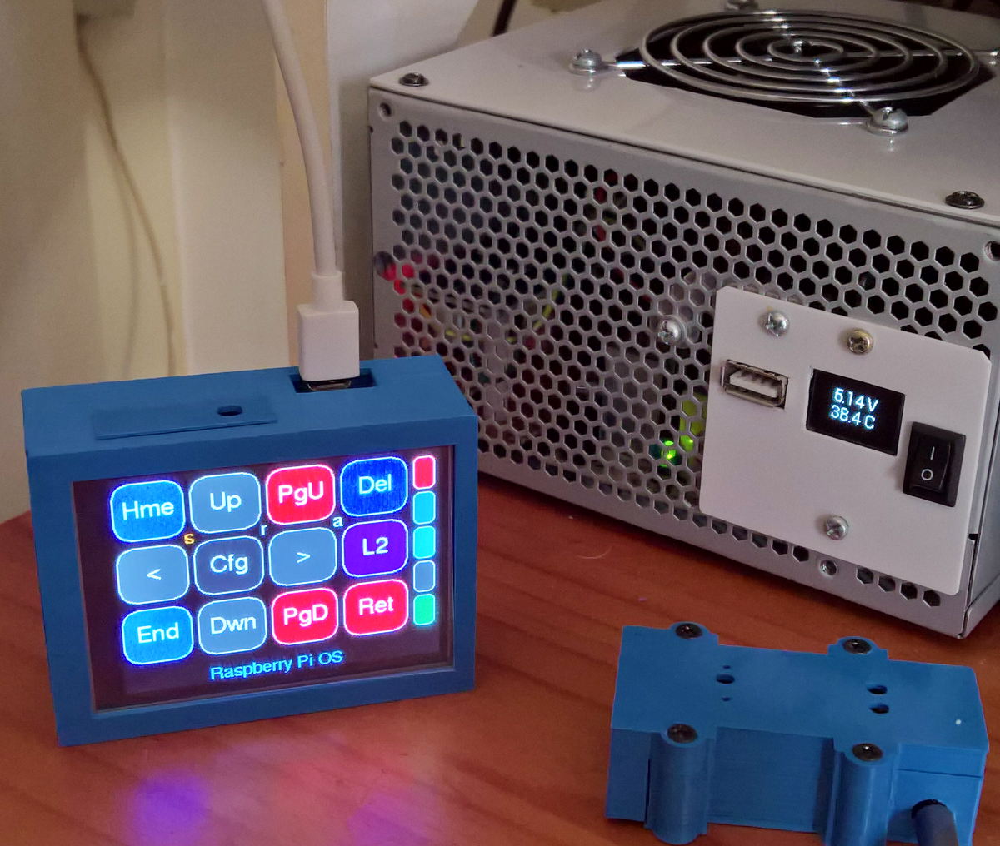

# Pico Touch Macropad

<p align="left">
 
 
 
</p>

The [**RPi Pico**](https://www.raspberrypi.org/products/raspberry-pi-pico/) is used as a **Touch LCD Macropad** with direct access to five types of files: (1) path-file-pointers, (2) macros, (3) textstrings, (4) linkfiles, and (5) \*codes. From Layout 2 (Configuration page), a number of sets of type (1) i.e. 5,952 indirected (file-path-pointer) and 960 type type (2)-(5) files (aA01-xX96 and 001-996) (note 3), and from Layouts 1, 3, and 4, another 3 independent sets (note 1), of 72 user-programmable macros, selectable from 3 sets of three banks of 24 macros (mM01-mM24, sS01-sS24, tT02-T24), as well as another five sets of 99 programmable macro-files (aA01-aA99 and k01-k99), each of which can be further linked (note 2), through a plaintext list of the 3-letter macro-filenames, are available. In addition 456 (19 sets of 24 files), text files can be accessed directly from an SDCard using the same macro-keys. There are more than 50 different pages and layouts for actions such as Media-keys (Volume Mute Play-Stop Next-Previous Bass-Treble), inserting special characters and mathematics symbols, a Restart-Shutdown Timer and Time(Clock) Configuration, Timer-and-Time-executed repeat-and-oneshot macros, a Macro Composition, Manipulation, File, and Linking editor, a Mouse-button, Scroll-wheel and cursor movement Keypad, an enhanced 3 page Numberpad, and facilities for showing PC sensor data (via HWInfo), Music Player information (via Foobar2000), PC Time or Date, or other manipulated data sources from a PC running GNU/Linux, and/or Windows.<br> 

Note 1: Macro definitions (A01-A99, k01-k99, S1-S24, T1-T24, M1-M24), and the 5,952 indirected files X01-X96, can be stored on the flash file-system as lowercase filenames (i.e. s01-s24 etc), or uppercase filenames (S01-S24), or on the SDCard as one set only of lower or uppercase files but here file s01 = file S01. Macros: 3 x 99 A-files + 2 x k01-k99 + 3 x 3 x 24 MST-files = 513 + 3 x 36 n01-n36 = 819. Linked-List Macros: 3 x 24 M,S,T,01Link - M,S,T,24Link + K01Link - K24Link = 96 linked-lists.<br> 

Note 2: Linklist files can be extended to load other linklist files, through LxyXnn where Xnn is the name of the next XnnLink file to be loaded and executed according to its content, and Lxy indicates various SDCard/Flash options for where the next linklist is stored, and how any switch between Flash memory and SDCard storage, should be handled. A repeat = 20 rnn and Rnn with r = repeat 1-99 and R - repeat 100 to 9900, and three delays = 0.5 and 3 seconds, with dnn, ddn, Dnn, DDn with d 0.1-0.9, and 1-99 seconds, D 1-99 minutes, and DDn 1-9 hours, was used in the macrolink string **a50a51dd5a53d03r20a52d03U02** for the macro animation as shown in the right-hand picture above. Refer to the [**manual**](manual.md) and the Extras - DuckyPad section, for more details. <br>

 Note 3: The x01-x96 files are neither macros, textstrings, ,\*codes, nor linkfiles. For each alphanumeric first character (aA-xX and 0-9), there are 8 pages, each with with 12 keys per page. They only point to another file through a a path - i.e. folder and file name, of any length less than 30 characters, on the same storage (Flash or SDCard) as the current set, to be executed as either a macro, textfile, linkfile, or \*code. For example if file n01 contains the text /passwords/BoA.txt then pressing key n01 will send the text from the file BoA.txt in folder /passwords to a focus(s)ed, opened application such as Chrome or notepad. Change the nKeys first character n with \*0n\*char - for example \*0n\*p will change the keys, and filenames used to p01 - p96. Use \*Code \*0s\*list-of-10-char to change a shortlist using [Cfg][Opt] and Pad[o] to select the nKeys first char from a list of 10 - the default is n o p q r s t m a k. Note that when the nKey first character is m,s,t,a,k then the nKeys list will interpret these as macros, textstrings, linkfiles or \*codes, and not as a filepath/filename.  If the contents of n01 is the text "s11Link" it will attempt the execute the link list contained in a file named "s11link". 

The power of these indirected set of files are in the ease in which a large number of actions can be changed with a single folder rename. For example if there are three folders named AppA, AppB, and AppC, and each folder has 96 specialized macros or strings for the three diffferent applications A, B, and C, then changing the folder name AppA, B, C to that contained in a nKey set such as CurrentApp, will redirect the nKey set of 96 keys to execute the specialized actions for each of the selected Apps A, B, or C.<br>

**Large Text file processing for nKeys:** Can handle very large text strings strings, preferably stored on SDCard, using nKeys n,o,p,q,r. If nKeys = m,s,t then large strings also enabled for M S T keys 01 - 96. Large strings tested up to 64kB. Keys MST 01-24 are best used for text<200 char and MST 25-96 for large text or use all NKeys NOPQR etc 01-96
for large text. For example copy two large (>10kB) files L1 and S12 on SDCard. Then program nKey n01 with content L1. Use KeyBrd editor with n01 as source in brown not white and add L1[Sav]. Test by pressing key nKey [n01]. Change nKey letter to S with [Cfg][Opt]PadKey[o] then press nKey [S12] - tested both keys both with notepad as the focus.

Eight keys - normally the [Cut][Copy]Paste[Delete][Return][cX][cC][cV] keys - can be assigned from 54 functions in Layouts 1, 3 and 4 - the functions are: 1 Delete 2 Backspace 3 Tab  4 AltTab 5 Insert 6 Esc 7 PScr 8 AltPScr 9 Return 10 Snipping 11 OnScrKeyBrd 12 UnDo 13 ReDo 14 CtrAltDel 15 Cut 16 Copy 17 Paste 18 TaskMan 19 Run 20 GuiX 21 Copilot 22-27 Tskbar1-6 28-51 K1-K24 NumLock 52 CapsLock 53 ScrollLock 54. The 24 K keys use the plaintext linking method as explained above - refer to the Extras - DuckyPad section, or the manual, for examples. 

Controlling the user interface appearance and functions are done using an extensive set of starcodes which can be entered on the TouchLCD or sent via a PC serial port or a Powershell command to the Touchpad. For example sending <\*x9\*0102030405060719> will set all 8 special keys - normally the Cut-Copy-Paste-Delete-Return keys, to new actions and labels - the 8 keys will then be Del Bks Tab aTb Ins Esc and [Del] = PrS and [Ret] = Run. Using a Powershell get-process, one can then set these keys according to which PC application is open. These \* commands can also be in a macrolink file.<br>

This means it is possible with a single macropad keypress to open for example photoshop on a PC, and at the same time re-configure the macropad keys for photoshop-specific functions. See Example 8 in the manual for more detail.

Six different LCD displays were tested with the MacroTouch firmware available here:
1. [**Waveshare IPS ST7789  LCD Pico Board 320x240 2.8 inch**](https://www.waveshare.com/pico-restouch-lcd-2.8.htm)
2. [**Waveshare TFT ILI9486 Raspberry Pi Type C 125MHz LCD 480x320 3.5 inch**](https://www.waveshare.com/3.5inch-rpi-lcd-c.htm)
3. [**Waveshare IPS ILI9486 Raspberry Pi Type B LCD 480x320 3.5 inch**](https://www.waveshare.com/product/3.5inch-RPi-LCD-B.htm)
4. [**Waveshare IPS ILI9488 Pico Evaluation Board Touch LCD 480x320 3.5 inch**](https://www.waveshare.com/pico-eval-board.htm)
5. [**Waveshare TFT ILI9486 Arduino LCD Shield 480x320 4 inch**](https://www.waveshare.com/4inch-tft-touch-shield.htm)
6. [**Waveshare IPS ILI9488 Pico Touch Display 480x320 3.5 inch**](https://www.waveshare.com/pico-restouch-lcd-3.5.htm)

LCDs 1, 4, 5, and 6 come with SDCard holders, and SDCard modules were added for LCDs 2 and 3. 

 The [**Pico Evaluation Board**](https://www.waveshare.com/pico-eval-board.htm) was modified by adding 3 connecting wires to convert the SDCard SDIO interface to a standard 1-bit SD interface. Remove pins GP5 GP18 GP19 from the Pico MCU male header. Then use the female Pico SMD header connections on the display board to connect the three wires as indicated below:  
```
D3 CS GP22 stay as is
CLK GP5 disconnect from Pico and connect to GP10 SPI-1 CLK
CMD GP18 disconnect from Pico and connect to GP11 SPI-1 MOSI
D0 GP19 disconnect from Pico and connect to GP12 SPI-1 MISO
```
Also note that not all SDCard brands work equally well - Sandisk, Toshiba, and Samsung SDCards have been used without any problems - if after a cold start the Touchpad does not respond, and only works after the HW reset button had been pressed, then replace the SDCard with another brand. As an alternative, enable the on-start-reset with \*r1\* - but doing this will prevent the Touchpad from being used during the Boot/BIOS phase.

<p align="left">
 
 
 
 
 
 
</p>

The SDCard slot can be used for saving and reading files both text and Macro definition files. When textfiles are used the 21 sets of 24 keys each send the SDCard files as keyboard characters to the PC - the size of the files/strings are only limited by the SDCard size. Change between 21 SDCard file-sets of 24 x 3 files each, with \*sd\*n. Refer to the [**manual**](Manual.md) for further instructions.

Usability guidelines for touch macro pads are difficult to find, but these [**Material Design Layout Guidelines**](https://m2.material.io/design/layout/understanding-layout.html#layout-anatomy) are in part, applicable. Note that the older versions of these guidelines were much better suited for using as a usability design tool. 

 The Touch LCD is used more conveniently when placed upright rather than lying flat, and then using your thumb-tip to press the 5 option pads, and the larger key pads. The single-touch characteristic of resistive touch overlays is in this case advantageous. Place one or two fingers on top or behind, the LCD to stabilise it when using your thumb to press the keys. This orientation is then similar to the current use of both thumbs to manipulate smartphones touch screens from the side, as opposed to using other fingers pushing on the touchscreen front. Those Waveshare Pico modules with a USB connection pointing up, can be modified by connecting a cable to the USB D+ and D- Pico bottom TP pads, and then taking the USB cable out through the side of the enclosure, or adding a USB Type C breakout board such as [**this one**](https://www.pololu.com/product/2585).

Of the 6 different LCD displays used here, I prefer the fast [**Waveshare 3.5 inch Type C 125MHz LCD display**](https://www.waveshare.com/3.5inch-rpi-lcd-c.htm) (even though it is not an IPS screen). It is available [**here**](https://www.robotics.org.za/W15811). But note that the difference in clarity between the TFT LCD (the Arduino-type 4" and the 3.5" Type C LCDs), and the other four IPS type LCDs (three 3.5" and one 2.8"), are obvious, and the latter four may be the preferred choice even though the larger 4" LCD panel is easier to use. The Waveshare 3.5" IPS Type B LCD is available [**here**](https://www.diyelectronics.co.za/store/displays/1632-5-inch-rpi-ips-lcd-320480.html). The Waveshare 3.5inch Touch Display Module for Raspberry Pi Pico is available [**here**](https://www.robotics.org.za/W19907).

Below are pictures taken whilst adding the SDCard modules to the Raspberry Pi Type C and type B LCDs with wiring diagrams:

<p align="left">
 
 
 
 
</p>

<p align="left">
 
 
 
</p>

Below are older pictures taken of four of the LCDs namely 1, 3, 4, and 5

<p align="left">
  
 
 
</p>
 
<p align="left">
 
 
 
 
</p>

<p align="left">
 
 
 
 
</p>


