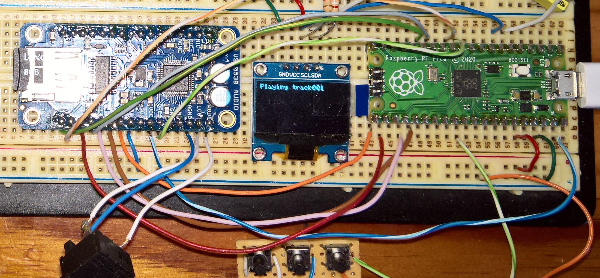
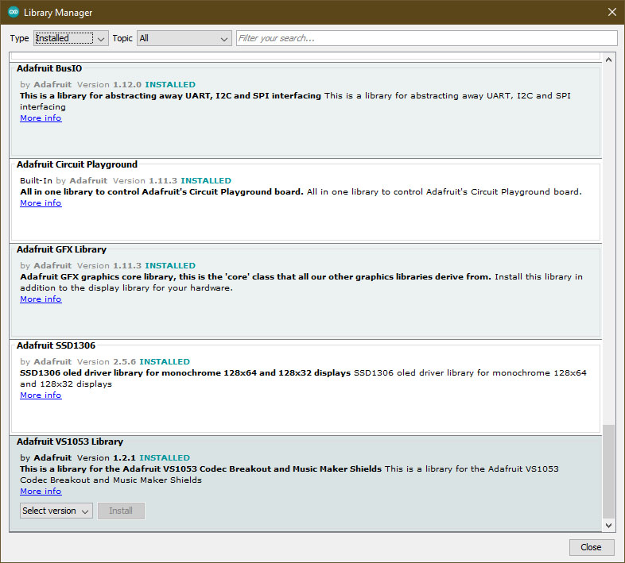
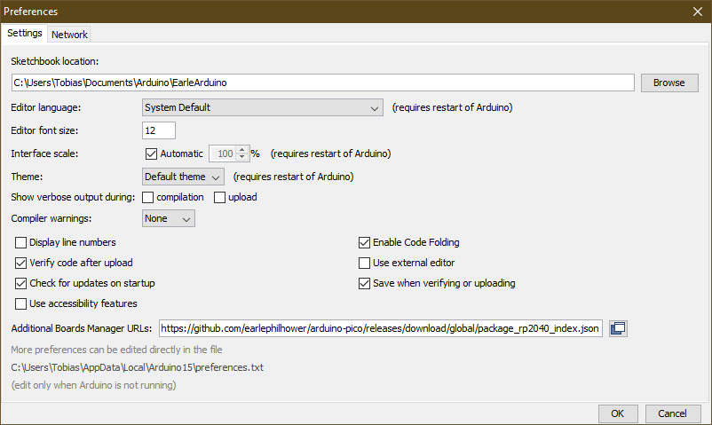
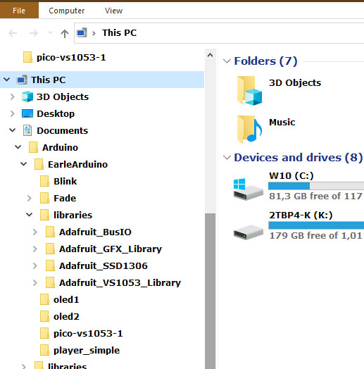

# Adafruit VS1053B and Raspberry Pi Pico Music Player

Used the [**Earle F. Philhower III Arduino Port**](https://github.com/earlephilhower/arduino-pico/), and August 2022 versions of three Adafruit GFX, SSD1306, and VS1053 libraries.

**The order in which I installed things on Windows 10x64**
1. Arduino Arduino IDE 1.8.19
2. Teensyduino 1.56 (you can leave this out - but is does install other versions of things such as the VS1053 lib)
3. The earlephilhower Aduino Pico port - see the 2nd last picture on the this page for details
4. Newest Adafruit GFX, SSD1306, and VS1053 libraries - refer to the third last picture on this page.

<p align="left">
 
</p>

```
#include <SPI.h>
#include <Wire.h>
#include <Adafruit_GFX.h>
#include <Adafruit_SSD1306.h>
#include <Adafruit_VS1053.h>
#include <SD.h>

// Declaration for an SSD1306 display connected to I2C (SDA, SCL pins)
#define SCREEN_WIDTH 128     // OLED display width, in pixels
#define SCREEN_HEIGHT 64     // OLED display height, in pixels  
#define OLED_RESET     -1    // Reset pin # (or -1 if sharing Arduino reset pin)
#define SCREEN_ADDRESS 0x3C  // See datasheet for Address; 0x3D for 128x64, 0x3C for 128x32
Adafruit_SSD1306 display(SCREEN_WIDTH, SCREEN_HEIGHT, &Wire, OLED_RESET);

#define CLK 18       // pin24 Pico-GPIO18 to SPI Clock, shared with SD card
#define MISO 16      // pin21 Pico-GPIO16 to Input data, from VS1053/SD card
#define MOSI 19      // pin25 Pico-GPIO19 to Output data, to VS1053/SD card

// These are the pins used for the Adafruit VS1053
#define BREAKOUT_RESET  10   // pin14 Pico-GPIO10 to VS1053 reset pin (output)
#define BREAKOUT_CS     17   // pin22 Pico-GPIO17 to VS1053 chip select pin (output)
#define BREAKOUT_DCS    11   // pin15 Pico-GPIO11 to VS1053 Data/command select pin (output)
#define CARDCS          9    // pin12 Pico-GPIO9 to Card chip select pin
#define DREQ            8    // pin11 Pico-GPIO8 to VS1053 Data request ideally an Interrupt pin

Adafruit_VS1053_FilePlayer musicPlayer = 
Adafruit_VS1053_FilePlayer(BREAKOUT_RESET, BREAKOUT_CS, BREAKOUT_DCS, DREQ, CARDCS);

void setup() {
 
  Wire.setSDA(4); //pin6
  Wire.setSCL(5); //pin7
  SPI.setRX(16);  //pin21
  SPI.setTX(19);  //pin25
  SPI.setSCK(18); //pin24
  SPI.setCS(17);  //pin22
```

<p align="left">
 
 
 
</p> 


**Additional Links**<br>
[1. Raspberry Pi Pico TinyGo VS1053](https://github.com/elehobica/pico_tinygo_vs1053)<br>
[2. Adafruit VS1053 Codec Breakout Library](https://github.com/adafruit/Adafruit_VS1053_Library)<br>
[3. Arduino VS1053 Library 1](https://mpflaga.github.io/Arduino_Library-vs1053_for_SdFat/)<br>
[4. Arduino SFEMP3Shield VSLI's VS10xx Library](https://github.com/madsci1016/Sparkfun-MP3-Player-Shield-Arduino-Library/)<br>
[5. Arduino VS1053 Library 2](https://github.com/mpflaga/Arduino_Library-vs1053_for_SdFat)<br>
[6. SparkFun MP3 Player Shield Library](https://github.com/sparkfun/MP3_Player_Shield/tree/V_1.5)<br>
[7. SparkFun MP3 Player Shield](https://www.sparkfun.com/products/12660)<br>
[8. Adafruit VS1053 Codec Breakout Board](https://www.adafruit.com/product/1381)<br>
[9. Adafruit Music Maker MP3 Amplifier Shield](https://www.adafruit.com/product/1788)<br>
[10. Adafruit Music Maker MP3 Shield](https://www.adafruit.com/product/1790)<br>

